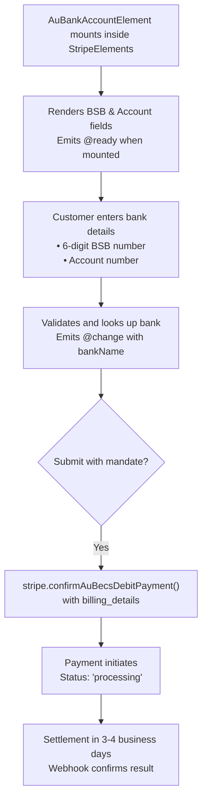

# VueStripeAuBankAccountElement

A form element for collecting Australian bank account details (BSB and account number) for BECS Direct Debit payments.

::: tip When to Use
Use VueStripeAuBankAccountElement for Australian customers. BECS Direct Debit is ideal for recurring payments and only supports AUD (Australian Dollar) currency.
:::

## What is AU Bank Account Element?

AU Bank Account Element collects bank details for Australian payments:

| Capability | Description |
|------------|-------------|
| **BSB Input** | 6-digit bank identifier with validation |
| **Account Number** | Bank account number input |
| **Bank Lookup** | Automatic bank/branch name from BSB |
| **AUD Only** | Supports Australian Dollar exclusively |
| **Direct Debit** | For recurring and one-time payments |

## How It Works



## Usage

```vue
<template>
  <VueStripeProvider :publishable-key="publishableKey">
    <VueStripeElements>
      <VueStripeAuBankAccountElement
        :options="options"
        @ready="onReady"
        @change="onChange"
      />
    </VueStripeElements>
  </VueStripeProvider>
</template>

<script setup>
import {
  VueStripeProvider,
  VueStripeElements,
  VueStripeAuBankAccountElement
} from '@vue-stripe/vue-stripe'

const publishableKey = import.meta.env.VITE_STRIPE_PUBLISHABLE_KEY

const options = {
  style: {
    base: {
      fontSize: '16px',
      color: '#424770'
    }
  },
  iconStyle: 'solid'
}

const onReady = (element) => {
  console.log('AU Bank Account element ready', element)
}

const onChange = (event) => {
  console.log('Bank:', event.bankName)
  console.log('Branch:', event.branchName)
  console.log('Complete:', event.complete)
}
</script>
```

## Props

| Prop | Type | Required | Description |
|------|------|----------|-------------|
| `options` | `StripeAuBankAccountElementOptions` | No | Element configuration |

### Options Object

```ts
interface StripeAuBankAccountElementOptions {
  classes?: StripeElementClasses
  style?: {
    base?: StripeElementStyle
    complete?: StripeElementStyle
    empty?: StripeElementStyle
    invalid?: StripeElementStyle
  }
  iconStyle?: 'default' | 'solid'
  hideIcon?: boolean
  disabled?: boolean
}
```

### Style Properties

```ts
interface StripeElementStyle {
  color?: string
  fontFamily?: string
  fontSize?: string
  fontWeight?: string
  iconColor?: string
  lineHeight?: string
  letterSpacing?: string
  padding?: string
  '::placeholder'?: { color?: string }
  ':focus'?: StripeElementStyle
  ':hover'?: StripeElementStyle
}
```

### Icon Options

| Option | Type | Default | Description |
|--------|------|---------|-------------|
| `iconStyle` | `'default' \| 'solid'` | `'default'` | Style of the bank icon |
| `hideIcon` | `boolean` | `false` | Whether to hide the icon |

## Events

| Event | Payload | Description |
|-------|---------|-------------|
| `@ready` | `StripeAuBankAccountElement` | Emitted when the element is fully rendered |
| `@change` | `StripeAuBankAccountElementChangeEvent` | Emitted when input changes |
| `@focus` | - | Emitted when the element gains focus |
| `@blur` | - | Emitted when the element loses focus |
| `@escape` | - | Emitted when Escape key is pressed |

### Change Event

```ts
interface StripeAuBankAccountElementChangeEvent {
  elementType: 'auBankAccount'
  empty: boolean
  complete: boolean
  bankName?: string   // Bank name from BSB lookup
  branchName?: string // Branch name from BSB lookup
  error?: {
    message: string
    type: string
  }
}
```

## Slots

### Loading Slot

Rendered while the element is initializing:

```vue
<VueStripeAuBankAccountElement>
  <template #loading>
    <div class="skeleton-loader">Loading...</div>
  </template>
</VueStripeAuBankAccountElement>
```

### Error Slot

Rendered when there's an error:

```vue
<VueStripeAuBankAccountElement>
  <template #error="{ error }">
    <div class="error-message">{{ error }}</div>
  </template>
</VueStripeAuBankAccountElement>
```

## Exposed Methods

Access these methods via template ref:

```vue
<script setup>
import { ref } from 'vue'

const auBankRef = ref()

const focusElement = () => auBankRef.value?.focus()
const clearElement = () => auBankRef.value?.clear()
</script>

<template>
  <VueStripeAuBankAccountElement ref="auBankRef" />
  <button @click="focusElement">Focus</button>
  <button @click="clearElement">Clear</button>
</template>
```

| Method | Description |
|--------|-------------|
| `focus()` | Focus the BSB field |
| `blur()` | Blur the element |
| `clear()` | Clear all input fields |

## Exposed Properties

| Property | Type | Description |
|----------|------|-------------|
| `element` | `Ref<StripeAuBankAccountElement \| null>` | The Stripe element instance |
| `loading` | `Ref<boolean>` | Whether the element is loading |
| `error` | `Ref<string \| null>` | Current error message |

## Examples

### Basic Usage

```vue
<VueStripeAuBankAccountElement
  @change="(e) => console.log('Bank:', e.bankName)"
/>
```

### With Icon Options

```vue
<VueStripeAuBankAccountElement
  :options="{
    iconStyle: 'solid',
    hideIcon: false
  }"
/>
```

### With Custom Styling

```vue
<script setup>
const options = {
  style: {
    base: {
      fontSize: '16px',
      color: '#32325d',
      fontFamily: '"Helvetica Neue", Helvetica, sans-serif',
      '::placeholder': {
        color: '#aab7c4'
      }
    }
  },
  iconStyle: 'solid'
}
</script>

<template>
  <VueStripeAuBankAccountElement :options="options" />
</template>
```

### Complete BECS Payment with Mandate

```vue
<script setup lang="ts">
import { ref } from 'vue'
import {
  VueStripeProvider,
  VueStripeElements,
  VueStripeAuBankAccountElement,
  useStripe,
  useStripeElements
} from '@vue-stripe/vue-stripe'

const publishableKey = import.meta.env.VITE_STRIPE_PUBLISHABLE_KEY
const bankName = ref('')
const isComplete = ref(false)
const mandateAccepted = ref(false)

const handleChange = (event: any) => {
  bankName.value = event.bankName || ''
  isComplete.value = event.complete
}

// In child component inside provider:
const confirmPayment = async (clientSecret: string) => {
  const { stripe } = useStripe()
  const { elements } = useStripeElements()

  const auBankElement = elements.value?.getElement('auBankAccount')

  const { error, paymentIntent } = await stripe.value.confirmAuBecsDebitPayment(
    clientSecret,
    {
      payment_method: {
        au_becs_debit: auBankElement,
        billing_details: {
          name: 'John Smith',
          email: 'john@example.com'
        }
      }
    }
  )

  if (error) {
    console.error(error.message)
  } else if (paymentIntent.status === 'processing') {
    console.log('Payment processing - settles in 3-4 business days')
  }
}
</script>

<template>
  <VueStripeProvider :publishable-key="publishableKey">
    <VueStripeElements>
      <form @submit.prevent="confirmPayment(clientSecret)">
        <VueStripeAuBankAccountElement @change="handleChange" />

        <div v-if="bankName" class="bank-info">
          Bank: {{ bankName }}
        </div>

        <!-- Mandate Agreement (Required) -->
        <div class="mandate">
          <label>
            <input v-model="mandateAccepted" type="checkbox" />
            I agree to the Direct Debit Request service agreement
          </label>
        </div>

        <button :disabled="!isComplete || !mandateAccepted">
          Pay with BECS Direct Debit
        </button>
      </form>
    </VueStripeElements>
  </VueStripeProvider>
</template>
```

### Displaying Bank Information

```vue
<script setup>
import { ref } from 'vue'

const bankInfo = ref({
  bankName: '',
  branchName: ''
})

const handleChange = (event) => {
  if (event.bankName) {
    bankInfo.value.bankName = event.bankName
  }
  if (event.branchName) {
    bankInfo.value.branchName = event.branchName
  }
}
</script>

<template>
  <div>
    <VueStripeAuBankAccountElement @change="handleChange" />

    <div v-if="bankInfo.bankName" class="bank-details">
      <p><strong>Bank:</strong> {{ bankInfo.bankName }}</p>
      <p v-if="bankInfo.branchName">
        <strong>Branch:</strong> {{ bankInfo.branchName }}
      </p>
    </div>
  </div>
</template>
```

## TypeScript

```ts
import { ref } from 'vue'
import { VueStripeAuBankAccountElement } from '@vue-stripe/vue-stripe'
import type {
  StripeAuBankAccountElement,
  StripeAuBankAccountElementChangeEvent,
  StripeAuBankAccountElementOptions
} from '@stripe/stripe-js'

// Options
const options: StripeAuBankAccountElementOptions = {
  style: {
    base: {
      fontSize: '16px'
    }
  },
  iconStyle: 'solid',
  hideIcon: false
}

// Event handlers
const handleReady = (element: StripeAuBankAccountElement) => {
  console.log('Ready:', element)
}

const handleChange = (event: StripeAuBankAccountElementChangeEvent) => {
  console.log('Bank:', event.bankName)
  console.log('Branch:', event.branchName)
  console.log('Complete:', event.complete)
}

// Template ref
const auBankRef = ref<InstanceType<typeof VueStripeAuBankAccountElement>>()
```

## Mandate Agreement

BECS Direct Debit requires displaying and collecting consent for the Direct Debit Request Service Agreement:

```vue
<template>
  <div class="mandate-text">
    <p>
      By providing your bank account details and confirming this payment, you agree
      to this Direct Debit Request and the
      <a href="https://stripe.com/au-becs-dd-service-agreement/legal" target="_blank">
        Direct Debit Request service agreement
      </a>,
      and authorise Stripe Payments Australia Pty Ltd ACN 160 180 343 Direct Debit
      User ID number 507156 ("Stripe") to debit your account through the Bulk Electronic
      Clearing System (BECS) on behalf of <strong>{{ businessName }}</strong>
      (the "Merchant") for any amounts separately communicated to you by the Merchant.
    </p>
  </div>
</template>
```

## Payment Status Flow

| Status | Meaning | When |
|--------|---------|------|
| `processing` | Payment initiated | Immediately after confirm |
| `succeeded` | Payment successful | 3-4 business days |
| `requires_payment_method` | Payment failed | 3-4 business days |

Use webhooks to track final status:

```ts
// webhook handler
switch (event.type) {
  case 'payment_intent.succeeded':
    // BECS payment settled
    break
  case 'payment_intent.payment_failed':
    // BECS payment failed
    break
}
```

## Error Handling

| Error | Cause | Solution |
|-------|-------|----------|
| `invalid_bsb` | BSB number is invalid | Verify BSB format (6 digits) |
| `invalid_account_number` | Account number invalid | Check account number format |
| `payment_intent_unexpected_state` | PaymentIntent not in expected state | Check PaymentIntent status |
| `mandate_data_missing` | The customer hasn't agreed to the BECS Direct Debit Request (DDR) service agreement | Collect the customer's mandate consent (show the DDR terms and pass `mandate_data` on confirmation) |

## See Also

- [VueStripeElements](/api/components/stripe-elements) - Parent container component
- [useStripeElements](/api/composables/use-stripe-elements) - Access elements in child components
- [AU Bank Account Element Guide](/guide/au-bank-account-element) - Step-by-step implementation
- [VueStripeFpxBankElement](/api/components/stripe-fpx-bank-element) - Malaysian payments
- [VueStripeIbanElement](/api/components/stripe-iban-element) - SEPA payments
