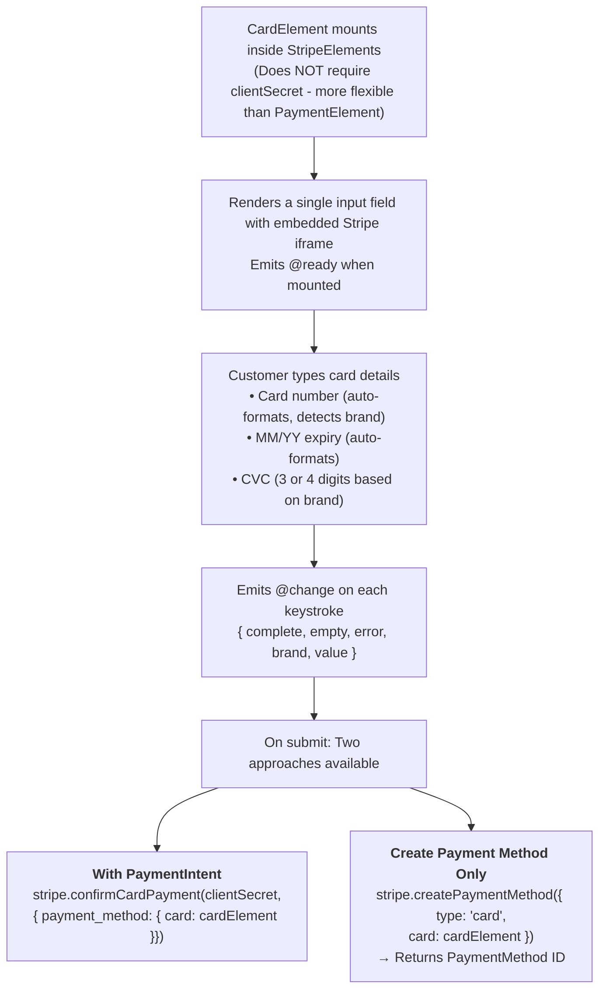

# VueStripeCardElement

A single, unified card input field that collects card number, expiration date, and CVC.

::: tip When to Use
Use StripeCardElement for a classic card-only payment experience. For modern payments that support cards, wallets, and bank transfers, consider [StripePaymentElement](/api/components/stripe-payment-element) instead.
:::

## What is Card Element?

Card Element is the classic Stripe card input that provides:

| Capability | Description |
|------------|-------------|
| **Unified Input** | Single field for card number, expiry, and CVC |
| **Real-time Validation** | Validates card number format, expiry, and CVC as user types |
| **Card Brand Detection** | Automatically detects and displays card brand icon |
| **Customizable Styling** | Full control over fonts, colors, and appearance |
| **No clientSecret Required** | Can be used without a PaymentIntent (flexible integration) |

## How It Works



## Usage

```vue
<template>
  <VueStripeProvider :publishable-key="publishableKey">
    <VueStripeElements>
      <VueStripeCardElement
        :options="cardOptions"
        @ready="onReady"
        @change="onChange"
      />
      <button @click="handleSubmit">Pay</button>
    </VueStripeElements>
  </VueStripeProvider>
</template>

<script setup>
import {
  StripeProvider,
  StripeElements,
  StripeCardElement
} from '@vue-stripe/vue-stripe'

const publishableKey = import.meta.env.VITE_STRIPE_PUBLISHABLE_KEY

const cardOptions = {
  style: {
    base: {
      fontSize: '16px',
      color: '#424770',
      '::placeholder': { color: '#aab7c4' }
    }
  }
}

const onReady = (element) => {
  console.log('Card element ready', element)
}

const onChange = (event) => {
  if (event.error) {
    console.error(event.error.message)
  }
}
</script>
```

## Props

| Prop | Type | Required | Description |
|------|------|----------|-------------|
| `options` | `StripeCardElementOptions` | No | Card element configuration |

### Options Object

```ts
interface StripeCardElementOptions {
  style?: {
    base?: StripeElementStyle
    complete?: StripeElementStyle
    empty?: StripeElementStyle
    invalid?: StripeElementStyle
  }
  hidePostalCode?: boolean
  iconStyle?: 'default' | 'solid'
  disabled?: boolean
}
```

#### Style Properties

```ts
interface StripeElementStyle {
  color?: string
  fontFamily?: string
  fontSize?: string
  fontSmoothing?: string
  fontStyle?: string
  fontVariant?: string
  fontWeight?: string
  iconColor?: string
  lineHeight?: string
  letterSpacing?: string
  textAlign?: string
  textDecoration?: string
  textShadow?: string
  textTransform?: string
  '::placeholder'?: { color?: string }
  ':-webkit-autofill'?: { color?: string }
  ':focus'?: StripeElementStyle
  ':hover'?: StripeElementStyle
  '::selection'?: { color?: string; backgroundColor?: string }
}
```

## Events

| Event | Payload | Description |
|-------|---------|-------------|
| `@ready` | `VueStripeCardElement` | Emitted when the element is fully rendered |
| `@change` | `StripeCardElementChangeEvent` | Emitted when the element value changes |
| `@focus` | - | Emitted when the element gains focus |
| `@blur` | - | Emitted when the element loses focus |
| `@escape` | - | Emitted when the escape key is pressed |

### Change Event

```ts
interface StripeCardElementChangeEvent {
  elementType: 'card'
  empty: boolean
  complete: boolean
  error?: {
    type: string
    code: string
    message: string
  }
  value: {
    postalCode: string
  }
  brand: 'visa' | 'mastercard' | 'amex' | 'discover' | 'diners' | 'jcb' | 'unionpay' | 'unknown'
}
```

## Slots

### Loading Slot

Rendered while the card element is initializing:

```vue
<VueStripeCardElement>
  <template #loading>
    <div class="skeleton-loader">Loading card form...</div>
  </template>
</VueStripeCardElement>
```

### Error Slot

Rendered when there's an error (from the change event):

```vue
<VueStripeCardElement>
  <template #error="{ error }">
    <div class="card-error">{{ error }}</div>
  </template>
</VueStripeCardElement>
```

## Exposed Methods

Access these methods via template ref:

```vue
<script setup>
import { ref } from 'vue'

const cardRef = ref()

const focusCard = () => cardRef.value?.focus()
const clearCard = () => cardRef.value?.clear()
const blurCard = () => cardRef.value?.blur()
</script>

<template>
  <VueStripeCardElement ref="cardRef" />
  <button @click="focusCard">Focus</button>
  <button @click="clearCard">Clear</button>
</template>
```

| Method | Description |
|--------|-------------|
| `focus()` | Focus the card input |
| `blur()` | Blur the card input |
| `clear()` | Clear the card input value |

## Exposed Properties

| Property | Type | Description |
|----------|------|-------------|
| `element` | `Ref<VueStripeCardElement \| null>` | The Stripe card element instance |
| `loading` | `Ref<boolean>` | Whether the element is loading |
| `error` | `Ref<string \| null>` | Current error message |

## Examples

### Basic Styling

```vue
<script setup>
const options = {
  style: {
    base: {
      fontSize: '16px',
      color: '#32325d',
      fontFamily: '"Helvetica Neue", Helvetica, sans-serif',
      '::placeholder': {
        color: '#aab7c4'
      }
    },
    invalid: {
      color: '#fa755a',
      iconColor: '#fa755a'
    }
  }
}
</script>

<template>
  <VueStripeCardElement :options="options" />
</template>
```

### Hide Postal Code

```vue
<VueStripeCardElement
  :options="{ hidePostalCode: true }"
/>
```

### Tracking Validation State

```vue
<script setup>
import { ref } from 'vue'

const cardComplete = ref(false)
const cardError = ref('')

const handleChange = (event) => {
  cardComplete.value = event.complete
  cardError.value = event.error?.message || ''
}
</script>

<template>
  <VueStripeCardElement @change="handleChange" />
  <p v-if="cardError" class="error">{{ cardError }}</p>
  <button :disabled="!cardComplete">Pay</button>
</template>
```

### Complete Payment Form

```vue
<script setup>
import { ref } from 'vue'
import {
  StripeProvider,
  StripeElements,
  StripeCardElement,
  useStripe,
  useStripeElements
} from '@vue-stripe/vue-stripe'

// In a child component inside StripeElements:
const { stripe } = useStripe()
const { elements } = useStripeElements()

const processing = ref(false)
const cardComplete = ref(false)

const handleSubmit = async (clientSecret) => {
  if (!stripe.value || !elements.value) return

  processing.value = true

  const cardElement = elements.value.getElement('card')

  const { error, paymentIntent } = await stripe.value.confirmCardPayment(
    clientSecret,
    {
      payment_method: {
        card: cardElement,
        billing_details: {
          name: 'Customer Name'
        }
      }
    }
  )

  processing.value = false

  if (error) {
    console.error(error.message)
  } else if (paymentIntent.status === 'succeeded') {
    console.log('Payment successful!')
  }
}
</script>
```

### With Custom Container Styling

```vue
<template>
  <div class="card-container">
    <VueStripeCardElement
      :options="options"
      @change="onChange"
    />
  </div>
</template>

<style scoped>
.card-container {
  padding: 12px;
  border: 1px solid #e0e0e0;
  border-radius: 8px;
  background: white;
  transition: border-color 0.2s ease;
}

.card-container:focus-within {
  border-color: #635bff;
  box-shadow: 0 0 0 3px rgba(99, 91, 255, 0.1);
}
</style>
```

## TypeScript

```ts
import { ref } from 'vue'
import { StripeCardElement } from '@vue-stripe/vue-stripe'
import type {
  StripeCardElement as StripeCardElementType,
  StripeCardElementChangeEvent,
  StripeCardElementOptions
} from '@stripe/stripe-js'

// Options
const options: StripeCardElementOptions = {
  style: {
    base: {
      fontSize: '16px'
    }
  },
  hidePostalCode: true
}

// Event handlers
const handleReady = (element: StripeCardElementType) => {
  console.log('Ready:', element)
}

const handleChange = (event: StripeCardElementChangeEvent) => {
  console.log('Complete:', event.complete)
  console.log('Brand:', event.brand)
}

// Template ref
const cardRef = ref<InstanceType<typeof StripeCardElement>>()
```

## Test Cards

Use these test card numbers in test mode:

| Card | Number |
|------|--------|
| Visa | `4242 4242 4242 4242` |
| Visa (debit) | `4000 0566 5566 5556` |
| Mastercard | `5555 5555 5555 4444` |
| American Express | `3782 822463 10005` |
| Discover | `6011 1111 1111 1117` |
| Declined | `4000 0000 0000 0002` |
| Insufficient funds | `4000 0000 0000 9995` |

Use any future expiration date and any 3-digit CVC (4-digit for Amex).

## See Also

- [StripeElements](/api/components/stripe-elements) - Parent container component
- [useStripeElements](/api/composables/use-stripe-elements) - Access elements in child components
- [Card Element Guide](/guide/card-element) - Step-by-step guide
