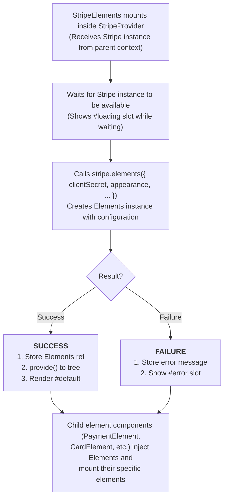

# VueStripeElements

Creates a Stripe Elements instance and provides it to child element components.

## What is StripeElements?

StripeElements is the bridge between StripeProvider and individual Stripe element components. It:

| Capability | Description |
|------------|-------------|
| **Elements Instance** | Creates the Stripe Elements instance required by all element components |
| **Payment Intent Binding** | Binds Elements to a specific PaymentIntent or SetupIntent via clientSecret |
| **Appearance Control** | Configures theme, colors, fonts, and styling for all child elements |
| **Context Provision** | Makes Elements available to child components via Vue's provide/inject |

## How It Works



## Usage

```vue
<template>
  <VueStripeProvider :publishable-key="publishableKey">
    <VueStripeElements :client-secret="clientSecret">
      <VueStripePaymentElement />
    </VueStripeElements>
  </VueStripeProvider>
</template>

<script setup>
import {
  StripeProvider,
  StripeElements,
  StripePaymentElement
} from '@vue-stripe/vue-stripe'

const publishableKey = import.meta.env.VITE_STRIPE_PUBLISHABLE_KEY
const clientSecret = 'pi_xxx_secret_xxx' // From your backend
</script>
```

## Props

| Prop | Type | Required | Description |
|------|------|----------|-------------|
| `clientSecret` | `string` | No* | Client secret from PaymentIntent or SetupIntent |
| `options` | `object` | No | Elements configuration options |

\* Required for Payment Element and some other elements. Optional for Card Element.

### Options Object

```ts
interface StripeElementsOptions {
  appearance?: {
    theme?: 'stripe' | 'night' | 'flat' | 'none'
    variables?: Record<string, string>
    rules?: Record<string, Record<string, string>>
    labels?: 'above' | 'floating'
  }
  fonts?: Array<{
    cssSrc?: string
    family?: string
    src?: string
    weight?: string
    style?: string
  }>
  locale?: string
  loader?: 'auto' | 'always' | 'never'
}
```

## Slots

### Default Slot

Rendered when Elements is ready:

```vue
<VueStripeElements :client-secret="secret">
  <VueStripePaymentElement />
</VueStripeElements>
```

### Loading Slot

Rendered while Elements is initializing:

```vue
<VueStripeElements :client-secret="secret">
  <template #loading>
    <div>Initializing payment form...</div>
  </template>

  <VueStripePaymentElement />
</VueStripeElements>
```

### Error Slot

Rendered if Elements fails to initialize:

```vue
<VueStripeElements :client-secret="secret">
  <template #error="{ error }">
    <div class="error">{{ error }}</div>
  </template>

  <VueStripePaymentElement />
</VueStripeElements>
```

## Provides

StripeElements uses Vue's `provide` to make these values available to descendants:

| Key | Type | Description |
|-----|------|-------------|
| `elements` | `Ref<VueStripeElements \| null>` | The Elements instance |
| `loading` | `Ref<boolean>` | Whether Elements is loading |
| `error` | `Ref<string \| null>` | Error message if initialization failed |

Access these values using the [useStripeElements](/api/composables/use-stripe-elements) composable.

## Appearance API

Customize the look of all Stripe Elements using the Appearance API:

### Themes

```vue
<VueStripeElements
  :client-secret="secret"
  :options="{
    appearance: {
      theme: 'stripe' // or 'night', 'flat', 'none'
    }
  }"
>
```

### Variables

```vue
<VueStripeElements
  :client-secret="secret"
  :options="{
    appearance: {
      theme: 'stripe',
      variables: {
        colorPrimary: '#0570de',
        colorBackground: '#ffffff',
        colorText: '#30313d',
        colorDanger: '#df1b41',
        fontFamily: 'system-ui, sans-serif',
        spacingUnit: '4px',
        borderRadius: '4px',
        fontSizeBase: '16px'
      }
    }
  }"
>
```

### Rules

Target specific elements with CSS-like rules:

```vue
<VueStripeElements
  :client-secret="secret"
  :options="{
    appearance: {
      rules: {
        '.Input': {
          border: '1px solid #e6e6e6',
          boxShadow: 'none'
        },
        '.Input:focus': {
          border: '1px solid #0570de',
          boxShadow: '0 0 0 1px #0570de'
        },
        '.Input--invalid': {
          border: '1px solid #df1b41'
        },
        '.Label': {
          fontWeight: '500'
        },
        '.Error': {
          color: '#df1b41'
        }
      }
    }
  }"
>
```

### Custom Fonts

```vue
<VueStripeElements
  :client-secret="secret"
  :options="{
    fonts: [
      {
        cssSrc: 'https://fonts.googleapis.com/css?family=Roboto'
      }
    ],
    appearance: {
      variables: {
        fontFamily: 'Roboto, sans-serif'
      }
    }
  }"
>
```

## Examples

### Dark Theme

```vue
<VueStripeElements
  :client-secret="secret"
  :options="{
    appearance: {
      theme: 'night',
      variables: {
        colorPrimary: '#7c3aed'
      }
    }
  }"
>
  <VueStripePaymentElement />
</VueStripeElements>
```

### Custom Styled

```vue
<script setup>
const appearance = {
  theme: 'none',
  variables: {
    fontFamily: '"Inter", system-ui, sans-serif',
    fontSizeBase: '15px',
    colorPrimary: '#10b981',
    colorBackground: '#f9fafb',
    colorText: '#1f2937',
    colorDanger: '#ef4444',
    borderRadius: '8px',
    spacingUnit: '4px'
  },
  rules: {
    '.Input': {
      backgroundColor: '#ffffff',
      border: '1px solid #d1d5db',
      padding: '12px',
      transition: 'border-color 0.15s ease'
    },
    '.Input:hover': {
      borderColor: '#9ca3af'
    },
    '.Input:focus': {
      borderColor: '#10b981',
      boxShadow: '0 0 0 3px rgba(16, 185, 129, 0.1)'
    },
    '.Label': {
      fontSize: '14px',
      fontWeight: '500',
      marginBottom: '6px'
    }
  }
}
</script>

<template>
  <VueStripeElements
    :client-secret="secret"
    :options="{ appearance }"
  >
    <VueStripePaymentElement />
  </VueStripeElements>
</template>
```

### Without clientSecret (Card Element only)

```vue
<VueStripeProvider :publishable-key="key">
  <VueStripeElements>
    <!-- Card Element doesn't require clientSecret on Elements -->
    <VueStripeCardElement />
  </VueStripeElements>
</VueStripeProvider>
```

## TypeScript

```ts
import type { Appearance } from '@stripe/stripe-js'

const appearance: Appearance = {
  theme: 'stripe',
  variables: {
    colorPrimary: '#0570de'
  }
}
```

## See Also

- [useStripeElements](/api/composables/use-stripe-elements) - Access Elements in child components
- [StripeProvider](/api/components/stripe-provider) - Parent provider component
- [Customization Guide](/guide/customization) - Full appearance customization guide
