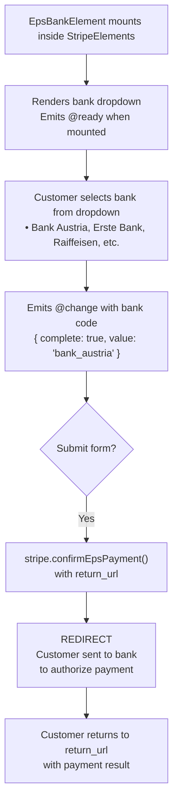

# VueStripeEpsBankElement

A dropdown selector for Austrian banks enabling EPS (Electronic Payment Standard) payments, a popular payment method in Austria.

::: tip When to Use
Use VueStripeEpsBankElement for Austrian customers. EPS has over 80% market coverage in Austria and only supports EUR currency.
:::

## What is EPS Bank Element?

EPS Bank Element provides a bank selector for Austrian payments:

| Capability | Description |
|------------|-------------|
| **Bank Dropdown** | Pre-populated list of 25+ Austrian banks |
| **Wide Coverage** | Supports almost all Austrian banks (80%+) |
| **EUR Only** | Supports Euro currency exclusively |
| **Redirect Flow** | Seamless redirect to customer's bank |
| **Instant Notification** | Real-time payment confirmation |

## How It Works



## Usage

```vue
<template>
  <VueStripeProvider :publishable-key="publishableKey">
    <VueStripeElements>
      <VueStripeEpsBankElement
        :options="options"
        @ready="onReady"
        @change="onChange"
      />
    </VueStripeElements>
  </VueStripeProvider>
</template>

<script setup>
import {
  VueStripeProvider,
  VueStripeElements,
  VueStripeEpsBankElement
} from '@vue-stripe/vue-stripe'

const publishableKey = import.meta.env.VITE_STRIPE_PUBLISHABLE_KEY

const options = {
  style: {
    base: {
      fontSize: '16px',
      color: '#424770'
    }
  }
}

const onReady = (element) => {
  console.log('EPS element ready', element)
}

const onChange = (event) => {
  console.log('Selected bank:', event.value)
  console.log('Complete:', event.complete)
}
</script>
```

## Props

| Prop | Type | Required | Description |
|------|------|----------|-------------|
| `options` | `StripeEpsBankElementOptions` | No | Element configuration |

### Options Object

```ts
interface StripeEpsBankElementOptions {
  style?: {
    base?: StripeElementStyle
    complete?: StripeElementStyle
    empty?: StripeElementStyle
    invalid?: StripeElementStyle
  }
  value?: string  // Pre-select a bank by code
  disabled?: boolean
}
```

### Style Properties

```ts
interface StripeElementStyle {
  color?: string
  fontFamily?: string
  fontSize?: string
  fontWeight?: string
  iconColor?: string
  lineHeight?: string
  letterSpacing?: string
  padding?: string
  '::placeholder'?: { color?: string }
  ':focus'?: StripeElementStyle
  ':hover'?: StripeElementStyle
}
```

## Events

| Event | Payload | Description |
|-------|---------|-------------|
| `@ready` | `StripeEpsBankElement` | Emitted when the element is fully rendered |
| `@change` | `StripeEpsBankElementChangeEvent` | Emitted when bank selection changes |
| `@focus` | - | Emitted when the element gains focus |
| `@blur` | - | Emitted when the element loses focus |

### Change Event

```ts
interface StripeEpsBankElementChangeEvent {
  elementType: 'epsBank'
  empty: boolean
  complete: boolean
  value?: string  // Bank code: 'bank_austria', 'erste_bank_und_sparkassen', etc.
}
```

### Bank Codes

| Code | Bank Name |
|------|-----------|
| `arzte_und_apotheker_bank` | Ärzte- und Apothekerbank |
| `austrian_anadi_bank_ag` | Austrian Anadi Bank AG |
| `bank_austria` | Bank Austria |
| `bank99` | bank99 AG |
| `bankhaus_carl_spangler` | Bankhaus Carl Spängler |
| `bankhaus_schelhammer_schattera` | Bankhaus Schelhammer & Schattera |
| `bawag_psk` | BAWAG P.S.K. AG |
| `bks_bank` | BKS Bank AG |
| `btv_vier_lander_bank` | BTV VIER LÄNDER BANK |
| `capital_bank_grawe_gruppe` | Capital Bank Grawe Gruppe |
| `dolomitenbank` | Dolomitenbank |
| `easybank` | Easybank AG |
| `erste_bank_und_sparkassen` | Erste Bank und Sparkassen |
| `hypo_alpe_adria` | Hypo Alpe-Adria-Bank |
| `hypo_noe` | HYPO NOE |
| `hypo_oberoesterreich` | HYPO Oberösterreich |
| `hypo_tirol` | Hypo Tirol Bank AG |
| `hypo_vorarlberg` | Hypo Vorarlberg Bank AG |
| `hypo_burgenland` | HYPO-BANK BURGENLAND |
| `marchfelder_bank` | Marchfelder Bank |
| `oberbank` | Oberbank AG |
| `raiffeisen` | Raiffeisen Bankengruppe Österreich |
| `schoellerbank` | Schoellerbank AG |
| `sparda_bank_wien` | Sparda-Bank Wien |
| `volksbank` | Volksbank Gruppe |
| `volkskreditbank` | Volkskreditbank AG |
| `vr_bank_braunau` | VR-Bank Braunau |

## Slots

### Loading Slot

Rendered while the element is initializing:

```vue
<VueStripeEpsBankElement>
  <template #loading>
    <div class="skeleton-loader">Loading banks...</div>
  </template>
</VueStripeEpsBankElement>
```

## Exposed Methods

Access these methods via template ref:

```vue
<script setup>
import { ref } from 'vue'

const epsRef = ref()

const focusElement = () => epsRef.value?.focus()
const clearElement = () => epsRef.value?.clear()
</script>

<template>
  <VueStripeEpsBankElement ref="epsRef" />
  <button @click="focusElement">Focus</button>
  <button @click="clearElement">Clear Selection</button>
</template>
```

| Method | Description |
|--------|-------------|
| `focus()` | Focus the bank selector |
| `blur()` | Blur the bank selector |
| `clear()` | Clear the selection |

## Exposed Properties

| Property | Type | Description |
|----------|------|-------------|
| `element` | `Ref<StripeEpsBankElement \| null>` | The Stripe element instance |
| `loading` | `Ref<boolean>` | Whether the element is loading |
| `error` | `Ref<string \| null>` | Current error message |

## Examples

### Basic Usage

```vue
<VueStripeEpsBankElement
  @change="(e) => console.log('Bank:', e.value)"
/>
```

### With Custom Styling

```vue
<script setup>
const options = {
  style: {
    base: {
      fontSize: '16px',
      color: '#32325d',
      fontFamily: '"Helvetica Neue", Helvetica, sans-serif',
      padding: '10px 12px'
    }
  }
}
</script>

<template>
  <VueStripeEpsBankElement :options="options" />
</template>
```

### Complete EPS Payment

```vue
<script setup lang="ts">
import { ref } from 'vue'
import {
  VueStripeProvider,
  VueStripeElements,
  VueStripeEpsBankElement,
  useStripe,
  useStripeElements
} from '@vue-stripe/vue-stripe'

const publishableKey = import.meta.env.VITE_STRIPE_PUBLISHABLE_KEY
const selectedBank = ref('')
const isComplete = ref(false)
const name = ref('')

const handleChange = (event: any) => {
  selectedBank.value = event.value || ''
  isComplete.value = event.complete
}

// In child component inside provider:
const confirmPayment = async (clientSecret: string) => {
  const { stripe } = useStripe()
  const { elements } = useStripeElements()

  const epsElement = elements.value?.getElement('epsBank')

  const { error } = await stripe.value.confirmEpsPayment(
    clientSecret,
    {
      payment_method: {
        eps: epsElement,
        billing_details: {
          name: name.value
        }
      },
      return_url: `${window.location.origin}/payment-complete`
    }
  )

  if (error) {
    console.error(error.message)
  }
  // Customer redirected to bank
}
</script>

<template>
  <VueStripeProvider :publishable-key="publishableKey">
    <VueStripeElements>
      <form @submit.prevent="confirmPayment(clientSecret)">
        <input v-model="name" type="text" placeholder="Name" />
        <VueStripeEpsBankElement @change="handleChange" />
        <button :disabled="!isComplete">Pay with EPS</button>
      </form>
    </VueStripeElements>
  </VueStripeProvider>
</template>
```

## TypeScript

```ts
import { ref } from 'vue'
import { VueStripeEpsBankElement } from '@vue-stripe/vue-stripe'
import type {
  StripeEpsBankElement,
  StripeEpsBankElementChangeEvent,
  StripeEpsBankElementOptions
} from '@stripe/stripe-js'

// Options
const options: StripeEpsBankElementOptions = {
  style: {
    base: {
      fontSize: '16px'
    }
  }
}

// Event handlers
const handleReady = (element: StripeEpsBankElement) => {
  console.log('Ready:', element)
}

const handleChange = (event: StripeEpsBankElementChangeEvent) => {
  console.log('Bank:', event.value)
  console.log('Complete:', event.complete)
}

// Template ref
const epsRef = ref<InstanceType<typeof VueStripeEpsBankElement>>()
```

## Error Handling

| Error | Cause | Solution |
|-------|-------|----------|
| `payment_intent_unexpected_state` | PaymentIntent not in expected state | Check PaymentIntent status |
| `redirect_failed` | Bank redirect failed | Retry the payment |
| `payment_method_not_available` | EPS not available | Verify account has EPS enabled |

## See Also

- [VueStripeElements](/api/components/stripe-elements) - Parent container component
- [useStripeElements](/api/composables/use-stripe-elements) - Access elements in child components
- [EPS Bank Element Guide](/guide/eps-bank-element) - Step-by-step implementation
- [VueStripeIdealBankElement](/api/components/stripe-ideal-bank-element) - Dutch payments
- [VueStripeP24BankElement](/api/components/stripe-p24-bank-element) - Polish payments
