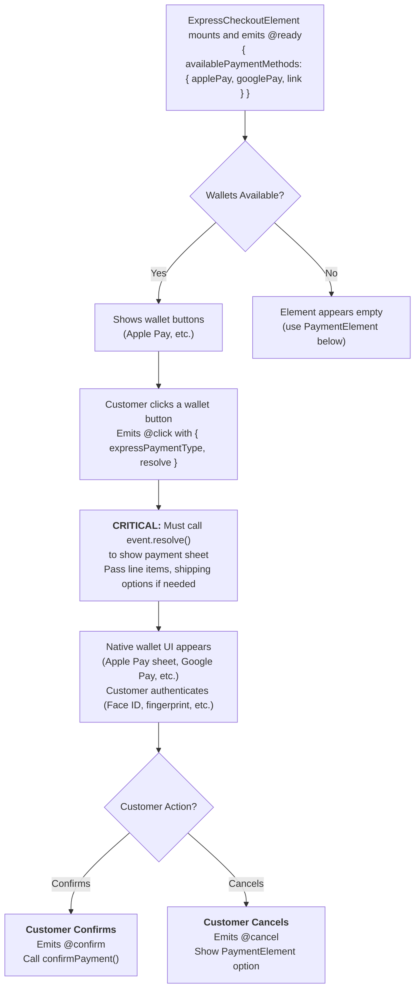

# VueStripeExpressCheckoutElement

Displays wallet payment buttons like Apple Pay, Google Pay, and Link for one-click checkout.

::: tip Standalone Element
Unlike `VueStripeLinkAuthenticationElement`, Express Checkout **can process payments independently**. It handles the full payment flow through the wallet's native interface.
:::

::: warning Requires clientSecret
Express Checkout Element requires a `clientSecret` from a PaymentIntent. Ensure StripeElements has a valid clientSecret configured.
:::

## What This Element Does

| Capability | Description |
|------------|-------------|
| **Wallet Buttons** | Displays Apple Pay, Google Pay, and Link buttons |
| **One-Click Checkout** | Customers pay with saved wallet payment methods |
| **Full Payment Flow** | Handles payment authorization through wallet interface |
| **Shipping Collection** | Can collect shipping address and rates (optional) |

## Wallet Availability

| Wallet | Requirements |
|--------|--------------|
| **Apple Pay** | Safari on macOS/iOS with Apple Wallet configured |
| **Google Pay** | Chrome/Android with Google Pay configured |
| **Link** | Customer has a Stripe Link account |

::: info Device-Dependent
Express Checkout buttons only appear when wallets are available on the customer's device. Testing typically requires a real device with a configured wallet.
:::

## How It Works



## Usage

### Basic Usage

```vue
<template>
  <VueStripeProvider :publishable-key="publishableKey">
    <VueStripeElements :client-secret="clientSecret">
      <VueStripeExpressCheckoutElement
        :options="options"
        @ready="onReady"
        @click="onClick"
        @confirm="onConfirm"
      />
    </VueStripeElements>
  </VueStripeProvider>
</template>

<script setup>
import { ref } from 'vue'
import {
  StripeProvider,
  StripeElements,
  StripeExpressCheckoutElement
} from '@vue-stripe/vue-stripe'

const publishableKey = import.meta.env.VITE_STRIPE_PUBLISHABLE_KEY
const clientSecret = 'pi_xxx_secret_xxx' // From your backend

const options = {
  buttonType: {
    applePay: 'buy',
    googlePay: 'buy'
  },
  buttonTheme: {
    applePay: 'black',
    googlePay: 'black'
  }
}

const onReady = (event) => {
  // Check which wallets are available
  console.log('Available:', event.availablePaymentMethods)
}

const onClick = (event) => {
  // Required: Call resolve() to show payment sheet
  event.resolve({})
}

const onConfirm = async (event) => {
  // Payment authorized - confirm with your backend
  console.log('Payment type:', event.expressPaymentType)
}
</script>
```

## Props

| Prop | Type | Required | Description |
|------|------|----------|-------------|
| `options` | `StripeExpressCheckoutElementOptions` | No | Element configuration options |

### Options Object

```ts
interface StripeExpressCheckoutElementOptions {
  buttonType?: {
    applePay?: 'plain' | 'buy' | 'check-out' | 'subscribe' | 'add-money' | 'book' | 'contribute' | 'donate' | 'order' | 'reload' | 'rent' | 'support' | 'tip' | 'top-up'
    googlePay?: 'plain' | 'buy' | 'book' | 'checkout' | 'donate' | 'order' | 'pay' | 'subscribe'
  }
  buttonTheme?: {
    applePay?: 'black' | 'white' | 'white-outline'
    googlePay?: 'black' | 'white'
  }
  layout?: {
    maxColumns?: number  // Max buttons per row
    maxRows?: number     // Max rows to display
    overflow?: 'auto' | 'never'
  }
  paymentMethods?: {
    applePay?: 'auto' | 'never'
    googlePay?: 'auto' | 'never'
    link?: 'auto' | 'never'
  }
}
```

## Events

| Event | Payload | Description |
|-------|---------|-------------|
| `@ready` | `StripeExpressCheckoutElementReadyEvent` | Emitted when mounted, includes available wallets |
| `@click` | `StripeExpressCheckoutElementClickEvent` | Emitted when a wallet button is clicked |
| `@confirm` | `StripeExpressCheckoutElementConfirmEvent` | Emitted when payment is authorized |
| `@cancel` | - | Emitted when customer cancels payment sheet |
| `@shippingaddresschange` | `{ address, name }` | Emitted when shipping address changes |
| `@shippingratechange` | `{ shippingRate }` | Emitted when shipping rate changes |

### Ready Event

```ts
interface StripeExpressCheckoutElementReadyEvent {
  availablePaymentMethods?: {
    applePay?: boolean
    googlePay?: boolean
    link?: boolean
  }
}
```

### Click Event (Critical!)

The `@click` event **must call `event.resolve()`** to continue with the payment sheet:

```ts
interface StripeExpressCheckoutElementClickEvent {
  expressPaymentType: 'apple_pay' | 'google_pay' | 'link'
  resolve: (options?: ClickResolveOptions) => void
}

interface ClickResolveOptions {
  lineItems?: Array<{
    name: string
    amount: number
  }>
  shippingOptions?: Array<{
    id: string
    label: string
    amount: number
  }>
  applePay?: {
    recurringPaymentRequest?: { ... }
  }
}
```

### Confirm Event

```ts
interface StripeExpressCheckoutElementConfirmEvent {
  expressPaymentType: 'apple_pay' | 'google_pay' | 'link'
  paymentMethodId?: string
  billingDetails?: {
    name?: string
    email?: string
    phone?: string
    address?: { ... }
  }
  shippingAddress?: { ... }
  shippingRate?: { ... }
}
```

## Exposed Properties

| Property | Type | Description |
|----------|------|-------------|
| `element` | `Ref<VueStripeExpressCheckoutElement \| null>` | The Stripe element instance |
| `loading` | `Ref<boolean>` | Whether the element is loading |
| `error` | `Ref<string \| null>` | Error message if creation failed |

## Slots

### Loading Slot

```vue
<VueStripeExpressCheckoutElement>
  <template #loading>
    <div class="skeleton">Loading wallet buttons...</div>
  </template>
</VueStripeExpressCheckoutElement>
```

### Error Slot

```vue
<VueStripeExpressCheckoutElement>
  <template #error="{ error }">
    <div class="error">{{ error }}</div>
  </template>
</VueStripeExpressCheckoutElement>
```

## Examples

### Click Event Handling

The click event must resolve before the payment sheet appears:

```vue
<script setup>
const onClick = (event) => {
  // Simple case: just show payment sheet
  event.resolve({})
}

// Or with line items (for Apple Pay)
const onClickWithItems = (event) => {
  event.resolve({
    lineItems: [
      { name: 'Product', amount: 1999 },
      { name: 'Tax', amount: 200 }
    ]
  })
}

// Or with shipping options
const onClickWithShipping = (event) => {
  event.resolve({
    shippingOptions: [
      { id: 'standard', label: 'Standard Shipping', amount: 500 },
      { id: 'express', label: 'Express Shipping', amount: 1500 }
    ]
  })
}
</script>
```

### Confirm and Payment Completion

```vue
<script setup>
import { useStripe, useStripeElements } from '@vue-stripe/vue-stripe'

// Must be inside StripeElements context
const { stripe } = useStripe()
const { elements } = useStripeElements()

const onConfirm = async (event) => {
  if (!stripe.value || !elements.value) return

  const { error } = await stripe.value.confirmPayment({
    elements: elements.value,
    clientSecret,
    confirmParams: {
      return_url: window.location.href
    },
    redirect: 'if_required'
  })

  if (error) {
    console.error('Payment failed:', error.message)
  } else {
    console.log('Payment succeeded!')
  }
}
</script>
```

### Shipping Address Collection

```vue
<script setup>
const options = {
  // Enable shipping collection in Payment Intent options
}

const onShippingAddressChange = (event) => {
  const { address, name } = event
  console.log('Shipping to:', name, address)

  // Calculate shipping rates based on address
  // Then call event.resolve() with available rates
}

const onShippingRateChange = (event) => {
  const { shippingRate } = event
  console.log('Selected shipping:', shippingRate.displayName)
}
</script>

<template>
  <VueStripeExpressCheckoutElement
    @shippingaddresschange="onShippingAddressChange"
    @shippingratechange="onShippingRateChange"
  />
</template>
```

### Custom Button Styling

```vue
<script setup>
const options = {
  buttonType: {
    applePay: 'check-out',  // "Check out with Apple Pay"
    googlePay: 'checkout'    // "Checkout"
  },
  buttonTheme: {
    applePay: 'white-outline',
    googlePay: 'white'
  },
  layout: {
    maxColumns: 2,
    maxRows: 1
  }
}
</script>
```

### Paired with Payment Element (Recommended)

Place Express Checkout above PaymentElement as a fast-path option:

```vue
<template>
  <VueStripeProvider :publishable-key="publishableKey">
    <VueStripeElements :client-secret="clientSecret">
      <!-- Fast checkout option -->
      <div class="express-section">
        <h3>Express Checkout</h3>
        <VueStripeExpressCheckoutElement
          @click="e => e.resolve({})"
          @confirm="onExpressConfirm"
        />
      </div>

      <div class="divider">Or pay with card</div>

      <!-- Traditional payment fallback -->
      <div class="card-section">
        <VueStripePaymentElement @change="onChange" />
        <button @click="handleSubmit">Pay</button>
      </div>
    </VueStripeElements>
  </VueStripeProvider>
</template>
```

### Detect Wallet Availability

```vue
<script setup>
import { ref } from 'vue'

const hasWallets = ref(false)
const availableWallets = ref([])

const onReady = (event) => {
  if (event.availablePaymentMethods) {
    const methods = Object.entries(event.availablePaymentMethods)
      .filter(([, available]) => available)
      .map(([method]) => method)

    availableWallets.value = methods
    hasWallets.value = methods.length > 0
  }
}
</script>

<template>
  <div>
    <VueStripeExpressCheckoutElement @ready="onReady" />

    <div v-if="!hasWallets" class="no-wallets-message">
      <p>No wallet payment methods available on this device.</p>
      <p>Use the card payment form below instead.</p>
    </div>
  </div>
</template>
```

## TypeScript

```ts
import { ref } from 'vue'
import { StripeExpressCheckoutElement } from '@vue-stripe/vue-stripe'
import type {
  StripeExpressCheckoutElement as StripeExpressCheckoutElementType,
  StripeExpressCheckoutElementOptions,
  StripeExpressCheckoutElementReadyEvent,
  StripeExpressCheckoutElementClickEvent,
  StripeExpressCheckoutElementConfirmEvent
} from '@stripe/stripe-js'

// Options
const options: StripeExpressCheckoutElementOptions = {
  buttonType: {
    applePay: 'buy',
    googlePay: 'buy'
  },
  buttonTheme: {
    applePay: 'black',
    googlePay: 'black'
  },
  layout: {
    maxColumns: 3,
    maxRows: 1
  }
}

// Event handlers
const handleReady = (event: StripeExpressCheckoutElementReadyEvent) => {
  console.log('Available wallets:', event.availablePaymentMethods)
}

const handleClick = (event: StripeExpressCheckoutElementClickEvent) => {
  event.resolve({})
}

const handleConfirm = (event: StripeExpressCheckoutElementConfirmEvent) => {
  console.log('Payment type:', event.expressPaymentType)
}

// Template ref
const expressCheckoutRef = ref<InstanceType<typeof StripeExpressCheckoutElement>>()
```

## Comparison with PaymentElement

| Feature | Express Checkout | Payment Element |
|---------|-----------------|-----------------|
| **Use Case** | Fast-path for wallet users | Full payment method support |
| **User Action** | One-click (saved wallet) | Enter payment details |
| **Wallet Support** | Primary focus | Secondary option |
| **Card Input** | No | Yes |
| **Bank Transfers** | No | Yes |
| **Placement** | Top of checkout | Primary payment form |

## Requirements

| Requirement | Details |
|-------------|---------|
| **clientSecret** | From PaymentIntent |
| **HTTPS** | Required (except localhost) |
| **Wallet Enabled** | Must be enabled in Stripe Dashboard |
| **Real Device** | Wallet buttons typically require real devices with configured wallets |

## Pairing Recommendation

::: tip Recommended Pattern
**Place Express Checkout Element above StripePaymentElement** to offer customers a fast checkout option while maintaining a fallback for those without wallets configured.
:::

```
┌─────────────────────────────────────┐
│  Express Checkout (optional fast    │
│  path for wallet users)             │
├─────────────────────────────────────┤
│  ─── Or pay with card ───           │
├─────────────────────────────────────┤
│  Payment Element (full payment      │
│  form for all customers)            │
└─────────────────────────────────────┘
```

## Related Components

| Component | Relationship |
|-----------|--------------|
| [StripeElements](/api/components/stripe-elements) | **Required parent** - Provides Elements context |
| [StripePaymentElement](/api/components/stripe-payment-element) | **Recommended pair** - Fallback payment form |
| [StripeLinkAuthenticationElement](/api/components/stripe-link-authentication-element) | Alternative - Email-based Link authentication |

## See Also

- [StripeElements](/api/components/stripe-elements) - Parent container component
- [StripePaymentElement](/api/components/stripe-payment-element) - All-in-one payment UI
- [Stripe Express Checkout Documentation](https://stripe.com/docs/elements/express-checkout-element) - Official Stripe docs
