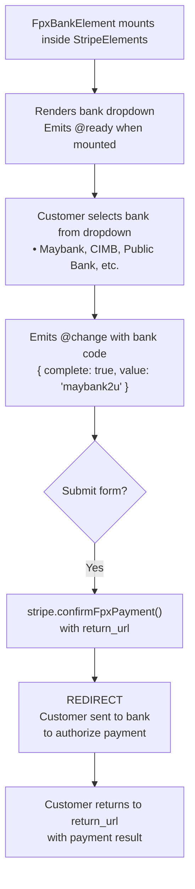

# VueStripeFpxBankElement

A dropdown selector for Malaysian banks enabling FPX (Financial Process Exchange) payments, Malaysia's national real-time online banking system.

::: tip When to Use
Use VueStripeFpxBankElement for Malaysian customers. FPX is the dominant payment method in Malaysia and only supports MYR (Malaysian Ringgit) currency.
:::

## What is FPX Bank Element?

FPX Bank Element provides a bank selector for Malaysian payments:

| Capability | Description |
|------------|-------------|
| **Bank Dropdown** | Pre-populated list of all major Malaysian banks |
| **Account Type** | Supports both individual and business accounts |
| **Redirect Flow** | Seamless redirect to customer's bank |
| **MYR Only** | Supports Malaysian Ringgit exclusively |
| **Instant Notification** | Real-time payment confirmation |

## How It Works



## Usage

```vue
<template>
  <VueStripeProvider :publishable-key="publishableKey">
    <VueStripeElements>
      <VueStripeFpxBankElement
        account-holder-type="individual"
        :options="options"
        @ready="onReady"
        @change="onChange"
      />
    </VueStripeElements>
  </VueStripeProvider>
</template>

<script setup>
import {
  VueStripeProvider,
  VueStripeElements,
  VueStripeFpxBankElement
} from '@vue-stripe/vue-stripe'

const publishableKey = import.meta.env.VITE_STRIPE_PUBLISHABLE_KEY

const options = {
  style: {
    base: {
      fontSize: '16px',
      color: '#424770'
    }
  }
}

const onReady = (element) => {
  console.log('FPX element ready', element)
}

const onChange = (event) => {
  console.log('Selected bank:', event.value)
  console.log('Complete:', event.complete)
}
</script>
```

## Props

| Prop | Type | Required | Default | Description |
|------|------|----------|---------|-------------|
| `accountHolderType` | `'individual' \| 'company'` | No | `'individual'` | Type of account holder |
| `options` | `Omit<StripeFpxBankElementOptions, 'accountHolderType'>` | No | - | Element configuration |

::: warning Required by Stripe
The `accountHolderType` is required by Stripe's FPX implementation. It defaults to `'individual'` if not specified.
:::

### Options Object

```ts
interface StripeFpxBankElementOptions {
  accountHolderType: 'individual' | 'company'  // Required by Stripe, handled via prop
  style?: {
    base?: StripeElementStyle
    complete?: StripeElementStyle
    empty?: StripeElementStyle
    invalid?: StripeElementStyle
  }
  value?: string  // Pre-select a bank by code
  disabled?: boolean
}
```

### Style Properties

```ts
interface StripeElementStyle {
  color?: string
  fontFamily?: string
  fontSize?: string
  fontWeight?: string
  iconColor?: string
  lineHeight?: string
  letterSpacing?: string
  padding?: string
  '::placeholder'?: { color?: string }
  ':focus'?: StripeElementStyle
  ':hover'?: StripeElementStyle
}
```

## Events

| Event | Payload | Description |
|-------|---------|-------------|
| `@ready` | `StripeFpxBankElement` | Emitted when the element is fully rendered |
| `@change` | `StripeFpxBankElementChangeEvent` | Emitted when bank selection changes |
| `@focus` | - | Emitted when the element gains focus |
| `@blur` | - | Emitted when the element loses focus |
| `@escape` | - | Emitted when Escape key is pressed |

### Change Event

```ts
interface StripeFpxBankElementChangeEvent {
  elementType: 'fpxBank'
  empty: boolean
  complete: boolean
  value: string  // Bank code: 'maybank2u', 'cimb', etc.
}
```

### Bank Codes

| Code | Bank Name |
|------|-----------|
| `affin_bank` | Affin Bank |
| `agrobank` | Agrobank |
| `alliance_bank` | Alliance Bank |
| `ambank` | AmBank |
| `bank_islam` | Bank Islam |
| `bank_muamalat` | Bank Muamalat |
| `bank_rakyat` | Bank Rakyat |
| `bsn` | BSN (Bank Simpanan Nasional) |
| `cimb` | CIMB Bank |
| `hong_leong_bank` | Hong Leong Bank |
| `hsbc` | HSBC Bank |
| `kfh` | KFH (Kuwait Finance House) |
| `maybank2u` | Maybank |
| `ocbc` | OCBC Bank |
| `public_bank` | Public Bank |
| `rhb` | RHB Bank |
| `standard_chartered` | Standard Chartered |
| `uob` | UOB Bank |

## Slots

### Loading Slot

Rendered while the element is initializing:

```vue
<VueStripeFpxBankElement account-holder-type="individual">
  <template #loading>
    <div class="skeleton-loader">Loading banks...</div>
  </template>
</VueStripeFpxBankElement>
```

### Error Slot

Rendered when there's an error:

```vue
<VueStripeFpxBankElement account-holder-type="individual">
  <template #error="{ error }">
    <div class="error-message">{{ error }}</div>
  </template>
</VueStripeFpxBankElement>
```

## Exposed Methods

Access these methods via template ref:

```vue
<script setup>
import { ref } from 'vue'

const fpxRef = ref()

const focusElement = () => fpxRef.value?.focus()
const clearElement = () => fpxRef.value?.clear()
</script>

<template>
  <VueStripeFpxBankElement ref="fpxRef" account-holder-type="individual" />
  <button @click="focusElement">Focus</button>
  <button @click="clearElement">Clear Selection</button>
</template>
```

| Method | Description |
|--------|-------------|
| `focus()` | Focus the bank selector |
| `blur()` | Blur the bank selector |
| `clear()` | Clear the selection |

## Exposed Properties

| Property | Type | Description |
|----------|------|-------------|
| `element` | `Ref<StripeFpxBankElement \| null>` | The Stripe element instance |
| `loading` | `Ref<boolean>` | Whether the element is loading |
| `error` | `Ref<string \| null>` | Current error message |

## Examples

### Basic Usage

```vue
<VueStripeFpxBankElement
  account-holder-type="individual"
  @change="(e) => console.log('Bank:', e.value)"
/>
```

### For Business Accounts

```vue
<VueStripeFpxBankElement
  account-holder-type="company"
  @change="handleChange"
/>
```

### With Custom Styling

```vue
<script setup>
const options = {
  style: {
    base: {
      fontSize: '16px',
      color: '#32325d',
      fontFamily: '"Helvetica Neue", Helvetica, sans-serif',
      padding: '10px 12px'
    }
  }
}
</script>

<template>
  <VueStripeFpxBankElement
    account-holder-type="individual"
    :options="options"
  />
</template>
```

### Pre-selecting a Bank

```vue
<VueStripeFpxBankElement
  account-holder-type="individual"
  :options="{ value: 'maybank2u' }"
/>
```

### Complete FPX Payment

```vue
<script setup lang="ts">
import { ref } from 'vue'
import {
  VueStripeProvider,
  VueStripeElements,
  VueStripeFpxBankElement,
  useStripe,
  useStripeElements
} from '@vue-stripe/vue-stripe'

const publishableKey = import.meta.env.VITE_STRIPE_PUBLISHABLE_KEY
const selectedBank = ref('')
const isComplete = ref(false)

const handleChange = (event: any) => {
  selectedBank.value = event.value || ''
  isComplete.value = event.complete
}

// In child component inside provider:
const confirmPayment = async (clientSecret: string) => {
  const { stripe } = useStripe()
  const { elements } = useStripeElements()

  const fpxElement = elements.value?.getElement('fpxBank')

  const { error } = await stripe.value.confirmFpxPayment(
    clientSecret,
    {
      payment_method: {
        fpx: fpxElement
      },
      return_url: `${window.location.origin}/payment-complete`
    }
  )

  if (error) {
    console.error(error.message)
  }
  // Customer redirected to bank
}
</script>

<template>
  <VueStripeProvider :publishable-key="publishableKey">
    <VueStripeElements>
      <form @submit.prevent="confirmPayment(clientSecret)">
        <VueStripeFpxBankElement
          account-holder-type="individual"
          @change="handleChange"
        />
        <button :disabled="!isComplete">Pay with FPX</button>
      </form>
    </VueStripeElements>
  </VueStripeProvider>
</template>
```

### Handling Return URL

```vue
<script setup>
import { onMounted, ref } from 'vue'
import { useStripe } from '@vue-stripe/vue-stripe'

const status = ref<'loading' | 'success' | 'error'>('loading')

onMounted(async () => {
  const params = new URLSearchParams(window.location.search)
  const clientSecret = params.get('payment_intent_client_secret')

  if (clientSecret) {
    const { stripe } = useStripe()
    const { paymentIntent } = await stripe.value.retrievePaymentIntent(clientSecret)

    status.value = paymentIntent.status === 'succeeded' ? 'success' : 'error'
  }
})
</script>
```

## TypeScript

```ts
import { ref } from 'vue'
import { VueStripeFpxBankElement } from '@vue-stripe/vue-stripe'
import type {
  StripeFpxBankElement,
  StripeFpxBankElementChangeEvent,
  StripeFpxBankElementOptions
} from '@stripe/stripe-js'

// Options (without accountHolderType - use prop instead)
const options: Omit<StripeFpxBankElementOptions, 'accountHolderType'> = {
  style: {
    base: {
      fontSize: '16px'
    }
  }
}

// Event handlers
const handleReady = (element: StripeFpxBankElement) => {
  console.log('Ready:', element)
}

const handleChange = (event: StripeFpxBankElementChangeEvent) => {
  console.log('Bank:', event.value)
  console.log('Complete:', event.complete)
}

// Template ref
const fpxRef = ref<InstanceType<typeof VueStripeFpxBankElement>>()
```

## Error Handling

| Error | Cause | Solution |
|-------|-------|----------|
| `payment_intent_unexpected_state` | PaymentIntent not in expected state | Check PaymentIntent status |
| `redirect_failed` | Bank redirect failed | Retry the payment |
| `payment_method_not_available` | FPX not available | Verify account has FPX enabled |

## See Also

- [VueStripeElements](/api/components/stripe-elements) - Parent container component
- [useStripeElements](/api/composables/use-stripe-elements) - Access elements in child components
- [FPX Bank Element Guide](/guide/fpx-bank-element) - Step-by-step implementation
- [VueStripeAuBankAccountElement](/api/components/stripe-au-bank-account-element) - Australian payments
- [VueStripeIdealBankElement](/api/components/stripe-ideal-bank-element) - Dutch payments
