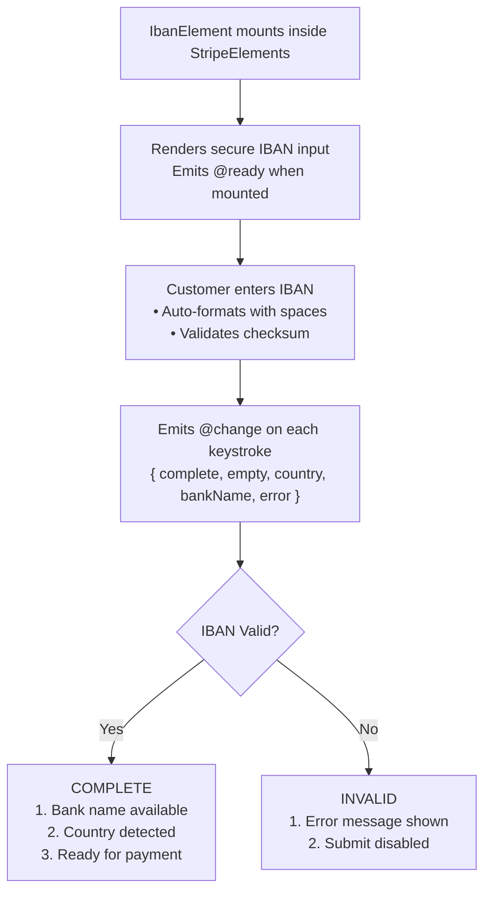

# VueStripeIbanElement

A secure IBAN input field for collecting International Bank Account Numbers for SEPA Direct Debit payments.

::: tip When to Use
Use VueStripeIbanElement for SEPA Direct Debit payments across Europe. For card-based payments, use [VueStripePaymentElement](/api/components/stripe-payment-element) instead.
:::

## What is IBAN Element?

IBAN Element collects bank account information for SEPA payments:

| Capability | Description |
|------------|-------------|
| **IBAN Validation** | Real-time format and checksum validation |
| **Bank Detection** | Automatically identifies the bank from IBAN |
| **Country Detection** | Extracts country code from IBAN prefix |
| **SEPA Support** | Supports all 36 SEPA member countries |
| **Auto-formatting** | Formats IBAN with spaces for readability |

## How It Works



## Usage

```vue
<template>
  <VueStripeProvider :publishable-key="publishableKey">
    <VueStripeElements>
      <VueStripeIbanElement
        :options="ibanOptions"
        @ready="onReady"
        @change="onChange"
      />
    </VueStripeElements>
  </VueStripeProvider>
</template>

<script setup>
import {
  VueStripeProvider,
  VueStripeElements,
  VueStripeIbanElement
} from '@vue-stripe/vue-stripe'

const publishableKey = import.meta.env.VITE_STRIPE_PUBLISHABLE_KEY

const ibanOptions = {
  supportedCountries: ['SEPA'],
  placeholderCountry: 'DE'
}

const onReady = (element) => {
  console.log('IBAN element ready', element)
}

const onChange = (event) => {
  console.log('Complete:', event.complete)
  console.log('Bank:', event.bankName)
  console.log('Country:', event.country)
}
</script>
```

## Props

| Prop | Type | Required | Description |
|------|------|----------|-------------|
| `options` | `StripeIbanElementOptions` | No | IBAN element configuration |

### Options Object

```ts
interface StripeIbanElementOptions {
  supportedCountries?: string[]  // Default: ['SEPA']
  placeholderCountry?: string    // Default: none
  style?: {
    base?: StripeElementStyle
    complete?: StripeElementStyle
    empty?: StripeElementStyle
    invalid?: StripeElementStyle
  }
  disabled?: boolean
  iconStyle?: 'default' | 'solid'
}
```

### Supported Countries

The `supportedCountries` option accepts:

| Value | Description |
|-------|-------------|
| `['SEPA']` | All 36 SEPA countries (default) |
| `['DE', 'FR', 'NL']` | Specific country codes |

### Placeholder Country

The `placeholderCountry` option sets the placeholder format:

| Country | Placeholder Format |
|---------|-------------------|
| `DE` | `DE00 0000 0000 0000 0000 00` |
| `FR` | `FR00 0000 0000 0000 0000 0000 000` |
| `NL` | `NL00 AAAA 0000 0000 00` |
| `AT` | `AT00 0000 0000 0000 0000` |

### Style Properties

```ts
interface StripeElementStyle {
  color?: string
  fontFamily?: string
  fontSize?: string
  fontSmoothing?: string
  fontStyle?: string
  fontWeight?: string
  iconColor?: string
  lineHeight?: string
  letterSpacing?: string
  textAlign?: string
  '::placeholder'?: { color?: string }
  ':focus'?: StripeElementStyle
  ':hover'?: StripeElementStyle
}
```

## Events

| Event | Payload | Description |
|-------|---------|-------------|
| `@ready` | `StripeIbanElement` | Emitted when the element is fully rendered |
| `@change` | `StripeIbanElementChangeEvent` | Emitted when the element value changes |
| `@focus` | - | Emitted when the element gains focus |
| `@blur` | - | Emitted when the element loses focus |

### Change Event

```ts
interface StripeIbanElementChangeEvent {
  elementType: 'iban'
  empty: boolean
  complete: boolean
  country?: string          // e.g., 'DE', 'FR', 'NL'
  bankName?: string         // e.g., 'Deutsche Bank'
  error?: {
    type: string
    code: string
    message: string
  }
}
```

## Slots

### Loading Slot

Rendered while the element is initializing:

```vue
<VueStripeIbanElement>
  <template #loading>
    <div class="skeleton-loader">Loading IBAN input...</div>
  </template>
</VueStripeIbanElement>
```

## Exposed Methods

Access these methods via template ref:

```vue
<script setup>
import { ref } from 'vue'

const ibanRef = ref()

const focusIban = () => ibanRef.value?.focus()
const clearIban = () => ibanRef.value?.clear()
const blurIban = () => ibanRef.value?.blur()
</script>

<template>
  <VueStripeIbanElement ref="ibanRef" />
  <button @click="focusIban">Focus</button>
  <button @click="clearIban">Clear</button>
</template>
```

| Method | Description |
|--------|-------------|
| `focus()` | Focus the IBAN input |
| `blur()` | Blur the IBAN input |
| `clear()` | Clear the IBAN input value |

## Exposed Properties

| Property | Type | Description |
|----------|------|-------------|
| `element` | `Ref<StripeIbanElement \| null>` | The Stripe IBAN element instance |
| `loading` | `Ref<boolean>` | Whether the element is loading |
| `error` | `Ref<string \| null>` | Current error message |

## Examples

### Basic Usage

```vue
<VueStripeIbanElement
  @ready="(el) => console.log('Ready')"
  @change="(e) => console.log('Complete:', e.complete)"
/>
```

### With Custom Options

```vue
<script setup>
const options = {
  supportedCountries: ['SEPA'],
  placeholderCountry: 'DE',
  style: {
    base: {
      fontSize: '16px',
      color: '#424770',
      '::placeholder': {
        color: '#aab7c4'
      }
    },
    invalid: {
      color: '#9e2146'
    }
  }
}
</script>

<template>
  <VueStripeIbanElement :options="options" />
</template>
```

### Tracking Bank Information

```vue
<script setup>
import { ref } from 'vue'

const bankName = ref('')
const country = ref('')
const isComplete = ref(false)

const handleChange = (event) => {
  isComplete.value = event.complete
  bankName.value = event.bankName || ''
  country.value = event.country || ''
}
</script>

<template>
  <VueStripeIbanElement @change="handleChange" />
  <div v-if="bankName">
    Bank: {{ bankName }} ({{ country }})
  </div>
  <button :disabled="!isComplete">Continue</button>
</template>
```

### Complete SEPA Payment Form

```vue
<script setup lang="ts">
import { ref } from 'vue'
import {
  VueStripeProvider,
  VueStripeElements,
  VueStripeIbanElement,
  useStripe,
  useStripeElements
} from '@vue-stripe/vue-stripe'

const publishableKey = import.meta.env.VITE_STRIPE_PUBLISHABLE_KEY

const ibanComplete = ref(false)
const bankName = ref('')
const processing = ref(false)

const handleChange = (event: any) => {
  ibanComplete.value = event.complete
  bankName.value = event.bankName || ''
}

// In a child component inside the provider:
const confirmPayment = async (clientSecret: string) => {
  const { stripe } = useStripe()
  const { elements } = useStripeElements()

  const ibanElement = elements.value?.getElement('iban')

  const { error, paymentIntent } = await stripe.value.confirmSepaDebitPayment(
    clientSecret,
    {
      payment_method: {
        sepa_debit: ibanElement,
        billing_details: {
          name: 'Customer Name',
          email: 'customer@example.com'
        }
      }
    }
  )

  if (error) {
    console.error(error.message)
  } else {
    console.log('Payment status:', paymentIntent.status)
  }
}
</script>

<template>
  <VueStripeProvider :publishable-key="publishableKey">
    <VueStripeElements>
      <form @submit.prevent="confirmPayment(clientSecret)">
        <VueStripeIbanElement
          :options="{ placeholderCountry: 'DE' }"
          @change="handleChange"
        />
        <p v-if="bankName">Bank: {{ bankName }}</p>
        <button :disabled="!ibanComplete || processing">
          Pay with SEPA
        </button>
      </form>
    </VueStripeElements>
  </VueStripeProvider>
</template>
```

## TypeScript

```ts
import { ref } from 'vue'
import { VueStripeIbanElement } from '@vue-stripe/vue-stripe'
import type {
  StripeIbanElement,
  StripeIbanElementChangeEvent,
  StripeIbanElementOptions
} from '@stripe/stripe-js'

// Options
const options: StripeIbanElementOptions = {
  supportedCountries: ['SEPA'],
  placeholderCountry: 'DE',
  style: {
    base: {
      fontSize: '16px'
    }
  }
}

// Event handlers
const handleReady = (element: StripeIbanElement) => {
  console.log('Ready:', element)
}

const handleChange = (event: StripeIbanElementChangeEvent) => {
  console.log('Complete:', event.complete)
  console.log('Country:', event.country)
  console.log('Bank:', event.bankName)
}

// Template ref
const ibanRef = ref<InstanceType<typeof VueStripeIbanElement>>()
```

## Test IBAN Numbers

Use these test IBANs in test mode:

| Country | IBAN | Description |
|---------|------|-------------|
| Germany | `DE89 3704 0044 0532 0130 00` | Standard test |
| France | `FR76 3000 6000 0112 3456 7890 189` | Standard test |
| Netherlands | `NL91 ABNA 0417 1643 00` | Standard test |
| Austria | `AT61 1904 3002 3457 3201` | Standard test |
| Belgium | `BE62 5100 0754 7061` | Standard test |
| Spain | `ES91 2100 0418 4502 0005 1332` | Standard test |
| Italy | `IT60 X054 2811 1010 0000 0123 456` | Standard test |

## Error Handling

| Error | Cause | Solution |
|-------|-------|----------|
| Invalid IBAN checksum | IBAN fails checksum validation | Verify IBAN is entered correctly |
| Unsupported country | Country not in SEPA | Check supportedCountries option |
| Invalid format | IBAN doesn't match expected format | Use correct country format |

## See Also

- [VueStripeElements](/api/components/stripe-elements) - Parent container component
- [useStripeElements](/api/composables/use-stripe-elements) - Access elements in child components
- [IBAN Element Guide](/guide/iban-element) - Step-by-step implementation guide
- [VueStripeIdealBankElement](/api/components/stripe-ideal-bank-element) - Dutch bank payments
