# VueStripeIdealBankElement

A dropdown selector for Dutch banks enabling iDEAL payments, the most popular payment method in the Netherlands.

::: tip When to Use
Use VueStripeIdealBankElement for Dutch customers. iDEAL has over 60% market share in the Netherlands and only supports EUR currency.
:::

## What is iDEAL Bank Element?

iDEAL Bank Element provides a bank selector for Dutch payments:

| Capability | Description |
|------------|-------------|
| **Bank Dropdown** | Pre-populated list of all major Dutch banks |
| **Brand Recognition** | Bank logos and familiar names for customers |
| **Redirect Flow** | Seamless redirect to customer's bank |
| **EUR Only** | Supports Euro currency exclusively |
| **Instant Notification** | Real-time payment confirmation |

## How It Works

```mermaid
flowchart TD
    A["IdealBankElement mounts inside StripeElements"] --> B["Renders bank dropdown<br/>Emits @ready when mounted"]
    B --> C["Customer selects bank from dropdown<br/>• ABN AMRO, ING, Rabobank, etc."]
    C --> D["Emits @change with bank code<br/>{ complete: true, value: 'abn_amro' }"]
    D --> E{Submit form?}
    E -->|Yes| F["stripe.confirmIdealPayment()<br/>with return_url"]
    F --> G["REDIRECT<br/>Customer sent to bank<br/>to authorize payment"]
    G --> H["Customer returns to return_url<br/>with payment result"]
```



## Usage

```vue
<template>
  <VueStripeProvider :publishable-key="publishableKey">
    <VueStripeElements>
      <VueStripeIdealBankElement
        :options="options"
        @ready="onReady"
        @change="onChange"
      />
    </VueStripeElements>
  </VueStripeProvider>
</template>

<script setup>
import {
  VueStripeProvider,
  VueStripeElements,
  VueStripeIdealBankElement
} from '@vue-stripe/vue-stripe'

const publishableKey = import.meta.env.VITE_STRIPE_PUBLISHABLE_KEY

const options = {
  style: {
    base: {
      fontSize: '16px',
      color: '#424770'
    }
  }
}

const onReady = (element) => {
  console.log('iDEAL element ready', element)
}

const onChange = (event) => {
  console.log('Selected bank:', event.value)
  console.log('Complete:', event.complete)
}
</script>
```

## Props

| Prop | Type | Required | Description |
|------|------|----------|-------------|
| `options` | `StripeIdealBankElementOptions` | No | Element configuration |

### Options Object

```ts
interface StripeIdealBankElementOptions {
  style?: {
    base?: StripeElementStyle
    complete?: StripeElementStyle
    empty?: StripeElementStyle
    invalid?: StripeElementStyle
  }
  value?: string  // Pre-select a bank by code
  disabled?: boolean
}
```

### Style Properties

```ts
interface StripeElementStyle {
  color?: string
  fontFamily?: string
  fontSize?: string
  fontWeight?: string
  iconColor?: string
  lineHeight?: string
  letterSpacing?: string
  padding?: string
  '::placeholder'?: { color?: string }
  ':focus'?: StripeElementStyle
  ':hover'?: StripeElementStyle
}
```

## Events

| Event | Payload | Description |
|-------|---------|-------------|
| `@ready` | `StripeIdealBankElement` | Emitted when the element is fully rendered |
| `@change` | `StripeIdealBankElementChangeEvent` | Emitted when bank selection changes |
| `@focus` | - | Emitted when the element gains focus |
| `@blur` | - | Emitted when the element loses focus |

### Change Event

```ts
interface StripeIdealBankElementChangeEvent {
  elementType: 'idealBank'
  empty: boolean
  complete: boolean
  value?: string  // Bank code: 'abn_amro', 'ing', 'rabobank', etc.
}
```

### Bank Codes

| Code | Bank Name |
|------|-----------|
| `abn_amro` | ABN AMRO |
| `asn_bank` | ASN Bank |
| `bunq` | bunq |
| `ing` | ING |
| `knab` | Knab |
| `n26` | N26 |
| `nn` | Nationale-Nederlanden |
| `rabobank` | Rabobank |
| `regiobank` | RegioBank |
| `revolut` | Revolut |
| `sns_bank` | SNS Bank |
| `triodos_bank` | Triodos Bank |
| `van_lanschot` | Van Lanschot |
| `yoursafe` | Yoursafe |

## Slots

### Loading Slot

Rendered while the element is initializing:

```vue
<VueStripeIdealBankElement>
  <template #loading>
    <div class="skeleton-loader">Loading banks...</div>
  </template>
</VueStripeIdealBankElement>
```

## Exposed Methods

Access these methods via template ref:

```vue
<script setup>
import { ref } from 'vue'

const idealRef = ref()

const focusElement = () => idealRef.value?.focus()
const clearElement = () => idealRef.value?.clear()
</script>

<template>
  <VueStripeIdealBankElement ref="idealRef" />
  <button @click="focusElement">Focus</button>
  <button @click="clearElement">Clear Selection</button>
</template>
```

| Method | Description |
|--------|-------------|
| `focus()` | Focus the bank selector |
| `blur()` | Blur the bank selector |
| `clear()` | Clear the selection |

## Exposed Properties

| Property | Type | Description |
|----------|------|-------------|
| `element` | `Ref<StripeIdealBankElement \| null>` | The Stripe element instance |
| `loading` | `Ref<boolean>` | Whether the element is loading |
| `error` | `Ref<string \| null>` | Current error message |

## Examples

### Basic Usage

```vue
<VueStripeIdealBankElement
  @change="(e) => console.log('Bank:', e.value)"
/>
```

### With Custom Styling

```vue
<script setup>
const options = {
  style: {
    base: {
      fontSize: '16px',
      color: '#32325d',
      fontFamily: '"Helvetica Neue", Helvetica, sans-serif',
      padding: '10px 12px'
    }
  }
}
</script>

<template>
  <VueStripeIdealBankElement :options="options" />
</template>
```

### Pre-selecting a Bank

```vue
<VueStripeIdealBankElement
  :options="{ value: 'ing' }"
/>
```

### Complete iDEAL Payment

```vue
<script setup lang="ts">
import { ref } from 'vue'
import {
  VueStripeProvider,
  VueStripeElements,
  VueStripeIdealBankElement,
  useStripe,
  useStripeElements
} from '@vue-stripe/vue-stripe'

const publishableKey = import.meta.env.VITE_STRIPE_PUBLISHABLE_KEY
const selectedBank = ref('')
const isComplete = ref(false)

const handleChange = (event: any) => {
  selectedBank.value = event.value || ''
  isComplete.value = event.complete
}

// In child component inside provider:
const confirmPayment = async (clientSecret: string) => {
  const { stripe } = useStripe()
  const { elements } = useStripeElements()

  const idealElement = elements.value?.getElement('idealBank')

  const { error } = await stripe.value.confirmIdealPayment(
    clientSecret,
    {
      payment_method: {
        ideal: idealElement
      },
      return_url: `${window.location.origin}/payment-complete`
    }
  )

  if (error) {
    console.error(error.message)
  }
  // Customer redirected to bank
}
</script>

<template>
  <VueStripeProvider :publishable-key="publishableKey">
    <VueStripeElements>
      <form @submit.prevent="confirmPayment(clientSecret)">
        <VueStripeIdealBankElement @change="handleChange" />
        <button :disabled="!isComplete">Pay with iDEAL</button>
      </form>
    </VueStripeElements>
  </VueStripeProvider>
</template>
```

### Handling Return URL

```vue
<script setup>
import { onMounted, ref } from 'vue'
import { useStripe } from '@vue-stripe/vue-stripe'

const status = ref<'loading' | 'success' | 'error'>('loading')

onMounted(async () => {
  const params = new URLSearchParams(window.location.search)
  const clientSecret = params.get('payment_intent_client_secret')

  if (clientSecret) {
    const { stripe } = useStripe()
    const { paymentIntent } = await stripe.value.retrievePaymentIntent(clientSecret)

    status.value = paymentIntent.status === 'succeeded' ? 'success' : 'error'
  }
})
</script>
```

## TypeScript

```ts
import { ref } from 'vue'
import { VueStripeIdealBankElement } from '@vue-stripe/vue-stripe'
import type {
  StripeIdealBankElement,
  StripeIdealBankElementChangeEvent,
  StripeIdealBankElementOptions
} from '@stripe/stripe-js'

// Options
const options: StripeIdealBankElementOptions = {
  style: {
    base: {
      fontSize: '16px'
    }
  }
}

// Event handlers
const handleReady = (element: StripeIdealBankElement) => {
  console.log('Ready:', element)
}

const handleChange = (event: StripeIdealBankElementChangeEvent) => {
  console.log('Bank:', event.value)
  console.log('Complete:', event.complete)
}

// Template ref
const idealRef = ref<InstanceType<typeof VueStripeIdealBankElement>>()
```

## Error Handling

| Error | Cause | Solution |
|-------|-------|----------|
| `payment_intent_unexpected_state` | PaymentIntent not in expected state | Check PaymentIntent status |
| `redirect_failed` | Bank redirect failed | Retry the payment |
| `payment_method_not_available` | iDEAL not available | Verify account has iDEAL enabled |

## See Also

- [VueStripeElements](/api/components/stripe-elements) - Parent container component
- [useStripeElements](/api/composables/use-stripe-elements) - Access elements in child components
- [iDEAL Bank Element Guide](/guide/ideal-bank-element) - Step-by-step implementation
- [VueStripeIbanElement](/api/components/stripe-iban-element) - SEPA payments
- [VueStripeP24BankElement](/api/components/stripe-p24-bank-element) - Polish payments
