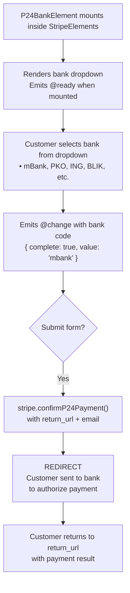

# VueStripeP24BankElement

A dropdown selector for Polish banks enabling Przelewy24 (P24) payments, one of the most popular payment methods in Poland.

::: tip When to Use
Use VueStripeP24BankElement for Polish customers. Przelewy24 supports both PLN and EUR currencies and includes BLIK mobile payments.
:::

## What is P24 Bank Element?

P24 Bank Element provides a bank selector for Polish payments:

| Capability | Description |
|------------|-------------|
| **Bank Dropdown** | Pre-populated list of 24+ Polish banks |
| **BLIK Support** | Includes BLIK mobile payment option |
| **Multi-Currency** | Supports both PLN and EUR |
| **Redirect Flow** | Seamless redirect to customer's bank |
| **Instant Notification** | Real-time payment confirmation |

## How It Works



## Usage

```vue
<template>
  <VueStripeProvider :publishable-key="publishableKey">
    <VueStripeElements>
      <VueStripeP24BankElement
        :options="options"
        @ready="onReady"
        @change="onChange"
      />
    </VueStripeElements>
  </VueStripeProvider>
</template>

<script setup>
import {
  VueStripeProvider,
  VueStripeElements,
  VueStripeP24BankElement
} from '@vue-stripe/vue-stripe'

const publishableKey = import.meta.env.VITE_STRIPE_PUBLISHABLE_KEY

const options = {
  style: {
    base: {
      fontSize: '16px',
      color: '#424770'
    }
  }
}

const onReady = (element) => {
  console.log('P24 element ready', element)
}

const onChange = (event) => {
  console.log('Selected bank:', event.value)
  console.log('Complete:', event.complete)
}
</script>
```

## Props

| Prop | Type | Required | Description |
|------|------|----------|-------------|
| `options` | `StripeP24BankElementOptions` | No | Element configuration |

### Options Object

```ts
interface StripeP24BankElementOptions {
  style?: {
    base?: StripeElementStyle
    complete?: StripeElementStyle
    empty?: StripeElementStyle
    invalid?: StripeElementStyle
  }
  value?: string  // Pre-select a bank by code
  disabled?: boolean
}
```

### Style Properties

```ts
interface StripeElementStyle {
  color?: string
  fontFamily?: string
  fontSize?: string
  fontWeight?: string
  iconColor?: string
  lineHeight?: string
  letterSpacing?: string
  padding?: string
  '::placeholder'?: { color?: string }
  ':focus'?: StripeElementStyle
  ':hover'?: StripeElementStyle
}
```

## Events

| Event | Payload | Description |
|-------|---------|-------------|
| `@ready` | `StripeP24BankElement` | Emitted when the element is fully rendered |
| `@change` | `StripeP24BankElementChangeEvent` | Emitted when bank selection changes |
| `@focus` | - | Emitted when the element gains focus |
| `@blur` | - | Emitted when the element loses focus |

### Change Event

```ts
interface StripeP24BankElementChangeEvent {
  elementType: 'p24Bank'
  empty: boolean
  complete: boolean
  value?: string  // Bank code: 'mbank', 'pko', 'blik', etc.
}
```

### Bank Codes

| Code | Bank Name |
|------|-----------|
| `alior_bank` | Alior Bank |
| `bank_millennium` | Bank Millennium |
| `bank_nowy_bfg` | Bank Nowy BFG S.A. |
| `bank_pekao_sa` | Bank PEKAO S.A. |
| `bank_spoldzielczy` | Bank spółdzielczy |
| `blik` | BLIK |
| `bnp_paribas` | BNP Paribas |
| `boz` | BOŻ |
| `citi_handlowy` | Citi Handlowy |
| `credit_agricole` | Credit Agricole |
| `e_transfer_pocztowy24` | e-Transfer Pocztowy24 |
| `getin_bank` | Getin Bank |
| `idea_bank` | Idea Bank |
| `ing` | ING |
| `inteligo` | inteligo |
| `mbank` | mBank |
| `nest_przelew` | Nest Przelew |
| `noble_pay` | Noble Pay |
| `pko` | PKO Bank Polski |
| `plus_bank` | Plus Bank |
| `santander` | Santander |
| `toyota_bank` | Toyota Bank |
| `velobank` | VeloBank |
| `volkswagen_bank` | Volkswagen Bank |

## Slots

### Loading Slot

Rendered while the element is initializing:

```vue
<VueStripeP24BankElement>
  <template #loading>
    <div class="skeleton-loader">Loading banks...</div>
  </template>
</VueStripeP24BankElement>
```

## Exposed Methods

Access these methods via template ref:

```vue
<script setup>
import { ref } from 'vue'

const p24Ref = ref()

const focusElement = () => p24Ref.value?.focus()
const clearElement = () => p24Ref.value?.clear()
</script>

<template>
  <VueStripeP24BankElement ref="p24Ref" />
  <button @click="focusElement">Focus</button>
  <button @click="clearElement">Clear Selection</button>
</template>
```

| Method | Description |
|--------|-------------|
| `focus()` | Focus the bank selector |
| `blur()` | Blur the bank selector |
| `clear()` | Clear the selection |

## Exposed Properties

| Property | Type | Description |
|----------|------|-------------|
| `element` | `Ref<StripeP24BankElement \| null>` | The Stripe element instance |
| `loading` | `Ref<boolean>` | Whether the element is loading |
| `error` | `Ref<string \| null>` | Current error message |

## Examples

### Basic Usage

```vue
<VueStripeP24BankElement
  @change="(e) => console.log('Bank:', e.value)"
/>
```

### With Custom Styling

```vue
<script setup>
const options = {
  style: {
    base: {
      fontSize: '16px',
      color: '#32325d',
      fontFamily: '"Helvetica Neue", Helvetica, sans-serif',
      padding: '10px 12px'
    }
  }
}
</script>

<template>
  <VueStripeP24BankElement :options="options" />
</template>
```

### Complete P24 Payment

```vue
<script setup lang="ts">
import { ref } from 'vue'
import {
  VueStripeProvider,
  VueStripeElements,
  VueStripeP24BankElement,
  useStripe,
  useStripeElements
} from '@vue-stripe/vue-stripe'

const publishableKey = import.meta.env.VITE_STRIPE_PUBLISHABLE_KEY
const selectedBank = ref('')
const isComplete = ref(false)
const email = ref('')

const handleChange = (event: any) => {
  selectedBank.value = event.value || ''
  isComplete.value = event.complete
}

// In child component inside provider:
const confirmPayment = async (clientSecret: string) => {
  const { stripe } = useStripe()
  const { elements } = useStripeElements()

  const p24Element = elements.value?.getElement('p24Bank')

  const { error } = await stripe.value.confirmP24Payment(
    clientSecret,
    {
      payment_method: {
        p24: p24Element,
        billing_details: {
          email: email.value // Required!
        }
      },
      return_url: `${window.location.origin}/payment-complete`
    }
  )

  if (error) {
    console.error(error.message)
  }
  // Customer redirected to bank
}
</script>

<template>
  <VueStripeProvider :publishable-key="publishableKey">
    <VueStripeElements>
      <form @submit.prevent="confirmPayment(clientSecret)">
        <input v-model="email" type="email" placeholder="Email (required)" />
        <VueStripeP24BankElement @change="handleChange" />
        <button :disabled="!isComplete || !email">Pay with P24</button>
      </form>
    </VueStripeElements>
  </VueStripeProvider>
</template>
```

## TypeScript

```ts
import { ref } from 'vue'
import { VueStripeP24BankElement } from '@vue-stripe/vue-stripe'
import type {
  StripeP24BankElement,
  StripeP24BankElementChangeEvent,
  StripeP24BankElementOptions
} from '@stripe/stripe-js'

// Options
const options: StripeP24BankElementOptions = {
  style: {
    base: {
      fontSize: '16px'
    }
  }
}

// Event handlers
const handleReady = (element: StripeP24BankElement) => {
  console.log('Ready:', element)
}

const handleChange = (event: StripeP24BankElementChangeEvent) => {
  console.log('Bank:', event.value)
  console.log('Complete:', event.complete)
}

// Template ref
const p24Ref = ref<InstanceType<typeof VueStripeP24BankElement>>()
```

## Error Handling

| Error | Cause | Solution |
|-------|-------|----------|
| `payment_intent_unexpected_state` | PaymentIntent not in expected state | Check PaymentIntent status |
| `redirect_failed` | Bank redirect failed | Retry the payment |
| `email_invalid` | Email not provided or invalid | Provide valid email |
| `payment_method_not_available` | P24 not available | Verify account has P24 enabled |

## See Also

- [VueStripeElements](/api/components/stripe-elements) - Parent container component
- [useStripeElements](/api/composables/use-stripe-elements) - Access elements in child components
- [P24 Bank Element Guide](/guide/p24-bank-element) - Step-by-step implementation
- [VueStripeIdealBankElement](/api/components/stripe-ideal-bank-element) - Dutch payments
- [VueStripeEpsBankElement](/api/components/stripe-eps-bank-element) - Austrian payments
