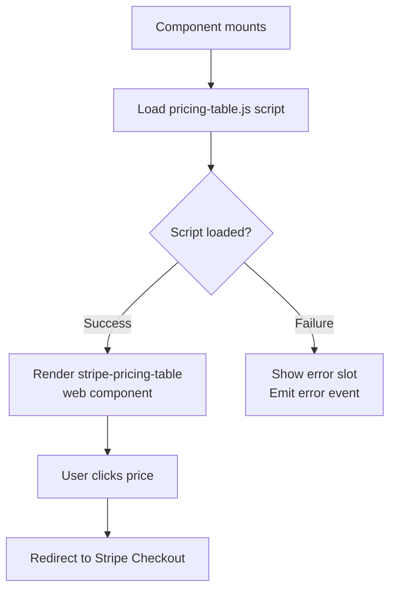

# VueStripePricingTable

Embed a Stripe pricing table for subscription products configured in your Stripe Dashboard.

::: tip No Backend Required
Unlike other Stripe integrations, Pricing Tables require no backend code. Everything is configured in the Stripe Dashboard.
:::

## What is VueStripePricingTable?

The `VueStripePricingTable` component embeds a pricing table web component from Stripe. It:

| Capability | Description |
|------------|-------------|
| **Embeddable pricing** | Display subscription pricing configured in Dashboard |
| **Automatic checkout** | Takes customers directly to Stripe Checkout |
| **Dynamic updates** | Changes in Dashboard reflect automatically |
| **No Elements wrapper** | Uses separate script, not Stripe Elements |

## How It Works



## Usage

```vue
<template>
  <VueStripeProvider :publishable-key="publishableKey">
    <VueStripePricingTable
      :pricing-table-id="pricingTableId"
      :customer-email="userEmail"
      @load="onLoad"
      @error="onError"
    />
  </VueStripeProvider>
</template>

<script setup>
import { VueStripeProvider, VueStripePricingTable } from '@vue-stripe/vue-stripe'

const publishableKey = 'pk_test_...'
const pricingTableId = 'prctbl_1234567890'
const userEmail = 'customer@example.com'

const onLoad = () => console.log('Pricing table loaded')
const onError = (error) => console.error('Error:', error)
</script>
```

## Props

| Prop | Type | Required | Description |
|------|------|----------|-------------|
| `pricingTableId` | `string` | Yes | Pricing table ID from Stripe Dashboard (starts with `prctbl_`) |
| `customerEmail` | `string` | No | Pre-fill customer email in checkout |
| `customerSessionClientSecret` | `string` | No | Client secret from Customer Session API for existing customers |
| `clientReferenceId` | `string` | No | Reference ID for reconciling with your internal systems |

### Props Interface

```ts
interface VueStripePricingTableProps {
  pricingTableId: string
  customerEmail?: string
  customerSessionClientSecret?: string
  clientReferenceId?: string
}
```

## Events

| Event | Payload | Description |
|-------|---------|-------------|
| `@load` | — | Emitted when the pricing table script loads successfully |
| `@error` | `Error` | Emitted when the script fails to load |

### Event Examples

```vue
<script setup>
const handleLoad = () => {
  console.log('Pricing table is ready')
  // Track analytics, hide loading state, etc.
}

const handleError = (error: Error) => {
  console.error('Failed to load pricing table:', error.message)
  // Show fallback UI, report to error tracking
}
</script>

<template>
  <VueStripePricingTable
    pricing-table-id="prctbl_..."
    @load="handleLoad"
    @error="handleError"
  />
</template>
```

## Slots

### Loading Slot

Rendered while the pricing table script is loading:

```vue
<VueStripePricingTable pricing-table-id="prctbl_...">
  <template #loading>
    <div class="loading-spinner">Loading pricing...</div>
  </template>
</VueStripePricingTable>
```

### Error Slot

Rendered when the script fails to load:

```vue
<VueStripePricingTable pricing-table-id="prctbl_...">
  <template #error="{ error }">
    <div class="error-message">
      Failed to load pricing: {{ error }}
      <button @click="retryLoad">Retry</button>
    </div>
  </template>
</VueStripePricingTable>
```

## Exposed Properties

Access component state via template refs:

| Property | Type | Description |
|----------|------|-------------|
| `loading` | `Ref<boolean>` | `true` while script is loading |
| `error` | `Ref<string \| null>` | Error message if script failed to load |

```vue
<script setup>
import { ref, watchEffect } from 'vue'

const pricingTableRef = ref()

watchEffect(() => {
  if (pricingTableRef.value) {
    console.log('Loading:', pricingTableRef.value.loading)
    console.log('Error:', pricingTableRef.value.error)
  }
})
</script>

<template>
  <VueStripePricingTable
    ref="pricingTableRef"
    pricing-table-id="prctbl_..."
  />
</template>
```

## Examples

### Basic Usage

```vue
<VueStripeProvider publishable-key="pk_test_...">
  <VueStripePricingTable pricing-table-id="prctbl_1234567890" />
</VueStripeProvider>
```

### With Pre-filled Email

```vue
<VueStripePricingTable
  pricing-table-id="prctbl_1234567890"
  customer-email="user@example.com"
/>
```

### With Customer Session (Existing Customers)

For returning customers who should see their saved payment methods:

```vue
<script setup>
import { ref, onMounted } from 'vue'

const sessionSecret = ref('')

onMounted(async () => {
  // Fetch from your backend
  const res = await fetch('/api/customer-session', {
    method: 'POST',
    body: JSON.stringify({ customerId: 'cus_xxx' })
  })
  const data = await res.json()
  sessionSecret.value = data.clientSecret
})
</script>

<template>
  <VueStripePricingTable
    v-if="sessionSecret"
    pricing-table-id="prctbl_1234567890"
    :customer-session-client-secret="sessionSecret"
  />
</template>
```

### With Client Reference ID

Track which user initiated the subscription:

```vue
<VueStripePricingTable
  pricing-table-id="prctbl_1234567890"
  :client-reference-id="currentUser.id"
/>
```

### Complete Example with All Features

```vue
<script setup lang="ts">
import { ref, computed } from 'vue'
import { VueStripeProvider, VueStripePricingTable } from '@vue-stripe/vue-stripe'

const publishableKey = import.meta.env.VITE_STRIPE_PK
const pricingTableId = 'prctbl_1234567890'

// User context
const user = ref({
  id: 'user_123',
  email: 'user@example.com'
})

// State tracking
const isReady = ref(false)
const hasError = ref(false)

const handleLoad = () => {
  isReady.value = true
  // Analytics tracking
  analytics.track('pricing_table_viewed')
}

const handleError = (error: Error) => {
  hasError.value = true
  // Error reporting
  errorReporter.capture(error)
}
</script>

<template>
  <div class="pricing-page">
    <h1>Choose Your Plan</h1>

    <VueStripeProvider :publishable-key="publishableKey">
      <VueStripePricingTable
        :pricing-table-id="pricingTableId"
        :customer-email="user.email"
        :client-reference-id="user.id"
        @load="handleLoad"
        @error="handleError"
      >
        <template #loading>
          <div class="skeleton-loader">
            <div class="skeleton-card" />
            <div class="skeleton-card" />
            <div class="skeleton-card" />
          </div>
        </template>

        <template #error="{ error }">
          <div class="error-container">
            <p>Unable to load pricing options.</p>
            <p class="error-details">{{ error }}</p>
            <button @click="() => location.reload()">
              Refresh Page
            </button>
          </div>
        </template>
      </VueStripePricingTable>
    </VueStripeProvider>

    <p v-if="isReady" class="pricing-help">
      All plans include a 14-day free trial
    </p>
  </div>
</template>
```

## Error Handling

| Error | Cause | Solution |
|-------|-------|----------|
| Script load failed | Network error, CSP blocking | Check network, add Stripe to CSP |
| Missing provider | Not wrapped in VueStripeProvider | Add VueStripeProvider wrapper |
| Invalid pricing table ID | Typo or deleted table | Verify ID in Stripe Dashboard |

### Error Recovery Pattern

```vue
<script setup>
import { ref } from 'vue'

const retryCount = ref(0)
const maxRetries = 3

const handleError = (error: Error) => {
  if (retryCount.value < maxRetries) {
    retryCount.value++
    // Force remount by changing key
    tableKey.value++
  }
}

const tableKey = ref(0)
</script>

<template>
  <VueStripePricingTable
    :key="tableKey"
    pricing-table-id="prctbl_..."
    @error="handleError"
  />
</template>
```

## TypeScript

```ts
import { VueStripeProvider, VueStripePricingTable } from '@vue-stripe/vue-stripe'
import type { VueStripePricingTableProps } from '@vue-stripe/vue-stripe'

// Type-safe props
const props: VueStripePricingTableProps = {
  pricingTableId: 'prctbl_1234567890',
  customerEmail: 'user@example.com',
  clientReferenceId: 'user_123'
}

// Event handlers
const handleLoad = () => void
const handleError = (error: Error) => void
```

## See Also

- [Pricing Table Guide](/guide/pricing-table) — Step-by-step tutorial
- [VueStripeProvider](/api/components/stripe-provider) — Required wrapper component
- [VueStripeCheckout](/api/components/stripe-checkout) — For one-time payments
- [Stripe Pricing Tables Docs](https://docs.stripe.com/payments/checkout/pricing-table) — Official documentation
