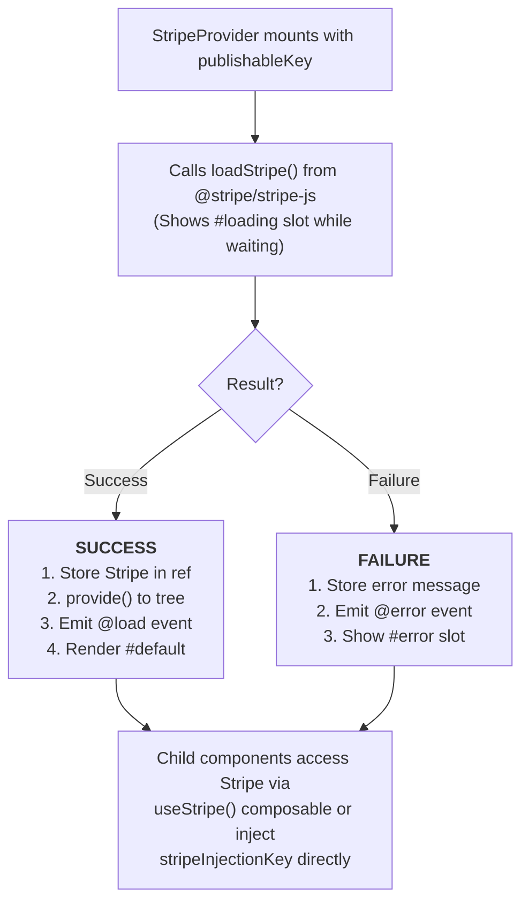

# VueStripeProvider

The root component that loads Stripe.js and provides the Stripe instance to all descendant components.

## What is StripeProvider?

StripeProvider is the foundation of any Vue Stripe integration. It handles:

| Capability | Description |
|------------|-------------|
| **Stripe.js Loading** | Asynchronously loads Stripe.js from Stripe's CDN |
| **Instance Management** | Creates and manages the Stripe instance lifecycle |
| **Context Provision** | Makes Stripe available to all child components via Vue's provide/inject |
| **Error Handling** | Catches and exposes loading errors for graceful degradation |

## How It Works



## Usage

```vue
<template>
  <VueStripeProvider
    :publishable-key="publishableKey"
    @load="onLoad"
    @error="onError"
  >
    <!-- Your payment components -->
  </VueStripeProvider>
</template>

<script setup>
import { VueStripeProvider } from '@vue-stripe/vue-stripe'

const publishableKey = import.meta.env.VITE_STRIPE_PUBLISHABLE_KEY

const onLoad = (stripe) => {
  console.log('Stripe loaded!', stripe)
}

const onError = (error) => {
  console.error('Failed to load Stripe:', error)
}
</script>
```

## Props

| Prop | Type | Required | Description |
|------|------|----------|-------------|
| `publishableKey` | `string` | Yes* | Your Stripe publishable key |
| `stripeKey` | `string` | Yes* | Alias for `publishableKey` (backwards compatibility) |
| `stripeAccount` | `string` | No | Connected account ID for Stripe Connect |
| `apiVersion` | `string` | No | Override Stripe API version |
| `locale` | `string` | No | Locale for Stripe.js (e.g., 'en', 'es', 'fr') |
| `options` | `object` | No | Additional Stripe initialization options |

\* Either `publishableKey` or `stripeKey` is required.

### Options Object

```ts
interface StripeProviderOptions {
  stripeAccount?: string
  apiVersion?: string
  locale?: string
}
```

## Events

| Event | Payload | Description |
|-------|---------|-------------|
| `@load` | `Stripe` | Emitted when Stripe.js loads successfully |
| `@error` | `Error` | Emitted when Stripe.js fails to load |

## Slots

### Default Slot

Rendered when Stripe is ready:

```vue
<VueStripeProvider :publishable-key="key">
  <MyPaymentForm />
</VueStripeProvider>
```

### Loading Slot

Rendered while Stripe.js is loading:

```vue
<VueStripeProvider :publishable-key="key">
  <template #loading>
    <div class="spinner">Loading payment form...</div>
  </template>

  <MyPaymentForm />
</VueStripeProvider>
```

### Error Slot

Rendered when Stripe.js fails to load:

```vue
<VueStripeProvider :publishable-key="key">
  <template #error="{ error }">
    <div class="error">
      Failed to load payment form: {{ error }}
    </div>
  </template>

  <MyPaymentForm />
</VueStripeProvider>
```

## Provides

StripeProvider uses Vue's `provide` to make these values available to descendants:

| Key | Type | Description |
|-----|------|-------------|
| `stripe` | `Ref<Stripe \| null>` | The Stripe instance |
| `loading` | `Ref<boolean>` | Whether Stripe is loading |
| `error` | `Ref<string \| null>` | Error message if loading failed |

Access these values using the [useStripe](/api/composables/use-stripe) composable.

## Examples

### Basic Usage

```vue
<VueStripeProvider :publishable-key="pk_test_...">
  <VueStripeElements :client-secret="secret">
    <VueStripePaymentElement />
  </VueStripeElements>
</VueStripeProvider>
```

### With Stripe Connect

```vue
<VueStripeProvider
  :publishable-key="pk_test_..."
  stripe-account="acct_1234567890"
>
  <!-- Payments go to connected account -->
</VueStripeProvider>
```

### With Custom Locale

```vue
<VueStripeProvider
  :publishable-key="pk_test_..."
  locale="es"
>
  <!-- Stripe Elements will be in Spanish -->
</VueStripeProvider>
```

### With All Slots

```vue
<VueStripeProvider
  :publishable-key="publishableKey"
  @load="onStripeLoad"
  @error="onStripeError"
>
  <template #loading>
    <LoadingSpinner message="Connecting to payment provider..." />
  </template>

  <template #error="{ error }">
    <ErrorMessage
      :message="error"
      @retry="retryLoad"
    />
  </template>

  <PaymentForm />
</VueStripeProvider>
```

## Error Handling

StripeProvider handles these error cases:

| Error | Cause | Solution |
|-------|-------|----------|
| Missing key | No `publishableKey` or `stripeKey` provided | Provide a valid key |
| Invalid key | Key doesn't start with `pk_` | Check your API keys in Stripe Dashboard |
| Network error | Failed to load Stripe.js from CDN | Check network, use `@error` to show retry option |

```vue
<script setup>
const handleError = (error) => {
  if (error.message.includes('network')) {
    // Show retry button
  } else if (error.message.includes('Invalid')) {
    // Configuration error - log to monitoring
  }
}
</script>
```

## TypeScript

```ts
import { VueStripeProvider } from '@vue-stripe/vue-stripe'
import type { Stripe } from '@stripe/stripe-js'

const onLoad = (stripe: Stripe) => {
  // stripe is fully typed
}
```

## See Also

- [useStripe](/api/composables/use-stripe) - Access Stripe instance in child components
- [StripeElements](/api/components/stripe-elements) - Create Elements instance
- [Architecture Guide](/guide/architecture) - Understand the component hierarchy
