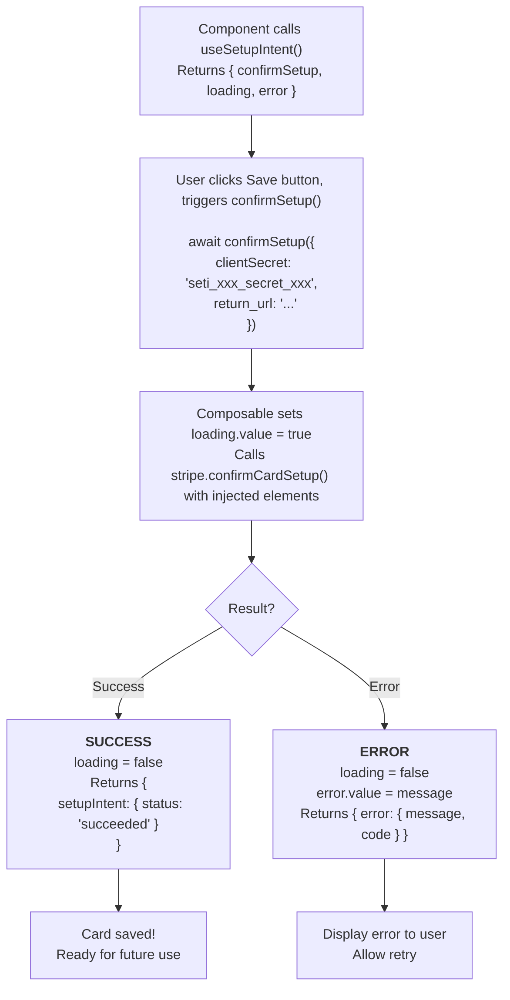

# useSetupIntent

A composable for saving payment methods for future use with Stripe SetupIntents.

## What is useSetupIntent?

A composable that simplifies saving payment methods with built-in state management:

| Capability | Description |
|------------|-------------|
| **Setup Confirmation** | Wraps `stripe.confirmCardSetup()` with error handling |
| **Loading State** | Tracks whether setup confirmation is in progress |
| **Error State** | Captures and exposes setup errors |
| **Auto Elements Injection** | Automatically uses Elements from context |
| **Redirect Handling** | Supports both redirect and inline confirmation flows |

## SetupIntent vs PaymentIntent

| Intent Type | Purpose | When to Use |
|-------------|---------|-------------|
| **SetupIntent** | Save payment method for later | Subscriptions, future purchases, card on file |
| **PaymentIntent** | Charge immediately | One-time purchases, checkout |

::: tip Key Difference
SetupIntent saves the card without charging. PaymentIntent charges immediately.
:::

## How It Works



::: tip Usage Context
This composable must be called within a component that is a descendant of `VueStripeProvider`. If used within `VueStripeElements`, the elements instance is automatically injected.
:::

## Usage

```vue
<script setup>
import { useSetupIntent } from '@vue-stripe/vue-stripe'

const { confirmSetup, loading, error } = useSetupIntent()

const handleSaveCard = async (clientSecret: string) => {
  const result = await confirmSetup({
    clientSecret,
    return_url: window.location.href
  })

  if (result.error) {
    console.error('Setup failed:', result.error.message)
  } else if (result.setupIntent?.status === 'succeeded') {
    console.log('Card saved successfully!')
  }
}
</script>
```

## Return Value

```ts
interface UseSetupIntentReturn {
  confirmSetup: (options: ConfirmSetupOptions) => Promise<ConfirmSetupResult>
  loading: Readonly<Ref<boolean>>
  error: Readonly<Ref<string | null>>
}
```

| Property | Type | Description |
|----------|------|-------------|
| `confirmSetup` | `Function` | Async function to confirm a setup intent |
| `loading` | `Readonly<Ref<boolean>>` | Whether setup confirmation is in progress |
| `error` | `Readonly<Ref<string \| null>>` | Error message from the last confirmation attempt |

## confirmSetup Options

```ts
interface ConfirmSetupOptions {
  /** Client secret from the SetupIntent (required) */
  clientSecret: string

  /** URL to redirect after successful setup */
  return_url?: string

  /** Payment method to use */
  payment_method?: string

  /** Payment method data */
  payment_method_data?: {
    billing_details?: {
      name?: string
      email?: string
      phone?: string
      address?: {
        line1?: string
        line2?: string
        city?: string
        state?: string
        postal_code?: string
        country?: string
      }
    }
  }

  /** Override injected elements (optional) */
  elements?: StripeElements
}
```

## confirmSetup Result

```ts
interface ConfirmSetupResult {
  setupIntent?: {
    id: string
    status: 'succeeded' | 'processing' | 'requires_action' | 'requires_confirmation' | 'requires_payment_method' | 'canceled'
    client_secret: string
    payment_method: string | null
    // ... other SetupIntent fields
  }
  error?: {
    type: string
    code?: string
    message: string
    decline_code?: string
    param?: string
  }
}
```

## Examples

### Basic Card Save

```vue
<script setup>
import { ref } from 'vue'
import { useSetupIntent } from '@vue-stripe/vue-stripe'

const { confirmSetup, loading, error } = useSetupIntent()
const savedCard = ref(false)

const handleSave = async () => {
  const result = await confirmSetup({
    clientSecret: 'seti_xxx_secret_xxx',
    return_url: `${window.location.origin}/account/cards`
  })

  if (result.error) {
    console.error(result.error.message)
  } else if (result.setupIntent?.status === 'succeeded') {
    savedCard.value = true
  }
}
</script>

<template>
  <div>
    <button @click="handleSave" :disabled="loading">
      {{ loading ? 'Saving...' : 'Save Card' }}
    </button>
    <p v-if="error" class="error">{{ error }}</p>
    <p v-if="savedCard" class="success">Card saved successfully!</p>
  </div>
</template>
```

### Without Redirect (Inline Flow)

```vue
<script setup>
import { useSetupIntent } from '@vue-stripe/vue-stripe'

const { confirmSetup, loading, error } = useSetupIntent()

const handleSave = async (clientSecret: string) => {
  const result = await confirmSetup({
    clientSecret,
    return_url: window.location.href // Required but won't redirect for basic cards
  })

  if (result.setupIntent?.status === 'succeeded') {
    // Handle success inline without redirect
    showSuccessMessage()
  }
}
</script>
```

### With Billing Details

```vue
<script setup>
import { ref } from 'vue'
import { useSetupIntent } from '@vue-stripe/vue-stripe'

const { confirmSetup } = useSetupIntent()

const customerName = ref('')
const customerEmail = ref('')

const handleSave = async (clientSecret: string) => {
  const result = await confirmSetup({
    clientSecret,
    return_url: window.location.href,
    payment_method_data: {
      billing_details: {
        name: customerName.value,
        email: customerEmail.value
      }
    }
  })

  if (result.error) {
    console.error(result.error.message)
  }
}
</script>
```

### Complete Setup Form

```vue
<script setup>
import { ref } from 'vue'
import {
  VueStripeProvider,
  VueStripeElements,
  VueStripePaymentElement
} from '@vue-stripe/vue-stripe'

const publishableKey = 'pk_test_...'
const setupSecret = ref('') // SetupIntent client_secret from your backend

const isComplete = ref(false)
const setupStatus = ref<'idle' | 'processing' | 'success' | 'error'>('idle')
const errorMessage = ref('')
</script>

<template>
  <VueStripeProvider :publishable-key="publishableKey">
    <VueStripeElements :client-secret="setupSecret">
      <VueStripePaymentElement @change="e => isComplete = e.complete" />
      <SetupFormButton
        :client-secret="setupSecret"
        :disabled="!isComplete"
        @success="setupStatus = 'success'"
        @error="msg => { setupStatus = 'error'; errorMessage = msg }"
      />
    </VueStripeElements>
  </VueStripeProvider>

  <div v-if="setupStatus === 'success'" class="success">
    Card saved for future use!
  </div>
  <div v-if="setupStatus === 'error'" class="error">
    {{ errorMessage }}
  </div>
</template>
```

```vue
<!-- SetupFormButton.vue -->
<script setup lang="ts">
import { useSetupIntent } from '@vue-stripe/vue-stripe'

const props = defineProps<{
  clientSecret: string
  disabled: boolean
}>()

const emit = defineEmits<{
  success: []
  error: [message: string]
}>()

const { confirmSetup, loading } = useSetupIntent()

const handleSubmit = async () => {
  const result = await confirmSetup({
    clientSecret: props.clientSecret,
    return_url: window.location.href
  })

  if (result.error) {
    emit('error', result.error.message || 'Setup failed')
  } else if (result.setupIntent?.status === 'succeeded') {
    emit('success')
  }
}
</script>

<template>
  <button
    @click="handleSubmit"
    :disabled="disabled || loading"
    class="save-button"
  >
    {{ loading ? 'Saving...' : 'Save Card' }}
  </button>
</template>
```

### Subscription Setup Flow

Common pattern for saving a card before starting a subscription:

```vue
<script setup>
import { ref } from 'vue'
import {
  VueStripeProvider,
  VueStripeElements,
  VueStripePaymentElement,
  useSetupIntent
} from '@vue-stripe/vue-stripe'

const publishableKey = 'pk_test_...'
const setupSecret = ref('') // From: POST /create-setup-intent

// Step 1: Create SetupIntent on mount
onMounted(async () => {
  const response = await fetch('/api/create-setup-intent', {
    method: 'POST',
    headers: { 'Content-Type': 'application/json' },
    body: JSON.stringify({ customer_id: customerId })
  })
  const data = await response.json()
  setupSecret.value = data.client_secret
})

// SetupForm component (inside StripeElements)
const SetupForm = {
  setup() {
    const { confirmSetup, loading, error } = useSetupIntent()

    const handleSave = async () => {
      const result = await confirmSetup({
        clientSecret: setupSecret.value,
        return_url: `${window.location.origin}/subscribe?step=confirm`
      })

      if (result.setupIntent?.status === 'succeeded') {
        // Step 2: Create subscription with saved payment method
        await createSubscription(result.setupIntent.payment_method)
      }
    }

    return { handleSave, loading, error }
  }
}
</script>
```

## TypeScript

```ts
import { useSetupIntent } from '@vue-stripe/vue-stripe'
import type {
  SetupIntent,
  StripeError
} from '@stripe/stripe-js'

const { confirmSetup, loading, error } = useSetupIntent()

// Type-safe result handling
const handleSetup = async (clientSecret: string) => {
  const result = await confirmSetup({
    clientSecret,
    return_url: window.location.href
  })

  // result.setupIntent is typed as SetupIntent | undefined
  // result.error is typed as StripeError | undefined

  if (result.setupIntent) {
    const { id, status, payment_method } = result.setupIntent
    console.log(`Setup ${id}: ${status}, PM: ${payment_method}`)
  }
}
```

## Error Handling

The composable handles errors in two ways:

1. **Stripe API errors** - Returned in `result.error` and stored in `error.value`
2. **Exceptions** - Caught internally and returned as `{ error: { message: string } }`

```vue
<script setup>
import { useSetupIntent } from '@vue-stripe/vue-stripe'

const { confirmSetup, error } = useSetupIntent()

const handleSave = async (clientSecret: string) => {
  const result = await confirmSetup({
    clientSecret,
    return_url: window.location.href
  })

  if (result.error) {
    // Check error type
    switch (result.error.type) {
      case 'card_error':
        // Card was declined
        console.error('Card declined:', result.error.message)
        break
      case 'validation_error':
        // Invalid parameters
        console.error('Validation error:', result.error.message)
        break
      default:
        console.error('Setup error:', result.error.message)
    }
  }
}
</script>
```

## Common Error Codes

| Code | Description |
|------|-------------|
| `card_declined` | The card was declined |
| `expired_card` | The card has expired |
| `incorrect_cvc` | The CVC is incorrect |
| `processing_error` | Processing error occurred |
| `setup_intent_authentication_failure` | Authentication failed |

## Use Cases

| Scenario | Description |
|----------|-------------|
| **Subscriptions** | Save card before creating a recurring subscription |
| **Future Purchases** | Store card for one-click checkout later |
| **Card on File** | Allow customers to manage saved payment methods |
| **Free Trials** | Collect card during trial, charge when trial ends |

## Requirements

| Requirement | Details |
|-------------|---------|
| **StripeProvider** | Must be used within StripeProvider context |
| **SetupIntent** | Need a SetupIntent client_secret from your backend |
| **StripeElements** | Optional - elements auto-injected if available |

## Creating a SetupIntent (Backend)

```js
// Node.js example
const stripe = require('stripe')('sk_test_...')

const setupIntent = await stripe.setupIntents.create({
  customer: 'cus_xxx', // Optional: attach to customer
  payment_method_types: ['card'],
})

// Return setupIntent.client_secret to frontend
```

## See Also

- [StripePaymentElement](/api/components/stripe-payment-element) - Payment UI component
- [StripeElements](/api/components/stripe-elements) - Elements container
- [usePaymentIntent](/api/composables/use-payment-intent) - For immediate charges
- [Stripe SetupIntents Docs](https://stripe.com/docs/payments/setup-intents) - Official guide
