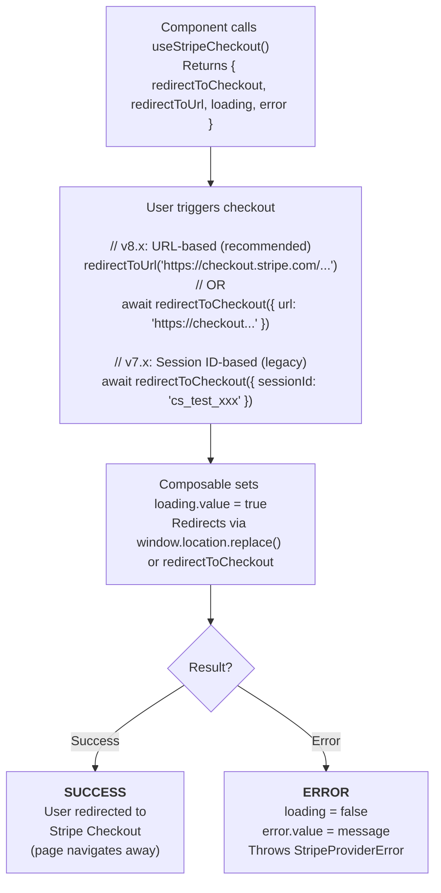

# useStripeCheckout

A composable for programmatically redirecting users to Stripe's hosted checkout page.

::: warning @stripe/stripe-js v8.x Compatibility
In `@stripe/stripe-js` v8.x, the `redirectToCheckout` method was removed. Use `redirectToUrl()` or `redirectToCheckout({ url })` with the Checkout Session URL from your backend instead.
:::

## What is useStripeCheckout?

A composable for Stripe Checkout with built-in state management:

| Capability | Description |
|------------|-------------|
| **URL Redirect** | Redirect using session URL (v8.x compatible) |
| **Legacy Redirect** | Wraps `stripe.redirectToCheckout()` (v7.x only) |
| **Loading State** | Tracks whether redirect is in progress |
| **Error State** | Captures and exposes checkout errors |

## How It Works



::: tip Usage Context
This composable must be called within a component that is a descendant of `VueStripeProvider`. It does not require `VueStripeElements`.
:::

## Usage

### v8.x (Recommended)

```vue
<script setup>
import { ref, onMounted } from 'vue'
import { useStripeCheckout } from '@vue-stripe/vue-stripe'

const { redirectToUrl, loading, error } = useStripeCheckout()
const sessionUrl = ref('')

onMounted(async () => {
  const response = await fetch('/api/create-checkout-session', {
    method: 'POST',
    body: JSON.stringify({ priceId: 'price_xxx' })
  })
  const data = await response.json()
  sessionUrl.value = data.url // Backend returns session URL
})

const handleCheckout = () => {
  redirectToUrl(sessionUrl.value)
}
</script>

<template>
  <button @click="handleCheckout" :disabled="loading || !sessionUrl">
    {{ loading ? 'Redirecting...' : 'Checkout' }}
  </button>
</template>
```

### v7.x (Legacy)

```vue
<script setup>
import { useStripeCheckout } from '@vue-stripe/vue-stripe'

const { redirectToCheckout, loading, error } = useStripeCheckout()

const handleCheckout = async () => {
  try {
    await redirectToCheckout({
      sessionId: 'cs_test_xxx'
    })
  } catch (err) {
    console.error('Checkout failed:', err.message)
  }
}
</script>
```

## Return Value

```ts
interface UseStripeCheckoutReturn {
  redirectToCheckout: (options: CheckoutRedirectOptions | LegacyCheckoutOptions) => Promise<void>
  redirectToUrl: (url: string) => void
  loading: Readonly<Ref<boolean>>
  error: Readonly<Ref<string | null>>
}
```

| Property | Type | Description |
|----------|------|-------------|
| `redirectToUrl` | `(url: string) => void` | Redirect using session URL **(v8.x, recommended)** |
| `redirectToCheckout` | `Function` | Redirect with options (supports both v7.x and v8.x) |
| `loading` | `Readonly<Ref<boolean>>` | Whether redirect is in progress |
| `error` | `Readonly<Ref<string \| null>>` | Error message from the last redirect attempt |

## redirectToCheckout Options

### URL-Based Options (v8.x Compatible)

```ts
interface CheckoutRedirectOptions {
  /** Checkout Session URL from your backend */
  url: string
}
```

### Session-Based Options (v7.x Only)

```ts
interface LegacyCheckoutOptions {
  /** Checkout Session ID from your backend */
  sessionId?: string

  /** Line items to purchase */
  lineItems?: Array<{
    price: string
    quantity: number
  }>

  /** Checkout mode */
  mode?: 'payment' | 'subscription' | 'setup'

  /** Redirect URL after successful payment */
  successUrl?: string

  /** Redirect URL when user cancels */
  cancelUrl?: string
}
```

::: warning v7.x Only
`sessionId`, `lineItems`, and other legacy options require `stripe.redirectToCheckout()` which was removed in `@stripe/stripe-js` v8.x. Use `url` or `redirectToUrl()` for v8.x compatibility.
:::

## Examples

### URL-Based Checkout (v8.x)

```vue
<script setup>
import { ref, onMounted } from 'vue'
import { useStripeCheckout } from '@vue-stripe/vue-stripe'

const { redirectToUrl, loading, error } = useStripeCheckout()
const sessionUrl = ref('')

onMounted(async () => {
  const response = await fetch('/api/create-checkout-session', {
    method: 'POST',
    body: JSON.stringify({ priceId: 'price_xxx' })
  })
  const data = await response.json()
  sessionUrl.value = data.url // Backend returns session URL
})

const handleCheckout = () => {
  redirectToUrl(sessionUrl.value)
}
</script>

<template>
  <button @click="handleCheckout" :disabled="loading || !sessionUrl">
    {{ loading ? 'Redirecting...' : 'Checkout' }}
  </button>
  <p v-if="error" class="error">{{ error }}</p>
</template>
```

### Session-Based Checkout (v7.x)

```vue
<script setup>
import { ref, onMounted } from 'vue'
import { useStripeCheckout } from '@vue-stripe/vue-stripe'

const { redirectToCheckout, loading, error } = useStripeCheckout()
const sessionId = ref('')

// Create session on mount
onMounted(async () => {
  const response = await fetch('/api/create-checkout-session', {
    method: 'POST',
    body: JSON.stringify({ priceId: 'price_xxx' })
  })
  const data = await response.json()
  sessionId.value = data.sessionId
})

const handleCheckout = async () => {
  try {
    await redirectToCheckout({ sessionId: sessionId.value })
  } catch (err) {
    // User stays on page if redirect fails
    console.error('Checkout failed:', err.message)
  }
}
</script>

<template>
  <button @click="handleCheckout" :disabled="loading || !sessionId">
    {{ loading ? 'Redirecting...' : 'Checkout' }}
  </button>
  <p v-if="error" class="error">{{ error }}</p>
</template>
```

### Multiple Products

```vue
<script setup>
import { useStripeCheckout } from '@vue-stripe/vue-stripe'

const { redirectToCheckout, loading } = useStripeCheckout()

// Shopping cart items
const cart = ref([
  { priceId: 'price_shirt', quantity: 2 },
  { priceId: 'price_hat', quantity: 1 }
])

const handleCheckout = async () => {
  await redirectToCheckout({
    lineItems: cart.value.map(item => ({
      price: item.priceId,
      quantity: item.quantity
    })),
    mode: 'payment',
    successUrl: `${window.location.origin}/order-complete`,
    cancelUrl: `${window.location.origin}/cart`
  })
}
</script>
```

### With Customer Email Pre-fill

```vue
<script setup>
import { useStripeCheckout } from '@vue-stripe/vue-stripe'

const { redirectToCheckout } = useStripeCheckout()
const userEmail = 'customer@example.com' // From your auth system

const handleCheckout = async () => {
  await redirectToCheckout({
    sessionId: 'cs_test_xxx',
    customerEmail: userEmail
  })
}
</script>
```

### Complete Integration Example

```vue
<script setup>
import { ref, onMounted } from 'vue'
import { VueStripeProvider, useStripeCheckout } from '@vue-stripe/vue-stripe'

const publishableKey = import.meta.env.VITE_STRIPE_PUBLISHABLE_KEY
const selectedPlan = ref('')
const isCreatingSession = ref(false)

const plans = [
  { id: 'basic', name: 'Basic', priceId: 'price_basic', price: '$9/mo' },
  { id: 'pro', name: 'Pro', priceId: 'price_pro', price: '$29/mo' },
  { id: 'enterprise', name: 'Enterprise', priceId: 'price_enterprise', price: '$99/mo' }
]
</script>

<template>
  <VueStripeProvider :publishable-key="publishableKey">
    <CheckoutHandler :plans="plans" />
  </VueStripeProvider>
</template>
```

```vue
<!-- CheckoutHandler.vue -->
<script setup>
import { useStripeCheckout } from '@vue-stripe/vue-stripe'

const props = defineProps<{ plans: Array<{ id: string; name: string; priceId: string; price: string }> }>()

const { redirectToCheckout, loading, error } = useStripeCheckout()

const handleSelectPlan = async (priceId: string) => {
  try {
    // Option 1: Create session on backend (recommended)
    const response = await fetch('/api/create-checkout-session', {
      method: 'POST',
      headers: { 'Content-Type': 'application/json' },
      body: JSON.stringify({ priceId })
    })
    const { sessionId } = await response.json()

    await redirectToCheckout({ sessionId })

    // Option 2: Price-based (simpler but less secure)
    // await redirectToCheckout({
    //   lineItems: [{ price: priceId, quantity: 1 }],
    //   mode: 'subscription',
    //   successUrl: `${window.location.origin}/welcome`,
    //   cancelUrl: window.location.href
    // })
  } catch (err) {
    console.error('Failed to start checkout:', err.message)
  }
}
</script>

<template>
  <div class="pricing-grid">
    <div v-for="plan in plans" :key="plan.id" class="plan-card">
      <h3>{{ plan.name }}</h3>
      <p class="price">{{ plan.price }}</p>
      <button @click="handleSelectPlan(plan.priceId)" :disabled="loading">
        {{ loading ? 'Processing...' : 'Select Plan' }}
      </button>
    </div>
  </div>
  <p v-if="error" class="error">{{ error }}</p>
</template>
```

## TypeScript

```ts
import { useStripeCheckout } from '@vue-stripe/vue-stripe'
import type { RedirectToCheckoutOptions } from '@stripe/stripe-js'

const { redirectToCheckout, loading, error } = useStripeCheckout()

// Session-based (recommended)
const sessionCheckout = async (sessionId: string) => {
  const options: RedirectToCheckoutOptions = { sessionId }
  await redirectToCheckout(options)
}

// Price-based
const priceCheckout = async (priceId: string) => {
  const options: RedirectToCheckoutOptions = {
    lineItems: [{ price: priceId, quantity: 1 }],
    mode: 'payment',
    successUrl: 'https://example.com/success',
    cancelUrl: 'https://example.com/cancel'
  }
  await redirectToCheckout(options)
}
```

## Error Handling

The composable handles errors in two ways:

1. **Stripe Redirect Errors** - Stored in `error.value` and thrown
2. **Initialization Errors** - Thrown immediately

```vue
<script setup>
import { useStripeCheckout } from '@vue-stripe/vue-stripe'

const { redirectToCheckout, loading, error } = useStripeCheckout()

const handleCheckout = async () => {
  try {
    await redirectToCheckout({ sessionId: 'cs_test_xxx' })
    // If successful, user is redirected (this line won't execute)
  } catch (err) {
    // User stays on page
    if (err.message.includes('Session expired')) {
      // Refresh the session
      await refreshCheckoutSession()
    } else if (err.message.includes('Stripe not initialized')) {
      // Stripe hasn't loaded yet
      console.error('Please wait for Stripe to load')
    } else {
      console.error('Checkout error:', err.message)
    }
  }
}
</script>
```

## Common Errors

| Error | Cause | Solution |
|-------|-------|----------|
| `Stripe not initialized` | Stripe hasn't loaded | Wait for StripeProvider to load |
| `Session expired` | Session too old | Create a new session |
| `Invalid session` | Wrong session ID | Check session ID format |
| `Redirect failed` | Network or Stripe error | Show retry option |

## useStripeCheckout vs StripeCheckout Component

| Aspect | useStripeCheckout | StripeCheckout Component |
|--------|-------------------|--------------------------|
| **Use Case** | Custom UI, programmatic control | Quick integration |
| **UI** | You build it | Pre-styled button |
| **Flexibility** | Full control | Limited customization |
| **Code** | More code | Less code |

Use **useStripeCheckout** when you need custom checkout triggers (e.g., form submission, multi-step flow).
Use **StripeCheckout** component for simple button-click checkout.

## Requirements

| Requirement | Details |
|-------------|---------|
| **StripeProvider** | Must be used within StripeProvider context |
| **Checkout Session** | Need a session ID or valid Price ID |
| **No StripeElements** | Does not require StripeElements wrapper |

## Creating Checkout Sessions (Backend)

```js
// Node.js example
const stripe = require('stripe')('sk_test_...')

app.post('/create-checkout-session', async (req, res) => {
  const session = await stripe.checkout.sessions.create({
    payment_method_types: ['card'],
    line_items: [
      {
        price: req.body.priceId,
        quantity: 1
      }
    ],
    mode: 'payment', // or 'subscription'
    success_url: 'https://example.com/success?session_id={CHECKOUT_SESSION_ID}',
    cancel_url: 'https://example.com/cancel'
  })

  // v8.x: Return URL (recommended)
  res.json({ url: session.url })

  // v7.x: Return session ID (legacy)
  // res.json({ sessionId: session.id })
})
```

## See Also

- [StripeCheckout](/api/components/stripe-checkout) - Pre-built checkout button component
- [StripeProvider](/api/components/stripe-provider) - Required parent component
- [Checkout Guide](/guide/checkout) - Step-by-step implementation guide
- [Stripe Checkout Docs](https://stripe.com/docs/payments/checkout) - Official documentation
