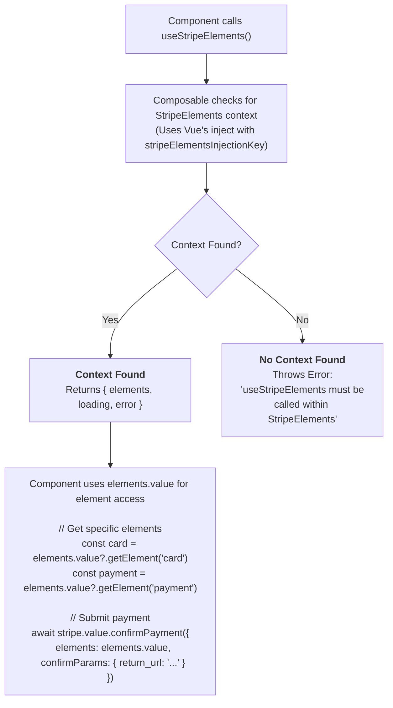

# useStripeElements

Access the Stripe Elements instance from any component within `VueStripeElements`.

## What is useStripeElements?

A composable that provides access to the Stripe Elements instance from any child component:

| Capability | Description |
|------------|-------------|
| **Elements Instance Access** | Get the StripeElements instance for element retrieval |
| **Element Retrieval** | Access individual elements via `getElement()` method |
| **Loading State** | Know when Elements is still initializing |
| **Error State** | Detect if Elements creation failed |
| **Payment Submission** | Pass elements to `confirmPayment()` for checkout |

## How It Works



## Usage

```vue
<script setup>
import { useStripeElements } from '@vue-stripe/vue-stripe'

// Must be called inside a component that's within StripeElements
const { elements, loading, error } = useStripeElements()
</script>
```

## Return Value

| Property | Type | Description |
|----------|------|-------------|
| `elements` | `Readonly<Ref<VueStripeElements \| null>>` | The Elements instance |
| `loading` | `Readonly<Ref<boolean>>` | True while Elements is initializing |
| `error` | `Readonly<Ref<string \| null>>` | Error message if initialization failed |

All return values are **readonly refs**.

## Examples

### Basic Usage

```vue
<script setup>
import { useStripe, useStripeElements } from '@vue-stripe/vue-stripe'

const { stripe } = useStripe()
const { elements } = useStripeElements()

const handleSubmit = async () => {
  if (!stripe.value || !elements.value) return

  const { error } = await stripe.value.confirmPayment({
    elements: elements.value,
    confirmParams: {
      return_url: 'https://example.com/complete'
    }
  })
}
</script>
```

### Getting a Specific Element

```vue
<script setup>
import { useStripeElements } from '@vue-stripe/vue-stripe'

const { elements } = useStripeElements()

const focusCard = () => {
  const cardElement = elements.value?.getElement('card')
  cardElement?.focus()
}

const clearCard = () => {
  const cardElement = elements.value?.getElement('card')
  cardElement?.clear()
}
</script>
```

### Submitting Elements

For Payment Element, use the Elements instance directly with `confirmPayment`:

```vue
<script setup>
import { useStripe, useStripeElements } from '@vue-stripe/vue-stripe'

const { stripe } = useStripe()
const { elements } = useStripeElements()

const pay = async () => {
  const { error } = await stripe.value!.confirmPayment({
    elements: elements.value!,
    confirmParams: {
      return_url: window.location.href
    }
  })

  if (error) {
    console.error(error.message)
  }
}
</script>
```

### Getting Element Data

Retrieve data from elements for validation:

```vue
<script setup>
import { ref } from 'vue'
import { useStripeElements } from '@vue-stripe/vue-stripe'

const { elements } = useStripeElements()
const cardComplete = ref(false)

// The Payment Element emits change events that you can listen to
// But you can also check elements directly
const checkElements = () => {
  if (!elements.value) return

  // For card element
  const cardElement = elements.value.getElement('card')
  // Note: getElement returns the element but not its state
  // Use the @change event on components to track completeness
}
</script>
```

## Error Handling

`useStripeElements()` throws if called outside of `VueStripeElements`:

```vue
<!-- ❌ Wrong - outside StripeElements -->
<script setup>
const { elements } = useStripeElements() // Throws error
</script>

<template>
  <VueStripeProvider :publishable-key="key">
    <VueStripeElements :client-secret="secret">
      <MyPaymentForm />
    </VueStripeElements>
  </VueStripeProvider>
</template>
```

```vue
<!-- ✅ Correct - inside StripeElements -->
<!-- MyPaymentForm.vue -->
<script setup>
const { elements } = useStripeElements() // Works!
</script>

<!-- Parent.vue -->
<template>
  <VueStripeProvider :publishable-key="key">
    <VueStripeElements :client-secret="secret">
      <MyPaymentForm />
    </VueStripeElements>
  </VueStripeProvider>
</template>
```

## Element Types

You can retrieve different element types:

```ts
// Get elements by type
const paymentElement = elements.value?.getElement('payment')
const cardElement = elements.value?.getElement('card')
const cardNumberElement = elements.value?.getElement('cardNumber')
const cardExpiryElement = elements.value?.getElement('cardExpiry')
const cardCvcElement = elements.value?.getElement('cardCvc')
const expressCheckoutElement = elements.value?.getElement('expressCheckout')
const addressElement = elements.value?.getElement('address')
const linkAuthenticationElement = elements.value?.getElement('linkAuthentication')
```

## TypeScript

```ts
import { useStripeElements } from '@vue-stripe/vue-stripe'
import type {
  StripeElements,
  StripeCardElement,
  StripePaymentElement
} from '@stripe/stripe-js'

const { elements, loading, error } = useStripeElements()

// Get typed elements
const getCardElement = (): StripeCardElement | null => {
  return elements.value?.getElement('card') || null
}

const getPaymentElement = (): StripePaymentElement | null => {
  return elements.value?.getElement('payment') || null
}
```

## Common Patterns

### Safe Elements Access

```ts
const submitPayment = async () => {
  const e = elements.value
  const s = stripe.value

  if (!e || !s) {
    console.error('Stripe or Elements not ready')
    return
  }

  // Both are now non-null
  const { error } = await s.confirmPayment({
    elements: e,
    confirmParams: { return_url: '...' }
  })
}
```

### With Card Element

```ts
const confirmCardPayment = async (clientSecret: string) => {
  const s = stripe.value
  const e = elements.value

  if (!s || !e) return

  const cardElement = e.getElement('card')
  if (!cardElement) return

  const { error, paymentIntent } = await s.confirmCardPayment(
    clientSecret,
    {
      payment_method: {
        card: cardElement,
        billing_details: {
          name: 'Customer Name'
        }
      }
    }
  )

  return { error, paymentIntent }
}
```

## See Also

- [StripeElements](/api/components/stripe-elements) - The Elements provider component
- [useStripe](/api/composables/use-stripe) - Access Stripe instance
- [Payment Element Guide](/guide/payment-element) - Using Payment Element
