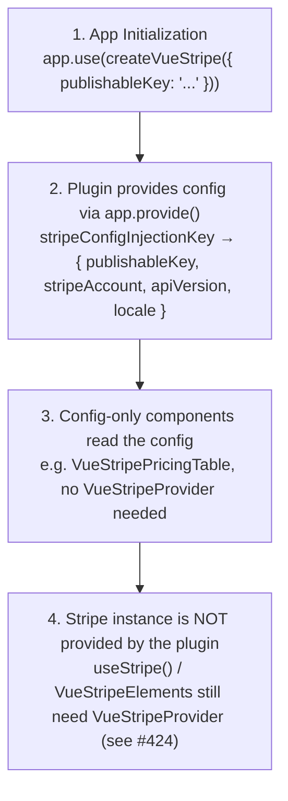

# createVueStripe Plugin

A Vue plugin that provides app-wide Stripe configuration under a shared injection key.

## What is createVueStripe?

`createVueStripe` is a Vue plugin factory that provides global Stripe configuration to your entire application. It registers your options under the shared config injection key, so config-only components such as `VueStripePricingTable` work without an explicit `VueStripeProvider`.

The plugin provides **configuration only** — it does not yet supply a reactive Stripe instance to `useStripe()` or `VueStripeElements`. Those still require a `VueStripeProvider` wrapper. A full plugin-level global provider is tracked in [issue #424](https://github.com/vue-stripe/vue-stripe/issues/424).

| Feature | Description |
|---------|-------------|
| **Global Config** | Configure Stripe once at app initialization |
| **Shared Injection Key** | Config is provided under the same key components inject |
| **Config Only** | Does not supply a Stripe instance (see [#424](https://github.com/vue-stripe/vue-stripe/issues/424)) |
| **SSR Safe** | No Stripe.js is loaded at install time |

## When to Use

| Scenario | Use Plugin | Use StripeProvider |
|----------|------------|-------------------|
| Single Stripe account for entire app | ✅ | ✅ |
| Multiple Stripe accounts (Connect) | ❌ | ✅ |
| Need to change keys at runtime | ❌ | ✅ |
| Want simpler component trees | ✅ | ❌ |
| SSR with hydration | ⚠️ Careful | ✅ Easier |

::: tip When to Choose
Use **createVueStripe** for simple apps with a single Stripe account.
Use **StripeProvider** when you need runtime configuration or Stripe Connect.
:::

## How It Works



## Installation

```ts
// main.ts
import { createApp } from 'vue'
import { createVueStripe } from '@vue-stripe/vue-stripe'
import App from './App.vue'

const app = createApp(App)

app.use(createVueStripe({
  publishableKey: import.meta.env.VITE_STRIPE_PUBLISHABLE_KEY
}))

app.mount('#app')
```

## Options

```ts
import type { StripeConstructorOptions } from '@stripe/stripe-js'

interface VueStripeOptions {
  /** Stripe publishable key (required) */
  publishableKey: string

  /** Connected account ID for Stripe Connect (optional) */
  stripeAccount?: string

  /** Stripe API version (optional) */
  apiVersion?: string

  /** Locale for Stripe elements (optional) */
  locale?: StripeConstructorOptions['locale']
}
```

| Option | Type | Required | Description |
|--------|------|----------|-------------|
| `publishableKey` | `string` | Yes | Your Stripe publishable key (`pk_test_...` or `pk_live_...`) |
| `stripeAccount` | `string` | No | Connected account ID for Stripe Connect (`acct_...`) |
| `apiVersion` | `string` | No | Stripe API version (e.g., `'2023-10-16'`) |
| `locale` | `StripeConstructorOptions['locale']` | No | Locale for Stripe Elements UI — a constrained union of Stripe-supported locales (`'auto'`, `'en'`, `'fr'`, `'de'`, etc.) |

## Provided Values

The plugin calls `app.provide()` once, registering the configuration under the shared config injection key. The provided value is the config derived from your options (`publishableKey`, `stripeAccount`, `apiVersion`, `locale`):

```ts
// Provided value shape (under the shared config injection key)
{
  publishableKey: '...',
  stripeAccount: '...', // optional
  apiVersion: '...',    // optional
  locale: '...'         // optional
}
```

Config-only components such as `VueStripePricingTable` read this value internally, so they work without an explicit `VueStripeProvider`.

::: warning No Stripe instance
The plugin does not supply a reactive Stripe instance. To access `stripe` via `useStripe()` or render `VueStripeElements`, wrap your tree in `VueStripeProvider`. A plugin-level global provider is tracked in [issue #424](https://github.com/vue-stripe/vue-stripe/issues/424).
:::

## Usage Examples

### Basic Usage

```ts
// main.ts
import { createApp } from 'vue'
import { createVueStripe } from '@vue-stripe/vue-stripe'

const app = createApp(App)

app.use(createVueStripe({
  publishableKey: 'pk_test_...'
}))

app.mount('#app')
```

### With All Options

```ts
app.use(createVueStripe({
  publishableKey: 'pk_test_...',
  stripeAccount: 'acct_...', // For Stripe Connect
  apiVersion: '2023-10-16',
  locale: 'fr'
}))
```

### Accessing Stripe in Components

The plugin provides configuration only — it does not expose a Stripe instance. To access `stripe`, wrap your tree in `VueStripeProvider` and read it with `useStripe()`:

```vue
<script setup lang="ts">
import { VueStripeProvider } from '@vue-stripe/vue-stripe'
</script>

<template>
  <VueStripeProvider publishable-key="pk_test_...">
    <CheckoutForm />
  </VueStripeProvider>
</template>
```

```vue
<!-- CheckoutForm.vue -->
<script setup lang="ts">
import { useStripe } from '@vue-stripe/vue-stripe'

const { stripe, loading, error } = useStripe()
</script>

<template>
  <div v-if="loading">Loading Stripe...</div>
  <div v-else-if="error">{{ error }}</div>
  <div v-else-if="stripe">Stripe ready!</div>
</template>
```

::: tip
`useStripe()` returns `{ stripe, loading, error, initialize }`. It requires a `VueStripeProvider` ancestor; the plugin alone is not sufficient (see [#424](https://github.com/vue-stripe/vue-stripe/issues/424)).
:::

### With StripeElements

`VueStripeElements` requires a Stripe instance from `VueStripeProvider`, so render it inside the provider:

```vue
<script setup lang="ts">
import { ref } from 'vue'
import {
  VueStripeProvider,
  VueStripeElements,
  VueStripePaymentElement
} from '@vue-stripe/vue-stripe'

const clientSecret = ref('pi_xxx_secret_xxx')
</script>

<template>
  <VueStripeProvider publishable-key="pk_test_...">
    <VueStripeElements :client-secret="clientSecret">
      <VueStripePaymentElement />
    </VueStripeElements>
  </VueStripeProvider>
</template>
```

::: warning Note
The plugin does not supply a Stripe instance to `VueStripeElements`. Use `VueStripeProvider` to provide the Stripe instance to the element tree (see [#424](https://github.com/vue-stripe/vue-stripe/issues/424)).
:::

## TypeScript

```ts
import { createVueStripe } from '@vue-stripe/vue-stripe'
import type { VueStripeOptions } from '@vue-stripe/vue-stripe'

const options: VueStripeOptions = {
  publishableKey: 'pk_test_...',
  stripeAccount: 'acct_...',
  apiVersion: '2023-10-16',
  locale: 'en'
}

app.use(createVueStripe(options))
```

### Accessing Stripe via the Provider

The plugin provides config only, so the Stripe instance is accessed through `VueStripeProvider` + `useStripe()`:

```ts
import { useStripe } from '@vue-stripe/vue-stripe'
import type { Stripe } from '@stripe/stripe-js'

// stripe is Readonly<Ref<Stripe | null>>; requires a VueStripeProvider ancestor
const { stripe, loading, error, initialize } = useStripe()
```

## Comparison with StripeProvider

| Feature | createVueStripe | StripeProvider |
|---------|-----------------|----------------|
| Configuration | Once at app init | Per component tree |
| Provides Stripe instance | No (config only, see [#424](https://github.com/vue-stripe/vue-stripe/issues/424)) | Yes (on mount) |
| Multiple Accounts | No | Yes (nested providers) |
| Runtime Key Changes | No | Yes (reactive prop) |
| Component Wrapper | Required for Stripe access | Required |
| Composables | `useStripe()` (needs provider) | Built-in `useStripe()` |
| SSR Handling | No Stripe load at install | Built-in |

## Best Practices

### Do

```ts
// ✅ Use environment variables
app.use(createVueStripe({
  publishableKey: import.meta.env.VITE_STRIPE_PUBLISHABLE_KEY
}))

// ✅ Use a constrained locale value
app.use(createVueStripe({
  publishableKey: import.meta.env.VITE_STRIPE_PUBLISHABLE_KEY,
  locale: 'auto'
}))

// ✅ Access Stripe through VueStripeProvider + useStripe()
const { stripe, loading, error } = useStripe()
```

### Don't

```ts
// ❌ Don't hardcode keys
app.use(createVueStripe({
  publishableKey: 'pk_live_actual_key_here'
}))

// ❌ Don't expect the plugin to provide a Stripe instance
// The plugin provides config only; wrap your tree in VueStripeProvider (see #424)

// ❌ Don't use for Stripe Connect with multiple accounts
// Use StripeProvider instead for dynamic stripeAccount
```

## SSR Considerations

Installing the plugin is SSR-safe because it only calls `app.provide()` with your config — no Stripe.js is loaded at install time. The Stripe instance is loaded client-side by `VueStripeProvider`, which only initializes Stripe in the browser:

```vue
<script setup lang="ts">
import { VueStripeProvider } from '@vue-stripe/vue-stripe'
</script>

<template>
  <!-- Stripe.js loads on the client; safe to render during SSR -->
  <VueStripeProvider publishable-key="pk_test_...">
    <CheckoutForm />
  </VueStripeProvider>
</template>
```

## See Also

- [Installation Guide](/guide/installation) — Setup for different frameworks
- [StripeProvider](/api/components/stripe-provider) — Component-based alternative
- [useStripe](/api/composables/use-stripe) — Composable for accessing Stripe
