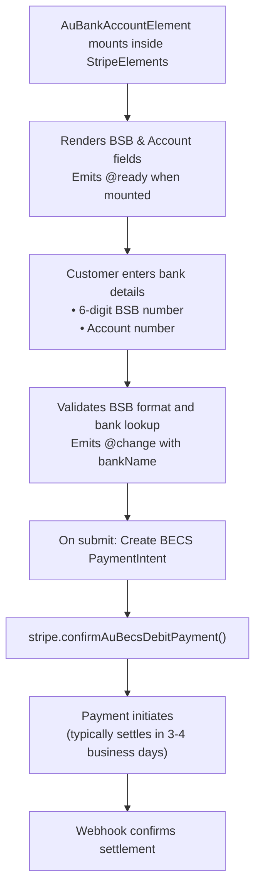

# AU Bank Account Element

The AU Bank Account Element collects Australian bank account details (BSB and account number) for BECS Direct Debit payments. BECS (Bulk Electronic Clearing System) is Australia's primary direct debit payment system.

::: tip Australia Only
BECS Direct Debit is exclusively for Australian bank accounts. For other APAC countries, see [FPX Bank Element](/guide/fpx-bank-element) (Malaysia). For European options, see [IBAN Element](/guide/iban-element) (SEPA).
:::

## Why Use BECS Direct Debit?

| Feature | Benefit |
|---------|---------|
| **Recurring Payments** | Ideal for subscriptions and recurring billing |
| **Lower Fees** | Significantly lower than card transaction fees |
| **No Expiration** | Bank accounts don't expire like cards |
| **AUD Support** | Native Australian Dollar transactions |
| **All Major Banks** | Works with all Australian banks |

## When to Use AU Bank Account Element

| Scenario | Description |
|----------|-------------|
| **Subscriptions** | Recurring payments for Australian customers |
| **B2B Payments** | Business-to-business transactions |
| **High-value transactions** | Avoid card limits and reduce fees |
| **AUD transactions** | BECS only supports Australian Dollars |

## How It Works



## Required Components

| Component | Role |
|-----------|------|
| `VueStripeProvider` | Loads Stripe.js and provides stripe instance |
| `VueStripeElements` | Creates Elements instance |
| `VueStripeAuBankAccountElement` | Renders BSB and account number fields |

## Basic Implementation

### Step 1: Set Up the Component

```vue
<script setup>
import {
  VueStripeProvider,
  VueStripeElements,
  VueStripeAuBankAccountElement
} from '@vue-stripe/vue-stripe'

const publishableKey = import.meta.env.VITE_STRIPE_PUBLISHABLE_KEY
</script>

<template>
  <VueStripeProvider :publishable-key="publishableKey">
    <VueStripeElements>
      <VueStripeAuBankAccountElement
        @ready="onReady"
        @change="onChange"
      />
    </VueStripeElements>
  </VueStripeProvider>
</template>
```

### Step 2: Handle Input Changes

```vue{7-14}
<script setup>
import { ref } from 'vue'

const isComplete = ref(false)
const bankName = ref('')

const onChange = (event) => {
  isComplete.value = event.complete
  if (event.bankName) {
    bankName.value = event.bankName
    console.log('Bank identified:', event.bankName)
  }
}
</script>
```

**What's happening:**
- The `@change` event fires as the user enters bank details
- `event.bankName` provides the bank name (looked up from BSB)
- `event.branchName` provides the branch name
- `event.complete` is true when both BSB and account number are valid

## Bank Identification

When a valid BSB is entered, Stripe looks up the bank:

| Change Event Property | Description |
|----------------------|-------------|
| `bankName` | Full bank name (e.g., "Commonwealth Bank of Australia") |
| `branchName` | Branch name for the BSB |
| `complete` | Whether both fields are valid |
| `empty` | Whether the fields are empty |

## Confirming BECS Payments

BECS payments require customer agreement to the Direct Debit Request Service Agreement:

### Backend Endpoint

```typescript
// POST /api/becs-intent
import Stripe from 'stripe'

const stripe = new Stripe(process.env.STRIPE_SECRET_KEY)

export async function POST(request: Request) {
  const { amount } = await request.json()

  const paymentIntent = await stripe.paymentIntents.create({
    amount,
    currency: 'aud', // BECS only supports AUD
    payment_method_types: ['au_becs_debit'],
  })

  return Response.json({
    clientSecret: paymentIntent.client_secret
  })
}
```

### Frontend Confirmation

```vue
<script setup>
import { useStripe, useStripeElements } from '@vue-stripe/vue-stripe'

const { stripe } = useStripe()
const { elements } = useStripeElements()

const handleSubmit = async (clientSecret: string) => {
  const auBankAccountElement = elements.value?.getElement('auBankAccount')

  const { error, paymentIntent } = await stripe.value.confirmAuBecsDebitPayment(
    clientSecret,
    {
      payment_method: {
        au_becs_debit: auBankAccountElement,
        billing_details: {
          name: 'Customer Name',
          email: 'customer@example.com'
        }
      }
    }
  )

  if (error) {
    console.error(error.message)
  } else if (paymentIntent.status === 'processing') {
    console.log('Payment is processing - will settle in 3-4 business days')
  }
}
</script>
```

::: warning Mandate Agreement Required
BECS Direct Debit requires displaying the Direct Debit Request Service Agreement and collecting customer consent. Include the mandate text in your payment form.
:::

## Displaying the Mandate Agreement

Australian regulations require displaying the Direct Debit Request Service Agreement:

```vue
<template>
  <div class="mandate-agreement">
    <p>
      By providing your bank account details and confirming this payment, you agree
      to this Direct Debit Request and the
      <a href="https://stripe.com/au-becs-dd-service-agreement/legal" target="_blank">
        Direct Debit Request service agreement
      </a>,
      and authorise Stripe Payments Australia Pty Ltd ACN 160 180 343 Direct Debit User ID
      number 507156 ("Stripe") to debit your account through the Bulk Electronic Clearing
      System (BECS) on behalf of <strong>{{ businessName }}</strong> (the "Merchant") for
      any amounts separately communicated to you by the Merchant.
    </p>
  </div>
</template>
```

## Payment Settlement

BECS payments don't confirm instantly like cards:

| Status | Meaning | Typical Timing |
|--------|---------|----------------|
| `processing` | Payment initiated | Immediate |
| `succeeded` | Payment successful | 3-4 business days |
| `requires_payment_method` | Payment failed | 3-4 business days |

Use webhooks to track the actual settlement:

```typescript
// Webhook handler
export async function POST(request: Request) {
  const event = await stripe.webhooks.constructEvent(/*...*/)

  switch (event.type) {
    case 'payment_intent.succeeded':
      // BECS payment settled successfully
      break
    case 'payment_intent.payment_failed':
      // BECS payment failed
      break
  }
}
```

## Customization

### Custom Styling

```vue
<script setup>
const auBankOptions = {
  style: {
    base: {
      fontSize: '16px',
      color: '#424770',
      fontFamily: '-apple-system, BlinkMacSystemFont, sans-serif',
      '::placeholder': {
        color: '#aab7c4'
      }
    }
  },
  iconStyle: 'solid', // or 'default'
  hideIcon: false
}
</script>

<template>
  <VueStripeAuBankAccountElement :options="auBankOptions" />
</template>
```

### Icon Options

| Option | Values | Default |
|--------|--------|---------|
| `iconStyle` | `'default'`, `'solid'` | `'default'` |
| `hideIcon` | `true`, `false` | `false` |

## Complete Example

```vue
<script setup lang="ts">
import { ref } from 'vue'
import {
  VueStripeProvider,
  VueStripeElements,
  VueStripeAuBankAccountElement,
  useStripe,
  useStripeElements
} from '@vue-stripe/vue-stripe'

const publishableKey = import.meta.env.VITE_STRIPE_PUBLISHABLE_KEY

const isComplete = ref(false)
const bankName = ref('')
const branchName = ref('')
const processing = ref(false)
const error = ref('')
const customerName = ref('')
const customerEmail = ref('')
const mandateAccepted = ref(false)

const businessName = 'Your Business Name'

const auBankOptions = {
  style: {
    base: {
      fontSize: '16px',
      color: '#424770'
    }
  },
  iconStyle: 'solid' as const
}

const handleChange = (event: any) => {
  isComplete.value = event.complete
  if (event.bankName) {
    bankName.value = event.bankName
  }
  if (event.branchName) {
    branchName.value = event.branchName
  }
}

const handleSubmit = async () => {
  if (!mandateAccepted.value) {
    error.value = 'Please accept the Direct Debit agreement'
    return
  }

  processing.value = true
  error.value = ''

  try {
    // Fetch clientSecret from backend
    const response = await fetch('/api/becs-intent', {
      method: 'POST',
      headers: { 'Content-Type': 'application/json' },
      body: JSON.stringify({ amount: 1000 })
    })
    const { clientSecret } = await response.json()

    // Confirm payment (would be in child component with useStripe)
    // ... confirm BECS payment
  } catch (e) {
    error.value = 'Failed to process payment'
  } finally {
    processing.value = false
  }
}
</script>

<template>
  <div class="becs-form">
    <VueStripeProvider :publishable-key="publishableKey">
      <VueStripeElements>
        <form @submit.prevent="handleSubmit">
          <div class="field">
            <label>Full Name</label>
            <input
              v-model="customerName"
              type="text"
              placeholder="John Smith"
              required
            />
          </div>

          <div class="field">
            <label>Email</label>
            <input
              v-model="customerEmail"
              type="email"
              placeholder="john@example.com"
              required
            />
          </div>

          <div class="field">
            <label>Bank Account (BSB & Account Number)</label>
            <VueStripeAuBankAccountElement
              :options="auBankOptions"
              @change="handleChange"
            />
          </div>

          <div v-if="bankName" class="bank-info">
            <strong>{{ bankName }}</strong>
            <span v-if="branchName"> - {{ branchName }}</span>
          </div>

          <!-- Mandate Agreement -->
          <div class="mandate">
            <label class="checkbox-label">
              <input
                v-model="mandateAccepted"
                type="checkbox"
              />
              <span>
                By providing your bank account details and confirming this payment,
                you agree to this Direct Debit Request and the
                <a href="https://stripe.com/au-becs-dd-service-agreement/legal" target="_blank">
                  Direct Debit Request service agreement
                </a>.
              </span>
            </label>
          </div>

          <div v-if="error" class="error">{{ error }}</div>

          <button
            type="submit"
            :disabled="!isComplete || !mandateAccepted || processing"
          >
            {{ processing ? 'Processing...' : 'Pay with BECS Direct Debit' }}
          </button>

          <p class="note">
            BECS Direct Debit payments typically settle in 3-4 business days.
          </p>
        </form>
      </VueStripeElements>
    </VueStripeProvider>
  </div>
</template>

<style scoped>
.becs-form {
  max-width: 400px;
  margin: 0 auto;
}

.field {
  margin-bottom: 16px;
}

.field label {
  display: block;
  margin-bottom: 8px;
  font-weight: 500;
}

.field input {
  width: 100%;
  padding: 10px 12px;
  border: 1px solid #e0e0e0;
  border-radius: 4px;
  font-size: 16px;
}

.bank-info {
  margin-bottom: 16px;
  padding: 8px 12px;
  background: #e8f5e9;
  border-radius: 4px;
  font-size: 14px;
  color: #2e7d32;
}

.mandate {
  margin-bottom: 16px;
  padding: 12px;
  background: #f5f5f5;
  border-radius: 4px;
  font-size: 12px;
}

.checkbox-label {
  display: flex;
  gap: 8px;
  cursor: pointer;
}

.checkbox-label input {
  width: auto;
}

button {
  width: 100%;
  padding: 12px;
  background: #002d5b;
  color: white;
  border: none;
  border-radius: 4px;
  font-size: 16px;
  cursor: pointer;
}

button:disabled {
  opacity: 0.5;
  cursor: not-allowed;
}

.error {
  color: #9e2146;
  margin-bottom: 16px;
}

.note {
  margin-top: 16px;
  font-size: 12px;
  color: #666;
  text-align: center;
}
</style>
```

## Next Steps

- [FPX Bank Element](/guide/fpx-bank-element) — Malaysian bank payments
- [IBAN Element](/guide/iban-element) — SEPA Direct Debit for EU
- [Payment Element](/guide/payment-element) — Unified payment method selector
- [API Reference](/api/components/stripe-au-bank-account-element) — Full props, events, and options
