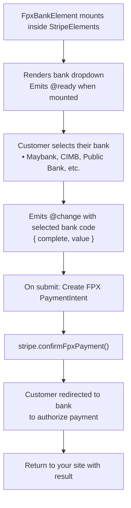

# FPX Bank Element

The FPX Bank Element displays a dropdown of Malaysian banks for FPX (Financial Process Exchange) payments. FPX is Malaysia's national real-time online banking system.

::: tip Malaysia Only
FPX is exclusively for Malaysian bank customers. For other APAC countries, see [AU Bank Account Element](/guide/au-bank-account-element) (Australia). For European options, see [iDEAL](/guide/ideal-bank-element) (Netherlands) or [IBAN](/guide/iban-element) (SEPA).
:::

## Why Use FPX?

| Feature | Benefit |
|---------|---------|
| **Market Leader** | Dominant payment method in Malaysia |
| **Bank Coverage** | Supports 16+ Malaysian banks |
| **Instant Confirmation** | Real-time payment notification |
| **Lower Fees** | Typically lower than card transaction fees |
| **MYR Transactions** | Native Malaysian Ringgit support |

## When to Use FPX Element

| Scenario | Description |
|----------|-------------|
| **Malaysian customers** | Primary payment method in Malaysia |
| **E-commerce** | Online purchases by Malaysian shoppers |
| **MYR transactions** | FPX only supports Malaysian Ringgit |

## How It Works



## Required Components

| Component | Role |
|-----------|------|
| `VueStripeProvider` | Loads Stripe.js and provides stripe instance |
| `VueStripeElements` | Creates Elements instance |
| `VueStripeFpxBankElement` | Renders the Malaysian bank dropdown |

## Basic Implementation

### Step 1: Set Up the Component

```vue
<script setup>
import {
  VueStripeProvider,
  VueStripeElements,
  VueStripeFpxBankElement
} from '@vue-stripe/vue-stripe'

const publishableKey = import.meta.env.VITE_STRIPE_PUBLISHABLE_KEY
</script>

<template>
  <VueStripeProvider :publishable-key="publishableKey">
    <VueStripeElements>
      <VueStripeFpxBankElement
        account-holder-type="individual"
        @ready="onReady"
        @change="onChange"
      />
    </VueStripeElements>
  </VueStripeProvider>
</template>
```

::: warning Required Prop
The `account-holder-type` prop is required by Stripe and must be either `'individual'` or `'company'`. It defaults to `'individual'` if not specified.
:::

### Step 2: Handle Bank Selection

```vue{7-12}
<script setup>
import { ref } from 'vue'

const selectedBank = ref('')
const isComplete = ref(false)

const onChange = (event) => {
  isComplete.value = event.complete
  selectedBank.value = event.value || ''
  console.log('Selected bank:', selectedBank.value)
}
</script>
```

**What's happening:**
- The `@change` event fires when a bank is selected
- `event.value` contains the bank code (e.g., `'affin_bank'`, `'maybank2u'`)
- `event.complete` is true when a bank is selected

## Supported Malaysian Banks

| Bank Code | Bank Name | Type |
|-----------|-----------|------|
| `affin_bank` | Affin Bank | Commercial bank |
| `agrobank` | Agrobank | Development bank |
| `alliance_bank` | Alliance Bank | Commercial bank |
| `ambank` | AmBank | Commercial bank |
| `bank_islam` | Bank Islam | Islamic bank |
| `bank_muamalat` | Bank Muamalat | Islamic bank |
| `bank_rakyat` | Bank Rakyat | Cooperative bank |
| `bsn` | BSN (Bank Simpanan Nasional) | National savings bank |
| `cimb` | CIMB Bank | Commercial bank |
| `hong_leong_bank` | Hong Leong Bank | Commercial bank |
| `hsbc` | HSBC Bank | Foreign bank |
| `kfh` | KFH (Kuwait Finance House) | Islamic bank |
| `maybank2u` | Maybank | Commercial bank |
| `ocbc` | OCBC Bank | Foreign bank |
| `public_bank` | Public Bank | Commercial bank |
| `rhb` | RHB Bank | Commercial bank |
| `standard_chartered` | Standard Chartered | Foreign bank |
| `uob` | UOB Bank | Foreign bank |

## Confirming FPX Payments

FPX uses a redirect flow - customers are sent to their bank to authorize the payment:

### Backend Endpoint

```typescript
// POST /api/fpx-intent
import Stripe from 'stripe'

const stripe = new Stripe(process.env.STRIPE_SECRET_KEY)

export async function POST(request: Request) {
  const { amount, accountHolderType } = await request.json()

  const paymentIntent = await stripe.paymentIntents.create({
    amount,
    currency: 'myr', // FPX only supports MYR
    payment_method_types: ['fpx'],
  })

  return Response.json({
    clientSecret: paymentIntent.client_secret
  })
}
```

### Frontend Confirmation

```vue
<script setup>
import { useStripe, useStripeElements } from '@vue-stripe/vue-stripe'

const { stripe } = useStripe()
const { elements } = useStripeElements()

const handleSubmit = async (clientSecret: string) => {
  const fpxBankElement = elements.value?.getElement('fpxBank')

  const { error } = await stripe.value.confirmFpxPayment(
    clientSecret,
    {
      payment_method: {
        fpx: fpxBankElement
      },
      return_url: `${window.location.origin}/payment-complete`
    }
  )

  if (error) {
    console.error(error.message)
  }
  // Customer is redirected to their bank
}
</script>
```

::: warning Redirect Required
FPX payments require a `return_url`. After the customer authorizes at their bank, they're redirected back to your site. Check the URL parameters for the payment result.
:::

## Handling the Return

After authorization, the customer returns to your `return_url`:

```vue
<script setup>
import { onMounted } from 'vue'
import { useStripe } from '@vue-stripe/vue-stripe'

onMounted(async () => {
  const clientSecret = new URLSearchParams(window.location.search)
    .get('payment_intent_client_secret')

  if (clientSecret) {
    const { stripe } = useStripe()
    const { paymentIntent } = await stripe.value.retrievePaymentIntent(clientSecret)

    if (paymentIntent.status === 'succeeded') {
      console.log('Payment successful!')
    } else if (paymentIntent.status === 'processing') {
      console.log('Payment is processing')
    }
  }
})
</script>
```

## Account Holder Types

FPX requires specifying the account holder type:

| Type | Description |
|------|-------------|
| `individual` | Personal banking accounts (default) |
| `company` | Business/corporate banking accounts |

```vue
<template>
  <!-- For personal accounts -->
  <VueStripeFpxBankElement account-holder-type="individual" />

  <!-- For business accounts -->
  <VueStripeFpxBankElement account-holder-type="company" />
</template>
```

## Customization

### Custom Styling

```vue
<script setup>
const fpxOptions = {
  style: {
    base: {
      fontSize: '16px',
      color: '#424770',
      fontFamily: '-apple-system, BlinkMacSystemFont, sans-serif',
      padding: '10px 12px'
    }
  }
}
</script>

<template>
  <VueStripeFpxBankElement
    account-holder-type="individual"
    :options="fpxOptions"
  />
</template>
```

## Complete Example

```vue
<script setup lang="ts">
import { ref } from 'vue'
import {
  VueStripeProvider,
  VueStripeElements,
  VueStripeFpxBankElement,
  useStripe,
  useStripeElements
} from '@vue-stripe/vue-stripe'

const publishableKey = import.meta.env.VITE_STRIPE_PUBLISHABLE_KEY

const selectedBank = ref('')
const isComplete = ref(false)
const processing = ref(false)
const error = ref('')
const accountHolderType = ref<'individual' | 'company'>('individual')

const fpxOptions = {
  style: {
    base: {
      fontSize: '16px',
      color: '#424770'
    }
  }
}

const handleChange = (event: any) => {
  isComplete.value = event.complete
  selectedBank.value = event.value || ''
}

const handleSubmit = async () => {
  processing.value = true
  error.value = ''

  try {
    // Fetch clientSecret from backend
    const response = await fetch('/api/fpx-intent', {
      method: 'POST',
      headers: { 'Content-Type': 'application/json' },
      body: JSON.stringify({ amount: 1000 })
    })
    const { clientSecret } = await response.json()

    // Confirm with redirect (would be in child component)
    // const { stripe } = useStripe()
    // const { elements } = useStripeElements()
    // ... confirm payment with redirect
  } catch (e) {
    error.value = 'Failed to process payment'
  } finally {
    processing.value = false
  }
}
</script>

<template>
  <div class="fpx-form">
    <VueStripeProvider :publishable-key="publishableKey">
      <VueStripeElements>
        <form @submit.prevent="handleSubmit">
          <div class="field">
            <label>Account Type</label>
            <select v-model="accountHolderType">
              <option value="individual">Individual</option>
              <option value="company">Company</option>
            </select>
          </div>

          <div class="field">
            <label>Select your bank</label>
            <VueStripeFpxBankElement
              :account-holder-type="accountHolderType"
              :options="fpxOptions"
              @change="handleChange"
            />
          </div>

          <div v-if="selectedBank" class="selected-bank">
            Selected: {{ selectedBank }}
          </div>

          <div v-if="error" class="error">{{ error }}</div>

          <button
            type="submit"
            :disabled="!isComplete || processing"
          >
            {{ processing ? 'Processing...' : 'Pay with FPX' }}
          </button>

          <p class="note">
            You will be redirected to your bank to authorize the payment.
          </p>
        </form>
      </VueStripeElements>
    </VueStripeProvider>
  </div>
</template>

<style scoped>
.fpx-form {
  max-width: 400px;
  margin: 0 auto;
}

.field {
  margin-bottom: 16px;
}

.field label {
  display: block;
  margin-bottom: 8px;
  font-weight: 500;
}

.field select {
  width: 100%;
  padding: 10px 12px;
  border: 1px solid #e0e0e0;
  border-radius: 4px;
  font-size: 16px;
}

.selected-bank {
  margin-bottom: 16px;
  padding: 8px 12px;
  background: #fff8e1;
  border-radius: 4px;
  font-size: 14px;
}

button {
  width: 100%;
  padding: 12px;
  background: #1d4ed8;
  color: white;
  border: none;
  border-radius: 4px;
  font-size: 16px;
  cursor: pointer;
}

button:disabled {
  opacity: 0.5;
  cursor: not-allowed;
}

.error {
  color: #9e2146;
  margin-bottom: 16px;
}

.note {
  margin-top: 16px;
  font-size: 12px;
  color: #666;
  text-align: center;
}
</style>
```

## Next Steps

- [AU Bank Account Element](/guide/au-bank-account-element) — Australian BECS Direct Debit
- [iDEAL Bank Element](/guide/ideal-bank-element) — Dutch bank payments
- [Payment Element](/guide/payment-element) — Unified payment method selector
- [API Reference](/api/components/stripe-fpx-bank-element) — Full props, events, and options
