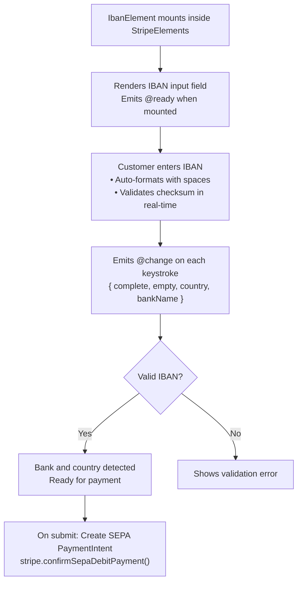

# IBAN Element

The IBAN Element collects International Bank Account Numbers for SEPA Direct Debit payments across Europe. Use it when accepting bank-based payments from customers in the European Union.

::: tip SEPA Coverage
SEPA (Single Euro Payments Area) covers 36 European countries including all EU member states, plus Iceland, Liechtenstein, Norway, Switzerland, Monaco, San Marino, and others.
:::

## Why Use IBAN Element?

| Feature | Benefit |
|---------|---------|
| **SEPA Coverage** | Accepts bank accounts from 36 European countries |
| **Real-time Validation** | Validates IBAN format and checksum as user types |
| **Bank Detection** | Automatically identifies the bank from the IBAN |
| **Country Detection** | Detects country from IBAN prefix (DE, FR, NL, etc.) |

## When to Use IBAN Element

| Scenario | Description |
|----------|-------------|
| **Recurring payments** | Subscription billing via SEPA Direct Debit |
| **B2B transactions** | Business-to-business payments in Europe |
| **Lower fees** | Bank transfers often have lower fees than cards |

::: tip SEPA vs Cards
- **SEPA Direct Debit** = Lower fees, but slower settlement (1-5 days)
- **Cards** = Higher fees, but instant confirmation
:::

## How It Works



## Required Components

| Component | Role |
|-----------|------|
| `VueStripeProvider` | Loads Stripe.js and provides stripe instance |
| `VueStripeElements` | Creates Elements instance (clientSecret optional) |
| `VueStripeIbanElement` | Renders the IBAN input field |

## Basic Implementation

### Step 1: Set Up the Provider Hierarchy

```vue
<script setup>
import {
  VueStripeProvider,
  VueStripeElements,
  VueStripeIbanElement
} from '@vue-stripe/vue-stripe'

const publishableKey = import.meta.env.VITE_STRIPE_PUBLISHABLE_KEY
</script>

<template>
  <VueStripeProvider :publishable-key="publishableKey">
    <VueStripeElements>
      <VueStripeIbanElement
        @ready="onReady"
        @change="onChange"
      />
    </VueStripeElements>
  </VueStripeProvider>
</template>
```

**What's happening:**
- `VueStripeProvider` loads Stripe.js with your publishable key
- `VueStripeElements` creates the Elements container
- `VueStripeIbanElement` renders the IBAN input with SEPA country support

### Step 2: Handle Events

```vue{8-17}
<script setup>
import { ref } from 'vue'

const ibanComplete = ref(false)
const bankName = ref('')
const country = ref('')

const onReady = (element) => {
  console.log('IBAN element ready')
}

const onChange = (event) => {
  ibanComplete.value = event.complete
  bankName.value = event.bankName || ''
  country.value = event.country || ''
}
</script>
```

**What's happening:**
- The `@change` event includes `bankName` when a valid IBAN is detected
- The `country` is automatically extracted from the IBAN prefix
- Use `complete` to enable/disable the submit button

## Confirming SEPA Payments

SEPA Direct Debit requires a backend endpoint to create PaymentIntents with the `sepa_debit` payment method type:

### Backend Endpoint

```typescript
// POST /api/sepa-debit-intent
import Stripe from 'stripe'

const stripe = new Stripe(process.env.STRIPE_SECRET_KEY)

export async function POST(request: Request) {
  const { amount, currency = 'eur' } = await request.json()

  const paymentIntent = await stripe.paymentIntents.create({
    amount,
    currency,
    payment_method_types: ['sepa_debit'],
  })

  return Response.json({
    clientSecret: paymentIntent.client_secret
  })
}
```

### Frontend Confirmation

```vue
<script setup>
import { useStripe, useStripeElements } from '@vue-stripe/vue-stripe'

const { stripe } = useStripe()
const { elements } = useStripeElements()

const handleSubmit = async (clientSecret: string) => {
  const ibanElement = elements.value?.getElement('iban')

  const { error, paymentIntent } = await stripe.value.confirmSepaDebitPayment(
    clientSecret,
    {
      payment_method: {
        sepa_debit: ibanElement,
        billing_details: {
          name: 'Customer Name',
          email: 'customer@example.com'
        }
      }
    }
  )

  if (error) {
    console.error(error.message)
  } else if (paymentIntent.status === 'processing') {
    // SEPA payments are not instant - they go to 'processing' first
    console.log('Payment is processing')
  }
}
</script>
```

::: warning SEPA Payment Status
Unlike card payments that succeed instantly, SEPA Direct Debit payments initially have a `processing` status. The payment typically takes 1-5 business days to complete or fail.
:::

## Customization

### Custom Styling

```vue
<script setup>
const ibanOptions = {
  supportedCountries: ['SEPA'],
  placeholderCountry: 'DE',
  style: {
    base: {
      fontSize: '16px',
      color: '#424770',
      fontFamily: '-apple-system, BlinkMacSystemFont, sans-serif',
      '::placeholder': {
        color: '#aab7c4'
      }
    },
    invalid: {
      color: '#9e2146',
      iconColor: '#9e2146'
    }
  }
}
</script>

<template>
  <VueStripeIbanElement :options="ibanOptions" />
</template>
```

### Placeholder Country

The `placeholderCountry` option determines the placeholder format shown:

| Country | Placeholder |
|---------|-------------|
| `DE` | `DE00 0000 0000 0000 0000 00` |
| `FR` | `FR00 0000 0000 0000 0000 0000 000` |
| `NL` | `NL00 AAAA 0000 0000 00` |

## Complete Example

```vue
<script setup lang="ts">
import { ref } from 'vue'
import {
  VueStripeProvider,
  VueStripeElements,
  VueStripeIbanElement,
  useStripe,
  useStripeElements
} from '@vue-stripe/vue-stripe'

const publishableKey = import.meta.env.VITE_STRIPE_PUBLISHABLE_KEY

const ibanRef = ref()
const ibanComplete = ref(false)
const bankName = ref('')
const country = ref('')
const processing = ref(false)
const error = ref('')
const success = ref(false)

const ibanOptions = {
  supportedCountries: ['SEPA'],
  placeholderCountry: 'DE',
  style: {
    base: {
      fontSize: '16px',
      color: '#424770'
    }
  }
}

const handleChange = (event: any) => {
  ibanComplete.value = event.complete
  bankName.value = event.bankName || ''
  country.value = event.country || ''
  error.value = event.error?.message || ''
}

const handleSubmit = async () => {
  // In a real app, fetch clientSecret from your backend
  const response = await fetch('/api/sepa-debit-intent', {
    method: 'POST',
    headers: { 'Content-Type': 'application/json' },
    body: JSON.stringify({ amount: 1000 })
  })
  const { clientSecret } = await response.json()

  // Get stripe and elements from composables (inside provider)
  // This would be in a child component
  // const { stripe } = useStripe()
  // const { elements } = useStripeElements()
  // ... confirm payment
}
</script>

<template>
  <div class="sepa-form">
    <div v-if="success" class="success">
      Payment submitted! It will be processed within 1-5 business days.
    </div>

    <VueStripeProvider v-else :publishable-key="publishableKey">
      <VueStripeElements>
        <form @submit.prevent="handleSubmit">
          <div class="field">
            <label>IBAN</label>
            <VueStripeIbanElement
              ref="ibanRef"
              :options="ibanOptions"
              @change="handleChange"
            />
          </div>

          <div v-if="bankName" class="bank-info">
            Bank: {{ bankName }} ({{ country }})
          </div>

          <div v-if="error" class="error">{{ error }}</div>

          <button
            type="submit"
            :disabled="!ibanComplete || processing"
          >
            {{ processing ? 'Processing...' : 'Pay with SEPA' }}
          </button>
        </form>
      </VueStripeElements>
    </VueStripeProvider>
  </div>
</template>

<style scoped>
.sepa-form {
  max-width: 400px;
  margin: 0 auto;
}

.field {
  margin-bottom: 16px;
}

.field label {
  display: block;
  margin-bottom: 8px;
  font-weight: 500;
}

.bank-info {
  margin-bottom: 16px;
  padding: 12px;
  background: #f0f9ff;
  border-radius: 4px;
  font-size: 14px;
}

button {
  width: 100%;
  padding: 12px;
  background: #5469d4;
  color: white;
  border: none;
  border-radius: 4px;
  font-size: 16px;
  cursor: pointer;
}

button:disabled {
  opacity: 0.5;
  cursor: not-allowed;
}

.error {
  color: #9e2146;
  margin-bottom: 16px;
}

.success {
  color: #00d66b;
  padding: 20px;
  text-align: center;
}
</style>
```

## Test IBAN Numbers

Use these test IBANs in test mode:

| IBAN | Country | Description |
|------|---------|-------------|
| `DE89 3704 0044 0532 0130 00` | Germany | Standard test IBAN |
| `FR76 3000 6000 0112 3456 7890 189` | France | Standard test IBAN |
| `NL91 ABNA 0417 1643 00` | Netherlands | Standard test IBAN |
| `AT61 1904 3002 3457 3201` | Austria | Standard test IBAN |
| `BE62 5100 0754 7061` | Belgium | Standard test IBAN |

## Next Steps

- [iDEAL Bank Element](/guide/ideal-bank-element) — Dutch bank payments
- [P24 Bank Element](/guide/p24-bank-element) — Polish bank payments
- [EPS Bank Element](/guide/eps-bank-element) — Austrian bank payments
- [API Reference](/api/components/stripe-iban-element) — Full props, events, and options
