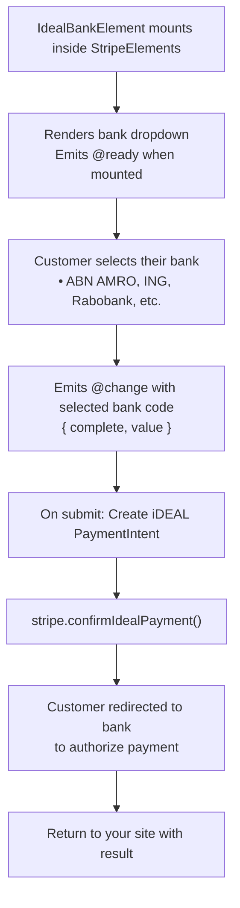

# iDEAL Bank Element

The iDEAL Bank Element displays a dropdown of Dutch banks for iDEAL payments. iDEAL is the most popular payment method in the Netherlands with over 60% market share.

::: tip Netherlands Only
iDEAL is exclusively for Dutch bank customers. For other European countries, see [IBAN Element](/guide/iban-element) (SEPA), [P24](/guide/p24-bank-element) (Poland), or [EPS](/guide/eps-bank-element) (Austria).
:::

## Why Use iDEAL?

| Feature | Benefit |
|---------|---------|
| **Market Leader** | 60%+ of Dutch online payments use iDEAL |
| **Bank Coverage** | Supports all major Dutch banks |
| **Instant Confirmation** | Real-time payment notification |
| **Lower Fees** | Typically lower than card transaction fees |

## When to Use iDEAL Element

| Scenario | Description |
|----------|-------------|
| **Dutch customers** | Primary payment method in Netherlands |
| **E-commerce** | Online purchases by Dutch shoppers |
| **EUR transactions** | iDEAL only supports Euro currency |

## How It Works



## Required Components

| Component | Role |
|-----------|------|
| `VueStripeProvider` | Loads Stripe.js and provides stripe instance |
| `VueStripeElements` | Creates Elements instance |
| `VueStripeIdealBankElement` | Renders the Dutch bank dropdown |

## Basic Implementation

### Step 1: Set Up the Component

```vue
<script setup>
import {
  VueStripeProvider,
  VueStripeElements,
  VueStripeIdealBankElement
} from '@vue-stripe/vue-stripe'

const publishableKey = import.meta.env.VITE_STRIPE_PUBLISHABLE_KEY
</script>

<template>
  <VueStripeProvider :publishable-key="publishableKey">
    <VueStripeElements>
      <VueStripeIdealBankElement
        @ready="onReady"
        @change="onChange"
      />
    </VueStripeElements>
  </VueStripeProvider>
</template>
```

### Step 2: Handle Bank Selection

```vue{7-12}
<script setup>
import { ref } from 'vue'

const selectedBank = ref('')
const isComplete = ref(false)

const onChange = (event) => {
  isComplete.value = event.complete
  selectedBank.value = event.value || ''
  console.log('Selected bank:', selectedBank.value)
}
</script>
```

**What's happening:**
- The `@change` event fires when a bank is selected
- `event.value` contains the bank code (e.g., `'abn_amro'`, `'ing'`)
- `event.complete` is true when a bank is selected

## Supported Dutch Banks

| Bank Code | Bank Name | Type |
|-----------|-----------|------|
| `abn_amro` | ABN AMRO | Major bank |
| `ing` | ING | Major bank |
| `rabobank` | Rabobank | Major bank |
| `bunq` | bunq | Digital bank |
| `knab` | Knab | Online bank |
| `n26` | N26 | Digital bank |
| `revolut` | Revolut | Digital bank |
| `sns_bank` | SNS Bank | Retail bank |
| `triodos_bank` | Triodos Bank | Sustainable bank |
| `regiobank` | RegioBank | Retail bank |

## Confirming iDEAL Payments

iDEAL uses a redirect flow - customers are sent to their bank to authorize the payment:

### Backend Endpoint

```typescript
// POST /api/ideal-intent
import Stripe from 'stripe'

const stripe = new Stripe(process.env.STRIPE_SECRET_KEY)

export async function POST(request: Request) {
  const { amount } = await request.json()

  const paymentIntent = await stripe.paymentIntents.create({
    amount,
    currency: 'eur', // iDEAL only supports EUR
    payment_method_types: ['ideal'],
  })

  return Response.json({
    clientSecret: paymentIntent.client_secret
  })
}
```

### Frontend Confirmation

```vue
<script setup>
import { useStripe, useStripeElements } from '@vue-stripe/vue-stripe'

const { stripe } = useStripe()
const { elements } = useStripeElements()

const handleSubmit = async (clientSecret: string) => {
  const idealBankElement = elements.value?.getElement('idealBank')

  const { error } = await stripe.value.confirmIdealPayment(
    clientSecret,
    {
      payment_method: {
        ideal: idealBankElement
      },
      return_url: `${window.location.origin}/payment-complete`
    }
  )

  if (error) {
    console.error(error.message)
  }
  // Customer is redirected to their bank
}
</script>
```

::: warning Redirect Required
iDEAL payments require a `return_url`. After the customer authorizes at their bank, they're redirected back to your site. Check the URL parameters for the payment result.
:::

## Handling the Return

After authorization, the customer returns to your `return_url`:

```vue
<script setup>
import { onMounted } from 'vue'
import { useStripe } from '@vue-stripe/vue-stripe'

onMounted(async () => {
  const clientSecret = new URLSearchParams(window.location.search)
    .get('payment_intent_client_secret')

  if (clientSecret) {
    const { stripe } = useStripe()
    const { paymentIntent } = await stripe.value.retrievePaymentIntent(clientSecret)

    if (paymentIntent.status === 'succeeded') {
      console.log('Payment successful!')
    } else if (paymentIntent.status === 'processing') {
      console.log('Payment is processing')
    }
  }
})
</script>
```

## Customization

### Custom Styling

```vue
<script setup>
const idealOptions = {
  style: {
    base: {
      fontSize: '16px',
      color: '#424770',
      fontFamily: '-apple-system, BlinkMacSystemFont, sans-serif',
      padding: '10px 12px'
    }
  }
}
</script>

<template>
  <VueStripeIdealBankElement :options="idealOptions" />
</template>
```

## Complete Example

```vue
<script setup lang="ts">
import { ref } from 'vue'
import {
  VueStripeProvider,
  VueStripeElements,
  VueStripeIdealBankElement,
  useStripe,
  useStripeElements
} from '@vue-stripe/vue-stripe'

const publishableKey = import.meta.env.VITE_STRIPE_PUBLISHABLE_KEY

const selectedBank = ref('')
const isComplete = ref(false)
const processing = ref(false)
const error = ref('')

const idealOptions = {
  style: {
    base: {
      fontSize: '16px',
      color: '#424770'
    }
  }
}

const handleChange = (event: any) => {
  isComplete.value = event.complete
  selectedBank.value = event.value || ''
}

const handleSubmit = async () => {
  processing.value = true
  error.value = ''

  try {
    // Fetch clientSecret from backend
    const response = await fetch('/api/ideal-intent', {
      method: 'POST',
      headers: { 'Content-Type': 'application/json' },
      body: JSON.stringify({ amount: 1000 })
    })
    const { clientSecret } = await response.json()

    // Confirm with redirect (would be in child component)
    // const { stripe } = useStripe()
    // const { elements } = useStripeElements()
    // ... confirm payment with redirect
  } catch (e) {
    error.value = 'Failed to process payment'
  } finally {
    processing.value = false
  }
}
</script>

<template>
  <div class="ideal-form">
    <VueStripeProvider :publishable-key="publishableKey">
      <VueStripeElements>
        <form @submit.prevent="handleSubmit">
          <div class="field">
            <label>Select your bank</label>
            <VueStripeIdealBankElement
              :options="idealOptions"
              @change="handleChange"
            />
          </div>

          <div v-if="selectedBank" class="selected-bank">
            Selected: {{ selectedBank }}
          </div>

          <div v-if="error" class="error">{{ error }}</div>

          <button
            type="submit"
            :disabled="!isComplete || processing"
          >
            {{ processing ? 'Processing...' : 'Pay with iDEAL' }}
          </button>

          <p class="note">
            You will be redirected to your bank to authorize the payment.
          </p>
        </form>
      </VueStripeElements>
    </VueStripeProvider>
  </div>
</template>

<style scoped>
.ideal-form {
  max-width: 400px;
  margin: 0 auto;
}

.field {
  margin-bottom: 16px;
}

.field label {
  display: block;
  margin-bottom: 8px;
  font-weight: 500;
}

.selected-bank {
  margin-bottom: 16px;
  padding: 8px 12px;
  background: #f0f9ff;
  border-radius: 4px;
  font-size: 14px;
}

button {
  width: 100%;
  padding: 12px;
  background: #cc0066;
  color: white;
  border: none;
  border-radius: 4px;
  font-size: 16px;
  cursor: pointer;
}

button:disabled {
  opacity: 0.5;
  cursor: not-allowed;
}

.error {
  color: #9e2146;
  margin-bottom: 16px;
}

.note {
  margin-top: 16px;
  font-size: 12px;
  color: #666;
  text-align: center;
}
</style>
```

## Next Steps

- [IBAN Element](/guide/iban-element) — SEPA Direct Debit for all EU
- [P24 Bank Element](/guide/p24-bank-element) — Polish bank payments
- [EPS Bank Element](/guide/eps-bank-element) — Austrian bank payments
- [API Reference](/api/components/stripe-ideal-bank-element) — Full props, events, and options
