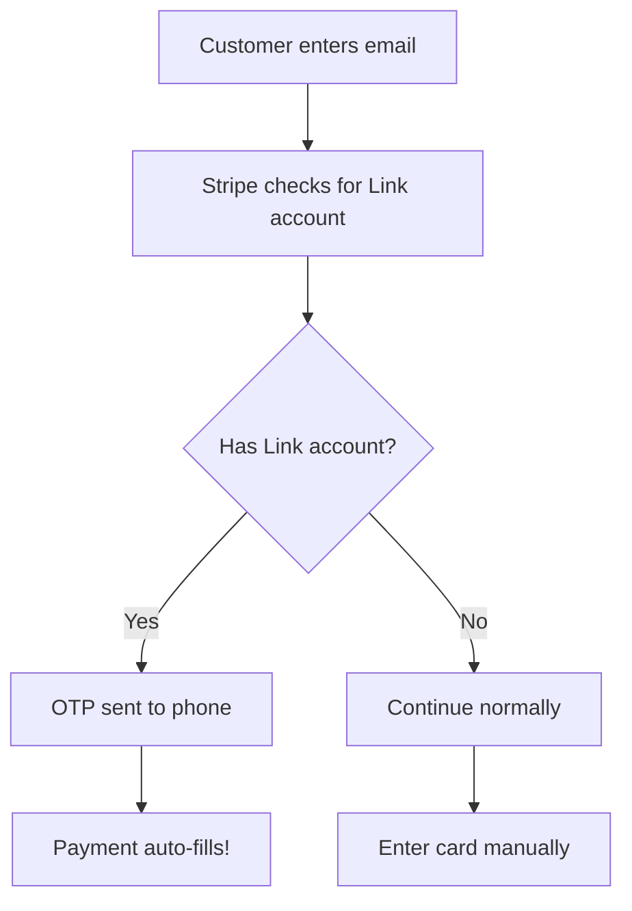

# Link Authentication

The Link Authentication Element enables faster checkout by collecting customer email and authenticating them with [Stripe Link](https://stripe.com/docs/payments/link). Returning customers can complete purchases in seconds with saved payment information.

## What is Stripe Link?

Stripe Link is a one-click checkout solution that saves customer payment information across all Stripe merchants:

| Feature | Benefit |
|---------|---------|
| **Cross-merchant** | Saved once, works everywhere that accepts Stripe |
| **Secure** | OTP verification via phone, no passwords |
| **Fast** | Returning customers checkout in seconds |
| **Higher conversion** | Less friction = more completed purchases |

## How It Works



## Basic Usage

::: warning Requires PaymentElement
Link Authentication Element **must be paired with PaymentElement**. It only handles email collection and Link authentication—it cannot process payments on its own.
:::

```vue
<script setup>
import { ref, computed } from 'vue'
import {
  VueStripeProvider,
  VueStripeElements,
  VueStripeLinkAuthenticationElement,
  VueStripePaymentElement
} from '@vue-stripe/vue-stripe'

const publishableKey = import.meta.env.VITE_STRIPE_PUBLISHABLE_KEY
const clientSecret = 'pi_xxx_secret_xxx' // From your backend

const emailComplete = ref(false)
const paymentComplete = ref(false)

const canPay = computed(() => emailComplete.value && paymentComplete.value)

const onEmailChange = (event) => {
  emailComplete.value = event.complete
  if (event.complete) {
    console.log('Email:', event.value.email)
  }
}

const onPaymentChange = (event) => {
  paymentComplete.value = event.complete
}
</script>

<template>
  <VueStripeProvider :publishable-key="publishableKey">
    <VueStripeElements :client-secret="clientSecret">
      <!-- Step 1: Email + Link detection -->
      <div class="form-field">
        <label>Email</label>
        <VueStripeLinkAuthenticationElement @change="onEmailChange" />
      </div>

      <!-- Step 2: Payment method -->
      <div class="form-field">
        <label>Payment</label>
        <VueStripePaymentElement @change="onPaymentChange" />
      </div>

      <button :disabled="!canPay">Pay Now</button>
    </VueStripeElements>
  </VueStripeProvider>
</template>
```

## The Link Experience

### For Returning Customers (has Link account)

1. **Enter email** → Stripe detects Link account
2. **Receive OTP** → Code sent to phone
3. **Enter code** → Verify identity
4. **Auto-fill** → Payment details appear automatically
5. **One click** → Complete purchase instantly

### For New Customers (no Link account)

1. **Enter email** → Continue normally
2. **Fill payment** → Enter card details manually
3. **Option to save** → Create Link account for next time

## Pre-filling Email

For logged-in users, pre-fill their email:

```vue
<script setup>
import { computed } from 'vue'

// User from your auth system
const user = { email: 'john@example.com' }

const options = computed(() => ({
  defaultValues: {
    email: user.email
  }
}))
</script>

<template>
  <VueStripeLinkAuthenticationElement :options="options" />
</template>
```

## Complete Checkout Flow

Here's a full example with payment processing:

```vue
<script setup>
import { ref, computed } from 'vue'
import {
  VueStripeProvider,
  VueStripeElements,
  VueStripeLinkAuthenticationElement,
  VueStripePaymentElement
} from '@vue-stripe/vue-stripe'

const publishableKey = import.meta.env.VITE_STRIPE_PUBLISHABLE_KEY
const clientSecret = ref('pi_xxx_secret_xxx')

const customerEmail = ref('')
const emailComplete = ref(false)
const paymentComplete = ref(false)
const isProcessing = ref(false)
const error = ref('')

const canSubmit = computed(() =>
  emailComplete.value && paymentComplete.value && !isProcessing.value
)

const onEmailChange = (event) => {
  emailComplete.value = event.complete
  if (event.complete) {
    customerEmail.value = event.value.email
  }
}

const onPaymentChange = (event) => {
  paymentComplete.value = event.complete
}
</script>

<template>
  <VueStripeProvider :publishable-key="publishableKey">
    <VueStripeElements :client-secret="clientSecret">
      <form @submit.prevent="handleSubmit">
        <div class="form-field">
          <label>Email</label>
          <VueStripeLinkAuthenticationElement @change="onEmailChange" />
        </div>

        <div class="form-field">
          <label>Payment</label>
          <VueStripePaymentElement @change="onPaymentChange" />
        </div>

        <div v-if="error" class="error">{{ error }}</div>

        <PaymentButton
          :disabled="!canSubmit"
          :email="customerEmail"
        />
      </form>
    </VueStripeElements>
  </VueStripeProvider>
</template>
```

### Payment Button Component

```vue
<script setup>
import { useStripe, useStripeElements } from '@vue-stripe/vue-stripe'

const props = defineProps(['disabled', 'email'])
const emit = defineEmits(['success', 'error'])

const { stripe } = useStripe()
const { elements } = useStripeElements()

const handleClick = async () => {
  if (!stripe.value || !elements.value) return

  // Validate elements
  const { error: submitError } = await elements.value.submit()
  if (submitError) {
    emit('error', submitError.message)
    return
  }

  // Confirm payment
  const { error, paymentIntent } = await stripe.value.confirmPayment({
    elements: elements.value,
    confirmParams: {
      return_url: window.location.href,
      receipt_email: props.email
    },
    redirect: 'if_required'
  })

  if (error) {
    emit('error', error.message)
  } else {
    emit('success', paymentIntent)
  }
}
</script>

<template>
  <button :disabled="disabled" @click="handleClick">
    Pay Now
  </button>
</template>
```

## Requirements

| Requirement | Details |
|-------------|---------|
| **clientSecret** | From PaymentIntent or SetupIntent |
| **Link enabled** | In [Stripe Dashboard](https://dashboard.stripe.com/settings/link) |
| **PaymentElement** | Must be paired for payment processing |

## Enable Link in Dashboard

1. Go to [Stripe Dashboard → Settings → Link](https://dashboard.stripe.com/settings/link)
2. Toggle **Enable Link** on
3. Configure your Link settings

## Integration Checklist

- [ ] StripeProvider with publishable key
- [ ] StripeElements with clientSecret
- [ ] StripeLinkAuthenticationElement for email
- [ ] StripePaymentElement for payment methods
- [ ] Payment confirmation logic
- [ ] Link enabled in Stripe Dashboard

## Combining with Address Element

For a complete checkout with shipping:

```vue
<template>
  <VueStripeProvider :publishable-key="publishableKey">
    <VueStripeElements :client-secret="clientSecret">
      <!-- Email + Link -->
      <VueStripeLinkAuthenticationElement @change="onEmailChange" />

      <!-- Shipping Address -->
      <VueStripeAddressElement :options="{ mode: 'shipping' }" />

      <!-- Payment -->
      <VueStripePaymentElement @change="onPaymentChange" />

      <button :disabled="!canPay">Pay Now</button>
    </VueStripeElements>
  </VueStripeProvider>
</template>
```

## Next Steps

- [Payment Element](/guide/payment-element) — Payment method collection
- [Address Element](/guide/address-element) — Shipping/billing addresses
- [API Reference](/api/components/stripe-link-authentication-element) — Full API documentation
