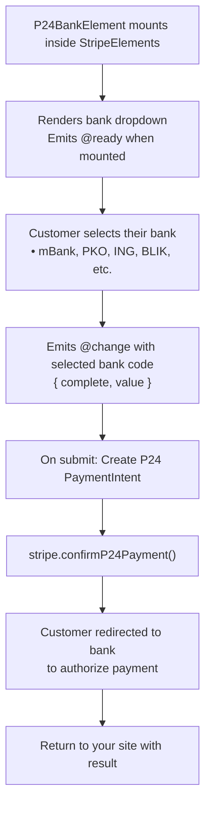
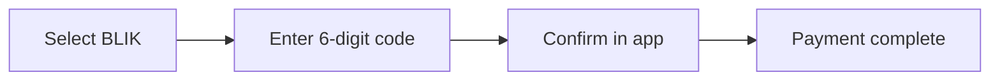

# P24 Bank Element

The P24 Bank Element displays a dropdown of Polish banks for Przelewy24 payments. Przelewy24 (P24) is one of the most popular payment methods in Poland, supporting online bank transfers and BLIK.

::: tip Poland Only
Przelewy24 is exclusively for Polish bank customers. For other European countries, see [iDEAL](/guide/ideal-bank-element) (Netherlands), [EPS](/guide/eps-bank-element) (Austria), or [IBAN Element](/guide/iban-element) (SEPA).
:::

## Why Use Przelewy24?

| Feature | Benefit |
|---------|---------|
| **Wide Coverage** | Supports 24+ Polish banks |
| **BLIK Support** | Includes BLIK mobile payments |
| **Multi-Currency** | Supports both EUR and PLN |
| **Instant Confirmation** | Real-time payment notification |

## When to Use P24 Element

| Scenario | Description |
|----------|-------------|
| **Polish customers** | Primary payment method in Poland |
| **E-commerce** | Online purchases by Polish shoppers |
| **PLN or EUR** | Supports both Polish Złoty and Euro |

## How It Works



## Required Components

| Component | Role |
|-----------|------|
| `VueStripeProvider` | Loads Stripe.js and provides stripe instance |
| `VueStripeElements` | Creates Elements instance |
| `VueStripeP24BankElement` | Renders the Polish bank dropdown |

## Basic Implementation

### Step 1: Set Up the Component

```vue
<script setup>
import {
  VueStripeProvider,
  VueStripeElements,
  VueStripeP24BankElement
} from '@vue-stripe/vue-stripe'

const publishableKey = import.meta.env.VITE_STRIPE_PUBLISHABLE_KEY
</script>

<template>
  <VueStripeProvider :publishable-key="publishableKey">
    <VueStripeElements>
      <VueStripeP24BankElement
        @ready="onReady"
        @change="onChange"
      />
    </VueStripeElements>
  </VueStripeProvider>
</template>
```

### Step 2: Handle Bank Selection

```vue{7-12}
<script setup>
import { ref } from 'vue'

const selectedBank = ref('')
const isComplete = ref(false)

const onChange = (event) => {
  isComplete.value = event.complete
  selectedBank.value = event.value || ''
  console.log('Selected bank:', selectedBank.value)
}
</script>
```

## Supported Polish Banks

| Bank Code | Bank Name | Description |
|-----------|-----------|-------------|
| `blik` | BLIK | Mobile payment system |
| `mbank` | mBank | Major Polish bank |
| `ing` | ING Bank Śląski | Major Polish bank |
| `pko` | PKO Bank Polski | Largest Polish bank |
| `santander` | Santander Bank Polska | Major bank |
| `alior_bank` | Alior Bank | Digital bank |
| `bank_millennium` | Bank Millennium | Major bank |
| `bnp_paribas` | BNP Paribas | International bank |
| `citi_handlowy` | Citi Handlowy | International bank |
| `credit_agricole` | Credit Agricole | Major bank |
| `getin_bank` | Getin Bank | Retail bank |
| `idea_bank` | Idea Bank | Business bank |
| `inteligo` | Inteligo | PKO digital banking |
| `plus_bank` | Plus Bank | Retail bank |
| `velobank` | VeloBank | Digital bank |

## Confirming P24 Payments

Przelewy24 uses a redirect flow - customers are sent to their bank to authorize the payment:

### Backend Endpoint

```typescript
// POST /api/p24-intent
import Stripe from 'stripe'

const stripe = new Stripe(process.env.STRIPE_SECRET_KEY)

export async function POST(request: Request) {
  const { amount, currency = 'pln' } = await request.json()

  const paymentIntent = await stripe.paymentIntents.create({
    amount,
    currency, // 'pln' or 'eur'
    payment_method_types: ['p24'],
  })

  return Response.json({
    clientSecret: paymentIntent.client_secret
  })
}
```

### Frontend Confirmation

```vue
<script setup>
import { useStripe, useStripeElements } from '@vue-stripe/vue-stripe'

const { stripe } = useStripe()
const { elements } = useStripeElements()

const handleSubmit = async (clientSecret: string) => {
  const p24Element = elements.value?.getElement('p24Bank')

  const { error } = await stripe.value.confirmP24Payment(
    clientSecret,
    {
      payment_method: {
        p24: p24Element,
        billing_details: {
          email: 'customer@example.com' // Required for P24
        }
      },
      return_url: `${window.location.origin}/payment-complete`
    }
  )

  if (error) {
    console.error(error.message)
  }
  // Customer is redirected to their bank
}
</script>
```

::: warning Email Required
P24 payments require a `billing_details.email` - this is mandatory for the redirect flow and customer communication.
:::

## Customization

### Custom Styling

```vue
<script setup>
const p24Options = {
  style: {
    base: {
      fontSize: '16px',
      color: '#424770',
      fontFamily: '-apple-system, BlinkMacSystemFont, sans-serif',
      padding: '10px 12px'
    }
  }
}
</script>

<template>
  <VueStripeP24BankElement :options="p24Options" />
</template>
```

## Complete Example

```vue
<script setup lang="ts">
import { ref } from 'vue'
import {
  VueStripeProvider,
  VueStripeElements,
  VueStripeP24BankElement,
  useStripe,
  useStripeElements
} from '@vue-stripe/vue-stripe'

const publishableKey = import.meta.env.VITE_STRIPE_PUBLISHABLE_KEY

const selectedBank = ref('')
const isComplete = ref(false)
const email = ref('')
const processing = ref(false)
const error = ref('')

const p24Options = {
  style: {
    base: {
      fontSize: '16px',
      color: '#424770'
    }
  }
}

const handleChange = (event: any) => {
  isComplete.value = event.complete
  selectedBank.value = event.value || ''
}

const handleSubmit = async () => {
  if (!email.value) {
    error.value = 'Email is required for P24 payments'
    return
  }

  processing.value = true
  error.value = ''

  try {
    // Fetch clientSecret from backend
    const response = await fetch('/api/p24-intent', {
      method: 'POST',
      headers: { 'Content-Type': 'application/json' },
      body: JSON.stringify({ amount: 1000, currency: 'pln' })
    })
    const { clientSecret } = await response.json()

    // Confirm payment (would be in child component)
    // const { stripe } = useStripe()
    // ... confirm P24 payment with redirect
  } catch (e) {
    error.value = 'Failed to process payment'
  } finally {
    processing.value = false
  }
}
</script>

<template>
  <div class="p24-form">
    <VueStripeProvider :publishable-key="publishableKey">
      <VueStripeElements>
        <form @submit.prevent="handleSubmit">
          <div class="field">
            <label>Email (required)</label>
            <input
              v-model="email"
              type="email"
              placeholder="customer@example.com"
            />
          </div>

          <div class="field">
            <label>Select your bank</label>
            <VueStripeP24BankElement
              :options="p24Options"
              @change="handleChange"
            />
          </div>

          <div v-if="selectedBank" class="selected-bank">
            Selected: {{ selectedBank }}
          </div>

          <div v-if="error" class="error">{{ error }}</div>

          <button
            type="submit"
            :disabled="!isComplete || !email || processing"
          >
            {{ processing ? 'Processing...' : 'Pay with Przelewy24' }}
          </button>

          <p class="note">
            You will be redirected to your bank to authorize the payment.
          </p>
        </form>
      </VueStripeElements>
    </VueStripeProvider>
  </div>
</template>

<style scoped>
.p24-form {
  max-width: 400px;
  margin: 0 auto;
}

.field {
  margin-bottom: 16px;
}

.field label {
  display: block;
  margin-bottom: 8px;
  font-weight: 500;
}

.field input {
  width: 100%;
  padding: 12px;
  border: 1px solid #e0e0e0;
  border-radius: 4px;
  font-size: 16px;
}

.selected-bank {
  margin-bottom: 16px;
  padding: 8px 12px;
  background: #f0f9ff;
  border-radius: 4px;
  font-size: 14px;
}

button {
  width: 100%;
  padding: 12px;
  background: #d32d27;
  color: white;
  border: none;
  border-radius: 4px;
  font-size: 16px;
  cursor: pointer;
}

button:disabled {
  opacity: 0.5;
  cursor: not-allowed;
}

.error {
  color: #9e2146;
  margin-bottom: 16px;
}

.note {
  margin-top: 16px;
  font-size: 12px;
  color: #666;
  text-align: center;
}
</style>
```

## BLIK Payments

BLIK is a mobile payment system popular in Poland. When a customer selects BLIK from the bank dropdown, they'll be prompted to enter a 6-digit code from their banking app:



## Next Steps

- [IBAN Element](/guide/iban-element) — SEPA Direct Debit for all EU
- [iDEAL Bank Element](/guide/ideal-bank-element) — Dutch bank payments
- [EPS Bank Element](/guide/eps-bank-element) — Austrian bank payments
- [API Reference](/api/components/stripe-p24-bank-element) — Full props, events, and options
