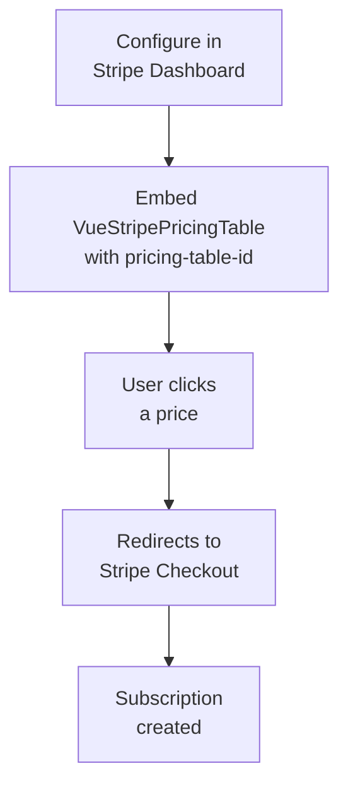

# Pricing Table

Embed a subscription pricing table from your Stripe Dashboard directly into your Vue application with zero backend code required.

::: tip No Backend Required
Pricing Tables are configured entirely in the Stripe Dashboard. The component simply embeds the table and handles checkout automatically.
:::

## Why Use Pricing Table?

| Feature | Benefit |
|---------|---------|
| **No-code configuration** | Configure products, prices, and appearance in Stripe Dashboard |
| **Pre-built checkout** | Takes customers directly to Stripe Checkout |
| **Subscription support** | Flat-rate, per-seat, tiered pricing, and free trials |
| **Automatic updates** | Changes in Dashboard reflect immediately—no code changes needed |

## When to Use Pricing Table

| Scenario | Description |
|----------|-------------|
| **Subscription SaaS** | Display subscription tiers for SaaS products |
| **Simple pricing pages** | When you don't need custom pricing UI |
| **Quick launch** | Get subscriptions working with minimal development |

::: tip Pricing Table vs Custom Checkout
- **Pricing Table** = No-code, Dashboard-configured, subscription-focused
- **Custom Checkout** = Full control, requires backend, any payment type
:::

## How It Works



## Prerequisites

Before implementing, you'll need to:

1. **Create a Pricing Table** in the [Stripe Dashboard](https://dashboard.stripe.com/pricing-tables)
2. **Get your Pricing Table ID** from the embed code (starts with `prctbl_`)
3. **Configure products and prices** in the Dashboard

## Basic Implementation

### Step 1: Create a Pricing Table in Dashboard

1. Go to **Product Catalog → Pricing tables** in your Stripe Dashboard
2. Click **Create pricing table**
3. Add your subscription products and prices
4. Customize the appearance
5. Copy the `pricing-table-id` from the embed code

### Step 2: Embed in Your Vue App

```vue
<script setup>
import { VueStripeProvider, VueStripePricingTable } from '@vue-stripe/vue-stripe'
</script>

<template>
  <VueStripeProvider publishable-key="pk_test_...">
    <VueStripePricingTable
      pricing-table-id="prctbl_1234567890"
    />
  </VueStripeProvider>
</template>
```

**What's happening:**
- `VueStripeProvider` provides the publishable key to child components
- `VueStripePricingTable` loads the pricing table script and renders the table
- No `VueStripeElements` wrapper needed—Pricing Table is not a Stripe Element

### Step 3: Handle Events

```vue{8-10}
<script setup>
import { VueStripeProvider, VueStripePricingTable } from '@vue-stripe/vue-stripe'

const onLoad = () => {
  console.log('Pricing table loaded')
}

const onError = (error) => {
  console.error('Failed to load pricing table:', error)
}
</script>

<template>
  <VueStripeProvider publishable-key="pk_test_...">
    <VueStripePricingTable
      pricing-table-id="prctbl_1234567890"
      @load="onLoad"
      @error="onError"
    />
  </VueStripeProvider>
</template>
```

## Advanced Features

### Pre-fill Customer Email

Pass a customer email to pre-fill the checkout form:

```vue
<VueStripePricingTable
  pricing-table-id="prctbl_1234567890"
  customer-email="customer@example.com"
/>
```

### Existing Customers (Customer Sessions)

For logged-in customers, use Customer Sessions to:
- Show their saved payment methods
- Apply existing discounts
- Pre-fill their information

```vue
<script setup>
import { ref, onMounted } from 'vue'

// Fetch customer session from your backend
const customerSessionClientSecret = ref('')

onMounted(async () => {
  const response = await fetch('/api/customer-session', {
    method: 'POST',
    headers: { 'Content-Type': 'application/json' },
    body: JSON.stringify({ customerId: 'cus_...' })
  })
  const data = await response.json()
  customerSessionClientSecret.value = data.clientSecret
})
</script>

<template>
  <VueStripeProvider publishable-key="pk_test_...">
    <VueStripePricingTable
      pricing-table-id="prctbl_1234567890"
      :customer-session-client-secret="customerSessionClientSecret"
    />
  </VueStripeProvider>
</template>
```

### Client Reference ID

Pass a reference ID for reconciling subscriptions with your internal systems:

```vue
<VueStripePricingTable
  pricing-table-id="prctbl_1234567890"
  client-reference-id="user_abc123"
/>
```

This ID will be included in the checkout session and can be retrieved via webhooks.

### Custom Loading and Error States

```vue
<VueStripePricingTable
  pricing-table-id="prctbl_1234567890"
>
  <template #loading>
    <div class="skeleton-loader">
      Loading pricing options...
    </div>
  </template>

  <template #error="{ error }">
    <div class="error-message">
      Unable to load pricing: {{ error }}
    </div>
  </template>
</VueStripePricingTable>
```

## Complete Example

```vue
<script setup lang="ts">
import { ref, computed } from 'vue'
import { VueStripeProvider, VueStripePricingTable } from '@vue-stripe/vue-stripe'

// Configuration
const publishableKey = 'pk_test_...'
const pricingTableId = 'prctbl_1234567890'

// Optional: Pre-fill user info if logged in
const userEmail = ref('user@example.com')
const userId = ref('user_123')

// Track loading state
const isLoaded = ref(false)
const loadError = ref<string | null>(null)

const handleLoad = () => {
  isLoaded.value = true
  console.log('Pricing table ready')
}

const handleError = (error: Error) => {
  loadError.value = error.message
  console.error('Pricing table error:', error)
}
</script>

<template>
  <div class="pricing-container">
    <h1>Choose Your Plan</h1>

    <VueStripeProvider :publishable-key="publishableKey">
      <VueStripePricingTable
        :pricing-table-id="pricingTableId"
        :customer-email="userEmail"
        :client-reference-id="userId"
        @load="handleLoad"
        @error="handleError"
      >
        <template #loading>
          <div class="loading-skeleton">
            <div class="skeleton-card" v-for="i in 3" :key="i" />
          </div>
        </template>

        <template #error="{ error }">
          <div class="error-state">
            <p>Unable to load pricing options.</p>
            <button @click="() => window.location.reload()">
              Try Again
            </button>
          </div>
        </template>
      </VueStripePricingTable>
    </VueStripeProvider>

    <p v-if="isLoaded" class="help-text">
      Click a plan above to start your subscription
    </p>
  </div>
</template>

<style scoped>
.pricing-container {
  max-width: 1200px;
  margin: 0 auto;
  padding: 2rem;
}

.loading-skeleton {
  display: flex;
  gap: 1rem;
  justify-content: center;
}

.skeleton-card {
  width: 300px;
  height: 400px;
  background: linear-gradient(90deg, #f0f0f0 25%, #e0e0e0 50%, #f0f0f0 75%);
  background-size: 200% 100%;
  animation: shimmer 1.5s infinite;
  border-radius: 8px;
}

@keyframes shimmer {
  0% { background-position: 200% 0; }
  100% { background-position: -200% 0; }
}

.error-state {
  text-align: center;
  padding: 2rem;
  background: #fef2f2;
  border-radius: 8px;
}

.help-text {
  text-align: center;
  color: #666;
  margin-top: 1rem;
}
</style>
```

## Limitations

Be aware of these Pricing Table limitations:

| Limitation | Details |
|------------|---------|
| **Max 4 products** | Per pricing interval (monthly, yearly) |
| **No usage-based pricing** | Metered billing not supported |
| **Rate limit** | 50 read operations per second |
| **Domain required** | Won't render on `file://` protocol |

## CSP Considerations

If using Content Security Policy, add these directives:

```
script-src: https://js.stripe.com
frame-src: https://js.stripe.com
```

## Next Steps

- [VueStripePricingTable API Reference](/api/components/stripe-pricing-table) — Full API documentation
- [VueStripeCheckout](/guide/checkout) — For one-time payments and custom checkout
- [Stripe Pricing Tables Docs](https://docs.stripe.com/payments/checkout/pricing-table) — Official Stripe documentation
