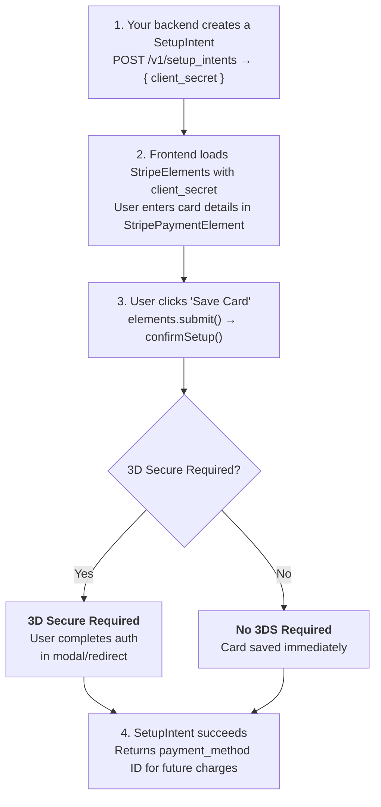
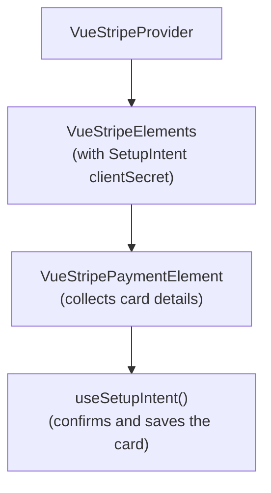
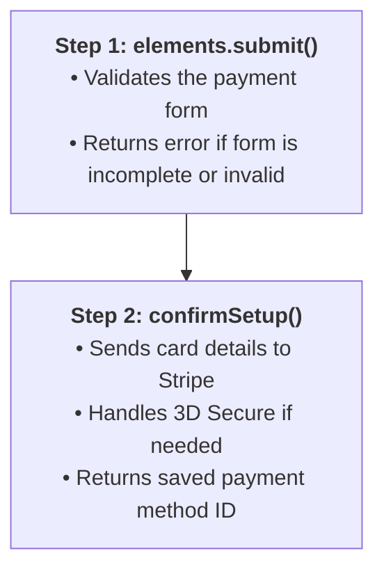

# Saving Payment Methods

Save a customer's payment method for future use without charging them immediately. This is essential for subscriptions, free trials, and "card on file" scenarios.

## Why Use SetupIntent?

| Feature | Benefit |
|---------|---------|
| **No immediate charge** | Collect card details without billing the customer |
| **Reusable payment method** | Charge the saved card anytime in the future |
| **3D Secure support** | Handle authentication upfront, avoid failures later |
| **Subscription-ready** | Perfect for recurring billing setup |

## When to Use SetupIntent

| Scenario | Description |
|----------|-------------|
| **Subscriptions** | Save card before starting recurring billing |
| **Free trials** | Collect card during trial, charge when it ends |
| **Card on file** | Let customers save cards to their account |
| **Pay later** | Authorize now, charge later (e.g., hotel bookings) |

::: tip SetupIntent vs PaymentIntent
- **SetupIntent** = Save card, charge later (or never)
- **PaymentIntent** = Charge immediately

Use SetupIntent when you're not ready to charge yet.
:::

## How It Works



## Required Components

SetupIntent works with the same components as PaymentIntent, but uses a different composable:



| Component | Role |
|-----------|------|
| `VueStripeProvider` | Loads Stripe.js |
| `VueStripeElements` | Creates Elements instance with SetupIntent secret |
| `VueStripePaymentElement` | Renders the payment form UI |
| `useSetupIntent()` | Confirms and saves the payment method |

::: warning Component Pairing Required
`useSetupIntent()` must be used with `VueStripePaymentElement` (or card elements) to collect payment details. The composable alone cannot save a card—it needs the element to capture the card information.
:::

## Basic Implementation

### Step 1: Create a SetupIntent (Backend)

First, create a SetupIntent on your server:

```js
// Node.js / Express
const stripe = require('stripe')('sk_test_...')

app.post('/create-setup-intent', async (req, res) => {
  const setupIntent = await stripe.setupIntents.create({
    customer: req.body.customerId, // Optional: attach to customer
    payment_method_types: ['card'],
  })

  res.json({ clientSecret: setupIntent.client_secret })
})
```

### Step 2: Build the Save Card Form

```vue
<script setup>
import { ref, onMounted } from 'vue'
import {
  VueStripeProvider,
  VueStripeElements,
  VueStripePaymentElement
} from '@vue-stripe/vue-stripe'

const publishableKey = import.meta.env.VITE_STRIPE_PUBLISHABLE_KEY
const setupSecret = ref('')
const isComplete = ref(false)
const status = ref<'idle' | 'saving' | 'success' | 'error'>('idle')
const errorMessage = ref('')

// Fetch SetupIntent on mount
onMounted(async () => {
  const response = await fetch('/api/create-setup-intent', {
    method: 'POST',
    headers: { 'Content-Type': 'application/json' },
    body: JSON.stringify({ customerId: 'cus_xxx' })
  })
  const data = await response.json()
  setupSecret.value = data.clientSecret
})
</script>

<template>
  <div v-if="setupSecret">
    <VueStripeProvider :publishable-key="publishableKey">
      <VueStripeElements :client-secret="setupSecret">
        <VueStripePaymentElement @change="e => isComplete = e.complete" />

        <SaveCardButton
          :client-secret="setupSecret"
          :disabled="!isComplete"
          @success="status = 'success'"
          @error="msg => { status = 'error'; errorMessage = msg }"
        />
      </VueStripeElements>
    </VueStripeProvider>

    <div v-if="status === 'success'" class="success">
      Card saved successfully!
    </div>
    <div v-if="status === 'error'" class="error">
      {{ errorMessage }}
    </div>
  </div>
</template>
```

### Step 3: Create the Submit Button Component

The button component must be inside `VueStripeElements` to access the composable:

```vue
<!-- SaveCardButton.vue -->
<script setup lang="ts">
import { useSetupIntent, useStripeElements } from '@vue-stripe/vue-stripe'

const props = defineProps<{
  clientSecret: string
  disabled: boolean
}>()

const emit = defineEmits<{
  success: [setupIntent: any]
  error: [message: string]
}>()

const { elements } = useStripeElements()
const { confirmSetup, loading } = useSetupIntent()

const handleSave = async () => {
  if (!elements.value) return

  // Step 1: Validate the form
  const { error: submitError } = await elements.value.submit()
  if (submitError) {
    emit('error', submitError.message || 'Validation failed')
    return
  }

  // Step 2: Confirm the setup (saves the card)
  const result = await confirmSetup({
    clientSecret: props.clientSecret,
    confirmParams: {
      return_url: `${window.location.origin}/account/cards`
    },
    redirect: 'if_required'
  })

  if (result.error) {
    emit('error', result.error.message || 'Failed to save card')
  } else if (result.setupIntent?.status === 'succeeded') {
    emit('success', result.setupIntent)
  }
}
</script>

<template>
  <button
    @click="handleSave"
    :disabled="disabled || loading"
    class="save-button"
  >
    {{ loading ? 'Saving...' : 'Save Card' }}
  </button>
</template>
```

## The Two-Step Process

Saving a card requires two steps:



::: warning Don't Skip Step 1
Always call `elements.submit()` before `confirmSetup()`. This validates the form and prepares the payment details. Skipping this step will cause errors.
:::

## After Saving: Using the Payment Method

Once saved, the SetupIntent contains the `payment_method` ID:

```js
// In your success handler
if (result.setupIntent?.status === 'succeeded') {
  const paymentMethodId = result.setupIntent.payment_method

  // Send to your backend to:
  // - Attach to customer
  // - Start a subscription
  // - Store for future charges
  await fetch('/api/attach-payment-method', {
    method: 'POST',
    body: JSON.stringify({ paymentMethodId })
  })
}
```

### Backend: Charge Later

```js
// When ready to charge the saved card
const paymentIntent = await stripe.paymentIntents.create({
  amount: 2000,
  currency: 'usd',
  customer: 'cus_xxx',
  payment_method: paymentMethodId, // From SetupIntent
  off_session: true,
  confirm: true,
})
```

## Subscription Flow Example

A common pattern is saving a card then immediately starting a subscription:

```vue
<script setup>
import { ref } from 'vue'
import { useSetupIntent, useStripeElements } from '@vue-stripe/vue-stripe'

const { elements } = useStripeElements()
const { confirmSetup, loading } = useSetupIntent()

const handleSubscribe = async (clientSecret: string, planId: string) => {
  // 1. Validate form
  const { error: submitError } = await elements.value!.submit()
  if (submitError) return

  // 2. Save the card
  const result = await confirmSetup({
    clientSecret,
    confirmParams: { return_url: window.location.href },
    redirect: 'if_required'
  })

  if (result.error) {
    console.error('Failed to save card:', result.error.message)
    return
  }

  // 3. Create subscription with saved payment method
  const response = await fetch('/api/create-subscription', {
    method: 'POST',
    headers: { 'Content-Type': 'application/json' },
    body: JSON.stringify({
      paymentMethodId: result.setupIntent.payment_method,
      planId
    })
  })

  if (response.ok) {
    // Subscription started!
    router.push('/subscription/success')
  }
}
</script>
```

## Test Cards

| Card Number | Behavior |
|-------------|----------|
| `4242 4242 4242 4242` | Succeeds |
| `4000 0000 0000 0002` | Declined |
| `4000 0025 0000 3155` | Requires 3D Secure |
| `4000 0000 0000 9995` | Insufficient funds (for later charges) |

Use any future expiry date and any 3-digit CVC.

## Error Handling

```vue
<script setup>
const { confirmSetup, loading, error } = useSetupIntent()

const handleSave = async (clientSecret: string) => {
  const result = await confirmSetup({
    clientSecret,
    confirmParams: { return_url: window.location.href },
    redirect: 'if_required'
  })

  if (result.error) {
    switch (result.error.code) {
      case 'card_declined':
        showError('Your card was declined. Please try another card.')
        break
      case 'expired_card':
        showError('Your card has expired.')
        break
      case 'setup_intent_authentication_failure':
        showError('Authentication failed. Please try again.')
        break
      default:
        showError(result.error.message || 'Failed to save card')
    }
  }
}
</script>
```

## Next Steps

- [Payment Element](/guide/payment-element) — For immediate charges
- [useSetupIntent API](/api/composables/use-setup-intent) — Full API reference
- [Stripe SetupIntents Docs](https://stripe.com/docs/payments/setup-intents) — Official guide
